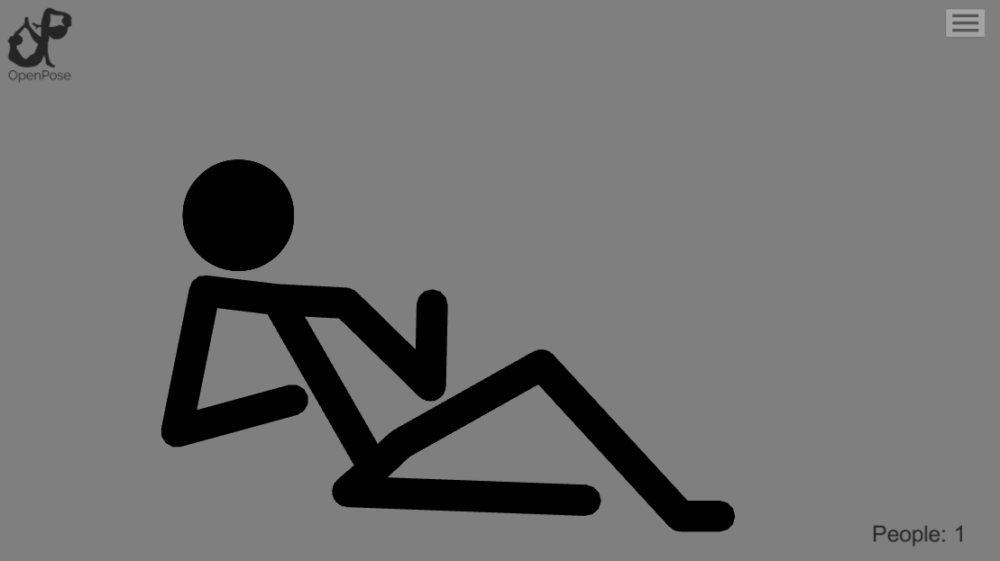
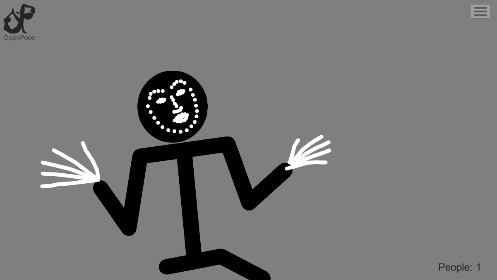

<div align="center">
    
</div>

-----------------

|                  |`Default Config`  |`CUDA (+Python)`  |`CPU (+Python)`   |`OpenCL (+Python)`| `Debug`          | `Unity`          |
| :---:            | :---:            | :---:            | :---:            | :---:            | :---:            | :---:            |
| **`Linux`**   | [](https://travis-ci.org/CMU-Perceptual-Computing-Lab/openpose) | [](https://travis-ci.org/CMU-Perceptual-Computing-Lab/openpose) | [](https://travis-ci.org/CMU-Perceptual-Computing-Lab/openpose) | [](https://travis-ci.org/CMU-Perceptual-Computing-Lab/openpose) | [](https://travis-ci.org/CMU-Perceptual-Computing-Lab/openpose) | [](https://travis-ci.org/CMU-Perceptual-Computing-Lab/openpose) |
| **`MacOS`**   | [](https://travis-ci.org/CMU-Perceptual-Computing-Lab/openpose) | | [](https://travis-ci.org/CMU-Perceptual-Computing-Lab/openpose) | [](https://travis-ci.org/CMU-Perceptual-Computing-Lab/openpose) | [](https://travis-ci.org/CMU-Perceptual-Computing-Lab/openpose) | [](https://travis-ci.org/CMU-Perceptual-Computing-Lab/openpose) | [](https://travis-ci.org/CMU-Perceptual-Computing-Lab/openpose) |
| **`Windows`** | [](https://ci.appveyor.com/project/gineshidalgo99/openpose/branch/master) | | | | |
<!--
Note: Currently using [travis-matrix-badges](https://github.com/bjfish/travis-matrix-badges) vs. traditional [](https://travis-ci.org/CMU-Perceptual-Computing-Lab/openpose)
-->

[**OpenPose**](https://github.com/CMU-Perceptual-Computing-Lab/openpose) has represented the **first real-time multi-person system to jointly detect human body, hand, facial, and foot keypoints (in total 135 keypoints) on single images**, and it is currently being actively used in many projects and research areas!

It is **authored by [Gines Hidalgo](https://www.gineshidalgo.com), [Zhe Cao](https://people.eecs.berkeley.edu/~zhecao), [Tomas Simon](http://www.cs.cmu.edu/~tsimon), [Shih-En Wei](https://scholar.google.com/citations?user=sFQD3k4AAAAJ&hl=en), [Hanbyul Joo](https://jhugestar.github.io), and [Yaser Sheikh](http://www.cs.cmu.edu/~yaser)**, and **maintained by [Gines Hidalgo](https://www.gineshidalgo.com) and [Yaadhav Raaj](https://www.raaj.tech)**. OpenPose would not be possible without the [**CMU Panoptic Studio dataset**](http://domedb.perception.cs.cmu.edu). We would also like to thank all the people who helped OpenPose in any way ([doc/contributors.md](doc/contributors.md)).

<!-- The [original CVPR 2017 repo](https://github.com/ZheC/Multi-Person-Pose-Estimation) includes Matlab and Python versions, as well as the training code. The body pose estimation work is based on [the original ECCV 2016 demo](https://github.com/CMU-Perceptual-Computing-Lab/caffe_rtpose). -->


<p align="center">
    
    <br>
    <sup>Authors <a href="https://www.gineshidalgo.com" target="_blank">Gines Hidalgo</a> (left) and <a href="https://jhugestar.github.io" target="_blank">Hanbyul Joo</a> (right) in front of the <a href="http://domedb.perception.cs.cmu.edu" target="_blank">CMU Panoptic Studio</a></sup>
</p>


## Contents
1. [Results](#results)
2. [Features](#features)
3. [Related Work](#related-work)
4. [Installation](#installation)
5. [Quick Start](#quick-start)
6. [Send Us Feedback!](#send-us-feedback)
7. [Citation](#citation)
8. [License](#license)


## Results
### Body and Foot Estimation
<p align="center">
    
    <br>
    <sup>Testing the <a href="https://www.youtube.com/watch?v=2DiQUX11YaY" target="_blank"><i>Crazy Uptown Funk flashmob in Sydney</i></a> video sequence with OpenPose</sup>
</p>

### 3D Reconstruction Module (Body, Foot, Face, and Hands)
<p align="center">
    
    <br>
    <sup>Testing the 3D Reconstruction Module of OpenPose</sup>
</p>

### Body, Foot, Face, and Hands Estimation
<p align="center">
    
    
    <br>
    <sup>Authors <a href="https://www.gineshidalgo.com" target="_blank">Gines Hidalgo</a> (left image) and <a href="http://www.cs.cmu.edu/~tsimon" target="_blank">Tomas Simon</a> (right image) testing OpenPose</sup>
</p>

### Unity Plugin
<p align="center">
    
    
    
    <br>
    <sup><a href="http://tianyizhao.com" target="_blank">Tianyi Zhao</a> and <a href="https://www.gineshidalgo.com" target="_blank">Gines Hidalgo</a> testing the <a href="https://github.com/CMU-Perceptual-Computing-Lab/openpose_unity_plugin" target="_blank">OpenPose Unity Plugin</a></sup>
</p>

### Runtime Analysis
In the following image, we show an inference time comparison between the 3 available pose estimation libraries: OpenPose, Alpha-Pose (fast Pytorch version), and Mask R-CNN. The OpenPose runtime is constant, while the runtime of Alpha-Pose and Mask R-CNN grow linearly with the number of people. The analysis was performed using the same hardware (Nvidia 1080 Ti) and number of images per algorithm. More details [**here**](https://arxiv.org/abs/1812.08008).
<p align="center">
    
</p>


## Features
- **Main Functionality**:
    - **2D real-time multi-person keypoint detection**:
        - 15, 18 or **25-keypoint body/foot keypoint estimation**, including **6 foot keypoints**. **Runtime invariant to number of detected people**.
        - **2x21-keypoint hand keypoint estimation**. **Runtime depends on number of detected people**. See [**OpenPose Training**](https://github.com/CMU-Perceptual-Computing-Lab/openpose_train) for a runtime invariant alternative.
        - **70-keypoint face keypoint estimation**. **Runtime depends on number of detected people**. See [**OpenPose Training**](https://github.com/CMU-Perceptual-Computing-Lab/openpose_train) for a runtime invariant alternative.
    - [**3D real-time single-person keypoint detection**](doc/advanced/3d_reconstruction_module.md):
        - 3D triangulation from multiple single views.
        - Synchronization of Flir cameras handled.
        - Compatible with Flir/Point Grey cameras.
    - [**Calibration toolbox**](doc/advanced/calibration_module.md): Estimation of distortion, intrinsic, and extrinsic camera parameters.
    - **Single-person tracking** for further speedup or visual smoothing.
- **Input**: Image, video, webcam, Flir/Point Grey and IP camera.
- **Output**: Basic image + keypoint display/saving (PNG, JPG, AVI, ...), keypoint saving (JSON, XML, YML, ...), and/or keypoints as array class.
- Included [C++](examples/tutorial_api_cpp/)/[python](examples/tutorial_api_python/) examples to add your custom input and/or output, as well as pre or post-processing steps.
- **OS**: Ubuntu (20, 18, 16, 14), Windows (10, 8), Mac OSX, Nvidia TX2.
- **Hardware compatibility**: CUDA (Nvidia GPU), OpenCL (AMD GPU), and non-GPU (CPU-only) versions.
- **Others**:
    - Available: command-line demo, C++ wrapper, and C++ API.
    - [**Python API**](doc/python_module.md).

For further details, check [all released features](doc/released_features.md) and [release notes](doc/release_notes.md).


## Related Work
- [**OpenPose training code**](https://github.com/CMU-Perceptual-Computing-Lab/openpose_train).
- [**OpenPose foot dataset**](https://cmu-perceptual-computing-lab.github.io/foot_keypoint_dataset/).
- [**Unity Plugin**](https://github.com/CMU-Perceptual-Computing-Lab/openpose_unity_plugin).
- OpenPose papers published in [**IEEE TPAMI** and **CVPR**](#citation). [Cite them](#citation) in your publications if OpenPose helps your research!


## Installation
If you want to use OpenPose without compiling or writing any code, simply [download and use the latest Windows portable version of OpenPose](doc/installation/README.md#windows-portable-demo))! Otherwise, you can also [build OpenPose from source](doc/installation/README.md#compiling-and-running-openpose-from-source-on-windows-ubuntu-and-mac).

See [doc/installation/README.md](doc/installation/README.md) for more details.


## Quick Start
Most users do not need the OpenPose C++/Python API, but can simply use the OpenPose Demo:

- [**Output information**](doc/output.md): Learn about the output format, keypoint index ordering, etc.

- **OpenPose Demo**: Choose your input (e.g., images, video, webcam), set of algorithms (body, hand, face), and output (e.g., display, JSON keypoint saving, image+keypoints). See [doc/quick_start.md](doc/quick_start.md) and [doc/demo_overview.md](doc/demo_overview.md).
    - E.g., in your terminal or PowerShell: Given an input video (`--video`), extract body (by default), face (`--face`) and hand (`--hand`) keypoints, save the keypoints in a JSON file (`--write_json`), and display (by default) the results in the screen. Remove any of the flags to remove that particular functionality.
```
# Ubuntu
./build/examples/openpose/openpose.bin --video examples/media/video.avi --face --hand --write_json output_json_folder/

:: Windows - Portable Demo
bin\OpenPoseDemo.exe --video examples\media\video.avi --face --hand --write_json output_json_folder/
```

- [**OpenPose C++ API**](examples/tutorial_api_cpp/): If you want to read a specific input, and/or add your custom post-processing function, and/or implement your own display/saving.
    - For quick prototyping: You can easily **create your custom code** on [examples/user_code/](examples/user_code/) and CMake will automatically compile it together with the whole OpenPose project. See [examples/user_code/README.md](examples/user_code/README.md) for more details.

- [**OpenPose Python API**](examples/tutorial_api_python/): Almost the exact same functionality than the C++ API, but in Python!
    - For quick prototyping: You can simply duplicate and rename any of the [existing example files](examples/tutorial_api_python/) within that same folder.

- [**Speeding up OpenPose and benchmark**](doc/speed_up_openpose.md): Check the OpenPose Benchmark as well as some hints to speed up and/or reduce the memory requirements for OpenPose.

- [**Calibration toolbox**](doc/advanced/calibration_module.md) and [**3D OpenPose**](doc/advanced/3d_reconstruction_module.md): Calibrate your cameras for 3D OpenPose (or any other stereo vision tasks) and start obtaining 3D keypoints!

- [**Standalone face or hand detector**doc/advanced/standalone_face_or_hand_keypoint_detector.md](doc/advanced/standalone_face_or_hand_keypoint_detector.md) is useful if you want to do any of the following:
    - **Face** keypoint detection **without body** keypoint detection: Pros: Speedup and RAM/GPU memory reduction. Cons: Worse accuracy and less detected number of faces).
    - **Use your own face/hand detector**: You can use the hand and/or face keypoint detectors with your own face or hand detectors, rather than using the body detector. E.g., useful for camera views at which the hands are visible but not the body (OpenPose detector would fail).


## Send Us Feedback!
Our library is open source for research purposes, and we want to continuously improve it! So please, let us know if...
1. ... you find any bug (in functionality or speed).
2. ... you added some functionality on top of OpenPose which we might want to add.
3. ... you know how to speed up or improve any part of OpenPose.
4. ... you want to share your cool demo or project made on top of OpenPose (you can email it to us too!).
5. ... etc.

Just create a new GitHub issue or a pull request and we will answer as soon as possible!


## Citation
Please cite these papers in your publications if it helps your research. All of OpenPose is based on [OpenPose: Realtime Multi-Person 2D Pose Estimation using Part Affinity Fields](https://arxiv.org/abs/1812.08008), while the hand and face detectors also use [Hand Keypoint Detection in Single Images using Multiview Bootstrapping](https://arxiv.org/abs/1704.07809) (the face detector was trained using the same procedure than the hand detector).

    @article{8765346,
      author = {Z. {Cao} and G. {Hidalgo Martinez} and T. {Simon} and S. {Wei} and Y. A. {Sheikh}},
      journal = {IEEE Transactions on Pattern Analysis and Machine Intelligence},
      title = {OpenPose: Realtime Multi-Person 2D Pose Estimation using Part Affinity Fields},
      year = {2019}
    }

    @inproceedings{simon2017hand,
      author = {Tomas Simon and Hanbyul Joo and Iain Matthews and Yaser Sheikh},
      booktitle = {CVPR},
      title = {Hand Keypoint Detection in Single Images using Multiview Bootstrapping},
      year = {2017}
    }

    @inproceedings{cao2017realtime,
      author = {Zhe Cao and Tomas Simon and Shih-En Wei and Yaser Sheikh},
      booktitle = {CVPR},
      title = {Realtime Multi-Person 2D Pose Estimation using Part Affinity Fields},
      year = {2017}
    }

    @inproceedings{wei2016cpm,
      author = {Shih-En Wei and Varun Ramakrishna and Takeo Kanade and Yaser Sheikh},
      booktitle = {CVPR},
      title = {Convolutional pose machines},
      year = {2016}
    }

Paper links:
- OpenPose: Realtime Multi-Person 2D Pose Estimation using Part Affinity Fields:
    - [IEEE TPAMI](https://ieeexplore.ieee.org/document/8765346)
    - [ArXiv](https://arxiv.org/abs/1812.08008)
- [Hand Keypoint Detection in Single Images using Multiview Bootstrapping](https://arxiv.org/abs/1704.07809)
- [Realtime Multi-Person 2D Pose Estimation using Part Affinity Fields](https://arxiv.org/abs/1611.08050)
- [Convolutional Pose Machines](https://arxiv.org/abs/1602.00134)


## License
OpenPose is freely available for free non-commercial use, and may be redistributed under these conditions. Please, see the [license](LICENSE) for further details. Interested in a commercial license? Check this [FlintBox link](https://cmu.flintbox.com/#technologies/b820c21d-8443-4aa2-a49f-8919d93a8740). For commercial queries, use the `Contact` section from the [FlintBox link](https://cmu.flintbox.com/#technologies/b820c21d-8443-4aa2-a49f-8919d93a8740) and also send a copy of that message to [Yaser Sheikh](mailto:yaser@cs.cmu.edu).
