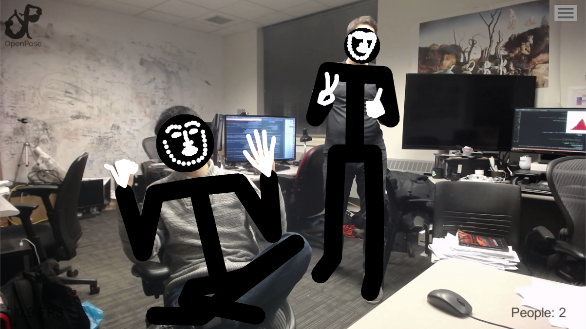

<div align="center">
    
</div>

-----------------

|                  |`Default Config`  |`CUDA (+Python)`  |`CPU (+Python)`   |`OpenCL (+Python)`| `Debug`          | `Unity`          |
| :---:            | :---:            | :---:            | :---:            | :---:            | :---:            | :---:            |
| **`Linux`**   | [](https://travis-ci.org/CMU-Perceptual-Computing-Lab/openpose) | [](https://travis-ci.org/CMU-Perceptual-Computing-Lab/openpose) | [](https://travis-ci.org/CMU-Perceptual-Computing-Lab/openpose) | [](https://travis-ci.org/CMU-Perceptual-Computing-Lab/openpose) | [](https://travis-ci.org/CMU-Perceptual-Computing-Lab/openpose) | [](https://travis-ci.org/CMU-Perceptual-Computing-Lab/openpose) |
| **`MacOS`**   | [](https://travis-ci.org/CMU-Perceptual-Computing-Lab/openpose) | | [](https://travis-ci.org/CMU-Perceptual-Computing-Lab/openpose) | [](https://travis-ci.org/CMU-Perceptual-Computing-Lab/openpose) | [](https://travis-ci.org/CMU-Perceptual-Computing-Lab/openpose) | [](https://travis-ci.org/CMU-Perceptual-Computing-Lab/openpose) | [](https://travis-ci.org/CMU-Perceptual-Computing-Lab/openpose) |
| **`Windows`** | [](https://ci.appveyor.com/project/gineshidalgo99/openpose/branch/master) | | | | |
<!--
Note: Currently using [travis-matrix-badges](https://github.com/bjfish/travis-matrix-badges) vs. traditional [](https://travis-ci.org/CMU-Perceptual-Computing-Lab/openpose)
-->

[**OpenPose**](https://github.com/CMU-Perceptual-Computing-Lab/openpose) represents the **first real-time multi-person system to jointly detect human body, hand, facial, and foot keypoints (in total 135 keypoints) on single images**.

It is **authored by [Gines Hidalgo](https://www.gineshidalgo.com), [Zhe Cao](https://people.eecs.berkeley.edu/~zhecao), [Tomas Simon](http://www.cs.cmu.edu/~tsimon), [Shih-En Wei](https://scholar.google.com/citations?user=sFQD3k4AAAAJ&hl=en), [Hanbyul Joo](https://jhugestar.github.io), and [Yaser Sheikh](http://www.cs.cmu.edu/~yaser)**. Currently, it is being **maintained by [Gines Hidalgo](https://www.gineshidalgo.com) and [Yaadhav Raaj](https://www.raaj.tech)**. In addition, OpenPose would not be possible without the [**CMU Panoptic Studio dataset**](http://domedb.perception.cs.cmu.edu). We would also like to thank all the people who helped OpenPose in any way. The main contributors are listed in [doc/contributors.md](doc/contributors.md).

<!-- The [original CVPR 2017 repo](https://github.com/ZheC/Multi-Person-Pose-Estimation) includes Matlab and Python versions, as well as the training code. The body pose estimation work is based on [the original ECCV 2016 demo](https://github.com/CMU-Perceptual-Computing-Lab/caffe_rtpose). -->


<p align="center">
    
    <br>
    <sup>Authors <a href="https://www.gineshidalgo.com" target="_blank">Gines Hidalgo</a> (left) and <a href="https://jhugestar.github.io" target="_blank">Hanbyul Joo</a> (right) in front of the <a href="http://domedb.perception.cs.cmu.edu" target="_blank">CMU Panoptic Studio</a></sup>
</p>

## Features
- **Functionality**:
    - **2D real-time multi-person keypoint detection**:
        - 15 or 18 or **25-keypoint body/foot keypoint estimation**. **Running time invariant to number of detected people**.
        - **6-keypoint foot keypoint estimation**. Integrated together with the 25-keypoint body/foot keypoint detector.
        - **2x21-keypoint hand keypoint estimation**. Currently, **running time depends** on **number of detected people**.
        - **70-keypoint face keypoint estimation**. Currently, **running time depends** on **number of detected people**.
    - **3D real-time single-person keypoint detection**:
        - 3-D triangulation from multiple single views.
        - Synchronization of Flir cameras handled.
        - Compatible with Flir/Point Grey cameras, but provided C++ demos to add your custom input.
    - **Calibration toolbox**:
        - Easy estimation of distortion, intrinsic, and extrinsic camera parameters.
    - **Single-person tracking** for further speed up or visual smoothing.
- **Input**: Image, video, webcam, Flir/Point Grey and IP camera. Included C++ demos to add your custom input.
- **Output**: Basic image + keypoint display/saving (PNG, JPG, AVI, ...), keypoint saving (JSON, XML, YML, ...), and/or keypoints as array class.
- **OS**: Ubuntu (14, 16), Windows (8, 10), Mac OSX, Nvidia TX2.
- **Training and datasets**:
    - [**OpenPose Training**](https://github.com/CMU-Perceptual-Computing-Lab/openpose_train).
    - [**Foot dataset website**](https://cmu-perceptual-computing-lab.github.io/foot_keypoint_dataset/).
- **Others**:
    - Available: command-line demo, C++ wrapper, and C++ API.
    - [**Python API**](doc/modules/python_module.md).
    - [**Unity Plugin**](https://github.com/CMU-Perceptual-Computing-Lab/openpose_unity_plugin).
    - CUDA (Nvidia GPU), OpenCL (AMD GPU), and CPU-only (no GPU) versions.


## Latest Features
- Sep 2019: [**Training code released**](https://github.com/CMU-Perceptual-Computing-Lab/openpose_train)!
- Jan 2019: [**Unity plugin released**](https://github.com/CMU-Perceptual-Computing-Lab/openpose_unity_plugin)!
- Jan 2019: [**Improved Python API**](doc/modules/python_module.md) released! Including body, face, hands, and all the functionality of the C++ API!
- Dec 2018: [**Foot dataset released**](https://cmu-perceptual-computing-lab.github.io/foot_keypoint_dataset) and [**new paper released**](https://arxiv.org/abs/1812.08008)!

For further details, check [all released features](doc/released_features.md) and [release notes](doc/release_notes.md).


## Results
### Body and Foot Estimation
<p align="center">
    
    <br>
    <sup>Testing the <a href="https://www.youtube.com/watch?v=2DiQUX11YaY" target="_blank"><i>Crazy Uptown Funk flashmob in Sydney</i></a> video sequence with OpenPose</sup>
</p>

### 3-D Reconstruction Module (Body, Foot, Face, and Hands)
<p align="center">
    
    <br>
    <sup>Testing the 3D Reconstruction Module of OpenPose</sup>
</p>

### Body, Foot, Face, and Hands Estimation
<p align="center">
    
    
    <br>
    <sup>Authors <a href="https://www.gineshidalgo.com" target="_blank">Gines Hidalgo</a> (left image) and <a href="http://www.cs.cmu.edu/~tsimon" target="_blank">Tomas Simon</a> (right image) testing OpenPose</sup>
</p>

### Unity Plugin
<p align="center">
    
    
    
    <br>
    <sup><a href="http://tianyizhao.com" target="_blank">Tianyi Zhao</a> and <a href="https://www.gineshidalgo.com" target="_blank">Gines Hidalgo</a> testing their <a href="https://github.com/CMU-Perceptual-Computing-Lab/openpose_unity_plugin" target="_blank">OpenPose Unity Plugin</a></sup>
</p>

### Runtime Analysis
Inference time comparison between the 3 available pose estimation libraries: OpenPose, Alpha-Pose (fast Pytorch version), and Mask R-CNN:
<p align="center">
    
</p>
This analysis was performed using the same images for each algorithm and a batch size of 1. Each analysis was repeated 1000 times and then averaged. This was all performed on a system with a Nvidia 1080 Ti and CUDA 8. Megvii (Face++) and MSRA GitHub repositories were excluded because they only provide pose estimation results given a cropped person. However, they suffer the same problem than Alpha-Pose and Mask R-CNN, their runtimes grow linearly with the number of people.


## Contents
1. [Features](#features)
2. [Latest Features](#latest-features)
3. [Results](#results)
4. [Installation, Reinstallation and Uninstallation](#installation-reinstallation-and-uninstallation)
5. [Quick Start](#quick-start)
6. [Output](#output)
7. [Speeding Up OpenPose and Benchmark](#speeding-up-openpose-and-benchmark)
8. [Training Code and Foot Dataset](#training-code-and-foot-dataset)
9. [Send Us Failure Cases and Feedback!](#send-us-failure-cases-and-feedback)
10. [Citation](#citation)
11. [License](#license)


## Installation, Reinstallation and Uninstallation
**Windows portable version**: Simply download and use the latest version from the [Releases](https://github.com/CMU-Perceptual-Computing-Lab/openpose/releases) section.

Otherwise, check [doc/installation.md](doc/installation.md) for instructions on how to build OpenPose from source.


## Quick Start
Most users do not need the OpenPose C++/Python API, but can simply use the OpenPose Demo:

- **OpenPose Demo**: To easily process images/video/webcam and display/save the results. See [doc/demo_overview.md](doc/demo_overview.md). E.g., run OpenPose in a video with:
```
# Ubuntu
./build/examples/openpose/openpose.bin --video examples/media/video.avi
:: Windows - Portable Demo
bin\OpenPoseDemo.exe --video examples\media\video.avi
```

- **Calibration toolbox**: To easily calibrate your cameras for 3-D OpenPose or any other stereo vision task. See [doc/modules/calibration_module.md](doc/modules/calibration_module.md).

- **OpenPose C++ API**: If you want to read a specific input, and/or add your custom post-processing function, and/or implement your own display/saving, check the C++ API tutorial on [examples/tutorial_api_cpp/](examples/tutorial_api_cpp/) and [doc/library_introduction.md](doc/library_introduction.md). You can create your custom code on [examples/user_code/](examples/user_code/) and quickly compile it with CMake when compiling the whole OpenPose project. Quickly **add your custom code**: See [examples/user_code/README.md](examples/user_code/README.md) for further details.

- **OpenPose Python API**: Analogously to the C++ API, find the tutorial for the Python API on [examples/tutorial_api_python/](examples/tutorial_api_python/).

- **Adding an extra module**: Check [doc/library_add_new_module.md](./doc/library_add_new_module.md).

- **Standalone face or hand detector**:
    - **Face** keypoint detection **without body** keypoint detection: If you want to speed it up (but also reduce amount of detected faces), check the OpenCV-face-detector approach in [doc/standalone_face_or_hand_keypoint_detector.md](doc/standalone_face_or_hand_keypoint_detector.md).
    - **Use your own face/hand detector**: You can use the hand and/or face keypoint detectors with your own face or hand detectors, rather than using the body detector. E.g., useful for camera views at which the hands are visible but not the body (OpenPose detector would fail). See [doc/standalone_face_or_hand_keypoint_detector.md](doc/standalone_face_or_hand_keypoint_detector.md).


## Output
Output (format, keypoint index ordering, etc.) in [doc/output.md](doc/output.md).


## Speeding Up OpenPose and Benchmark
Check the OpenPose Benchmark as well as some hints to speed up and/or reduce the memory requirements for OpenPose on [doc/speed_up_openpose.md](doc/speed_up_openpose.md).


## Training Code and Foot Dataset
For training OpenPose, check [github.com/CMU-Perceptual-Computing-Lab/openpose_train](https://github.com/CMU-Perceptual-Computing-Lab/openpose_train).

For the foot dataset, check the [foot dataset website](https://cmu-perceptual-computing-lab.github.io/foot_keypoint_dataset/) and new [OpenPose paper](https://arxiv.org/abs/1812.08008) for more information.


## Send Us Failure Cases and Feedback!
Our library is open source for research purposes, and we want to continuously improve it! So please, let us know if...

1. ... you find videos or images where OpenPose does not seems to work well. Feel free to send them to openposecmu@gmail.com (email only for failure cases!), we will use them to improve the quality of the algorithm!
2. ... you find any bug (in functionality or speed).
3. ... you added some functionality to some class or some new Worker<T> subclass which we might potentially incorporate.
4. ... you know how to speed up or improve any part of the library.
5. ... you have a request about possible functionality.
6. ... etc.

Just comment on GitHub or make a pull request and we will answer as soon as possible! Send us an email if you use the library to make a cool demo or YouTube video!


## Citation
Please cite these papers in your publications if it helps your research. The body-foot model and any additional functionality (calibration, 3-D reconstruction, etc.) use `[Cao et al. 2018]`; the hand and face keypoint detectors use `[Cao et al. 2018]` and `[Simon et al. 2017]` (the face detector was trained using the same procedure than for hands); and the old (deprecated) body-only model uses `[Cao et al. 2017]`.

    @inproceedings{cao2018openpose,
      author = {Zhe Cao and Gines Hidalgo and Tomas Simon and Shih-En Wei and Yaser Sheikh},
      booktitle = {arXiv preprint arXiv:1812.08008},
      title = {Open{P}ose: realtime multi-person 2{D} pose estimation using {P}art {A}ffinity {F}ields},
      year = {2018}
    }

    @inproceedings{simon2017hand,
      author = {Tomas Simon and Hanbyul Joo and Iain Matthews and Yaser Sheikh},
      booktitle = {CVPR},
      title = {Hand Keypoint Detection in Single Images using Multiview Bootstrapping},
      year = {2017}
    }

    @inproceedings{cao2017realtime,
      author = {Zhe Cao and Tomas Simon and Shih-En Wei and Yaser Sheikh},
      booktitle = {CVPR},
      title = {Realtime Multi-Person 2D Pose Estimation using Part Affinity Fields},
      year = {2017}
    }

    @inproceedings{wei2016cpm,
      author = {Shih-En Wei and Varun Ramakrishna and Takeo Kanade and Yaser Sheikh},
      booktitle = {CVPR},
      title = {Convolutional pose machines},
      year = {2016}
    }

Links to the papers:

- [OpenPose: Realtime Multi-Person 2D Pose Estimation using Part Affinity Fields](https://arxiv.org/abs/1812.08008)
- [Hand Keypoint Detection in Single Images using Multiview Bootstrapping](https://arxiv.org/abs/1704.07809)
- [Realtime Multi-Person 2D Pose Estimation using Part Affinity Fields](https://arxiv.org/abs/1611.08050)
- [Convolutional Pose Machines](https://arxiv.org/abs/1602.00134)


## License
OpenPose is freely available for free non-commercial use, and may be redistributed under these conditions. Please, see the [license](LICENSE) for further details. Interested in a commercial license? Check this [FlintBox link](https://flintbox.com/public/project/47343/). For commercial queries, use the `Directly Contact Organization` section from the [FlintBox link](https://flintbox.com/public/project/47343/) and also send a copy of that message to [Yaser Sheikh](mailto:yaser@cs.cmu.edu).
