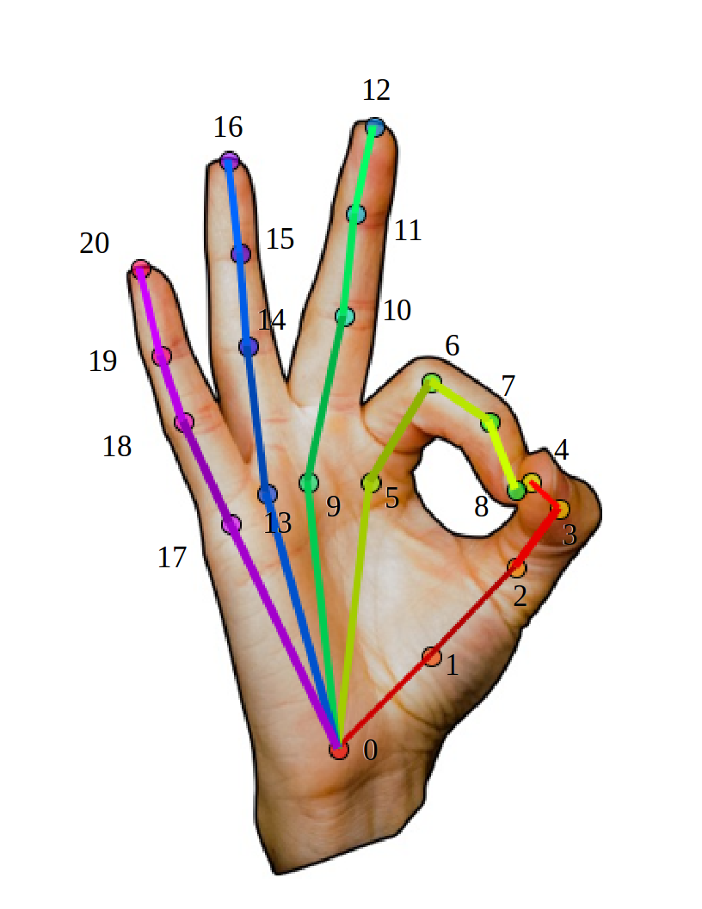

OpenPose Doc - Output
====================================


## Contents
1. [UI and Visual Output](#ui-and-visual-output)
2. [JSON-UI Mapping](#json-ui-mapping)
    1. [Pose Output Format (BODY_25)](#pose-output-format-body_25)
    2. [Pose Output Format (COCO)](#pose-output-format-coco)
    3. [Face Output Format](#face-output-format)
    4. [Hand Output Format](#hand-output-format)
3. [JSON Output Format](#output-format)
4. [Keypoints in C++/Python](#body-keypoints-in-c-python)
    1. [Keypoint Ordering in C++/Python](#body-keypoint-ordering-in-c-python)
    2. [Keypoint Format in Datum (Advanced)](#keypoint-format-in-datum-advanced)
5. [Reading Saved Results](#reading-saved-results)
6. [Advanced](#advanced)
    1. [Camera Matrix Output Format](#camera-matrix-output-format)
    2. [Heatmaps](#heatmaps)


## UI and Visual Output
The visual GUI should show the original image with the poses blended on it, similarly to the pose of this gif:

<p align="center">
    
</p>


## JSON-UI Mapping
The output of the JSON files consist of a set of keypoints, whose ordering is related with the UI output as follows:

### Pose Output Format (BODY_25)
<p align="center">
    
</p>


### Pose Output Format (COCO)
<p align="center">
    
</p>


### Face Output Format
<p align="center">
    
</p>


### Hand Output Format
<p align="center">
    
</p>


## JSON Output Format
There are 2 alternatives to save the OpenPose output. But both of them follow the keypoint ordering described in the section [Keypoint Ordering in C++/Python](#body-keypoints-in-c-python) section (which you should read next).

1. The `--write_json` flag saves the people pose data into JSON files. Each file represents a frame, it has a `people` array of objects, where each object has:
    1. `pose_keypoints_2d`: Body part locations (`x`, `y`) and detection confidence (`c`) formatted as `x0,y0,c0,x1,y1,c1,...`. The coordinates `x` and `y` can be normalized to the range [0,1], [-1,1], [0, source size], [0, output size], etc. (see the flag `--keypoint_scale` for more information), while the confidence score (`c`) in the range [0,1].
    2. `face_keypoints_2d`, `hand_left_keypoints_2d`, and `hand_right_keypoints_2d` are analogous to `pose_keypoints_2d` but applied to the face and hand parts.
    3. `body_keypoints_3d`, `face_keypoints_3d`, `hand_left_keypoints_2d`, and `hand_right_keypoints_2d` are analogous but applied to the 3-D parts. They are empty if `--3d` is not enabled. Their format is `x0,y0,z0,c0,x1,y1,z1,c1,...`, where `c` is 1 or 0 depending on whether the 3-D reconstruction was successful or not.
    4. `part_candidates` (optional and advanced): The body part candidates before being assembled into people. Empty if `--part_candidates` is not enabled (see that flag for more details).
```
{
    "version":1.1,
    "people":[
        {
            "pose_keypoints_2d":[582.349,507.866,0.845918,746.975,631.307,0.587007,...],
            "face_keypoints_2d":[468.725,715.636,0.189116,554.963,652.863,0.665039,...],
            "hand_left_keypoints_2d":[746.975,631.307,0.587007,615.659,617.567,0.377899,...],
            "hand_right_keypoints_2d":[617.581,472.65,0.797508,0,0,0,723.431,462.783,0.88765,...]
            "pose_keypoints_3d":[582.349,507.866,507.866,0.845918,507.866,746.975,631.307,0.587007,...],
            "face_keypoints_3d":[468.725,715.636,715.636,0.189116,715.636,554.963,652.863,0.665039,...],
            "hand_left_keypoints_3d":[746.975,631.307,631.307,0.587007,631.307,615.659,617.567,0.377899,...],
            "hand_right_keypoints_3d":[617.581,472.65,472.65,0.797508,472.65,0,0,0,723.431,462.783,0.88765,...]
        }
    ],
    // If `--part_candidates` enabled
    "part_candidates":[
        {
            "0":[296.994,258.976,0.845918,238.996,365.027,0.189116],
            "1":[381.024,321.984,0.587007],
            "2":[313.996,314.97,0.377899],
            "3":[238.996,365.027,0.189116],
            "4":[283.015,332.986,0.665039],
            "5":[457.987,324.003,0.430488,283.015,332.986,0.665039],
            "6":[],
            "7":[],
            "8":[],
            "9":[],
            "10":[],
            "11":[],
            "12":[],
            "13":[],
            "14":[293.001,242.991,0.674305],
            "15":[314.978,241,0.797508],
            "16":[],
            "17":[369.007,235.964,0.88765]
        }
    ]
}
```

2. (Deprecated) `--write_keypoint` uses the OpenCV `cv::FileStorage` default formats, i.e., JSON (if OpenCV 3 or higher), XML, and YML. It only prints 2D body information (no 3D or face/hands).


## Keypoints in C++/Python
### Keypoint Ordering in C++/Python
The body part mapping order of any body model (e.g., `BODY_25`, `COCO`, `MPI`) can be extracted from the C++ and Python APIs.

- In C++, `getPoseBodyPartMapping(const PoseModel poseModel)` is available in [poseParameters.hpp](../include/openpose/pose/poseParameters.hpp):
```
// C++ API call
#include <openpose/pose/poseParameters.hpp>
const auto& poseBodyPartMappingBody25 = getPoseBodyPartMapping(PoseModel::BODY_25);
const auto& poseBodyPartMappingCoco = getPoseBodyPartMapping(PoseModel::COCO_18);
const auto& poseBodyPartMappingMpi = getPoseBodyPartMapping(PoseModel::MPI_15);
const auto& poseBodyPartMappingBody25B = getPoseBodyPartMapping(PoseModel::BODY_25B);
const auto& poseBodyPartMappingBody135 = getPoseBodyPartMapping(PoseModel::BODY_135);

// Result for BODY_25 (25 body parts consisting of COCO + foot)
// const std::map<unsigned int, std::string> POSE_BODY_25_BODY_PARTS {
//     {0,  "Nose"},
//     {1,  "Neck"},
//     {2,  "RShoulder"},
//     {3,  "RElbow"},
//     {4,  "RWrist"},
//     {5,  "LShoulder"},
//     {6,  "LElbow"},
//     {7,  "LWrist"},
//     {8,  "MidHip"},
//     {9,  "RHip"},
//     {10, "RKnee"},
//     {11, "RAnkle"},
//     {12, "LHip"},
//     {13, "LKnee"},
//     {14, "LAnkle"},
//     {15, "REye"},
//     {16, "LEye"},
//     {17, "REar"},
//     {18, "LEar"},
//     {19, "LBigToe"},
//     {20, "LSmallToe"},
//     {21, "LHeel"},
//     {22, "RBigToe"},
//     {23, "RSmallToe"},
//     {24, "RHeel"},
//     {25, "Background"}
// };
```

- You can also check them on Python:
```
poseModel = op.PoseModel.BODY_25
print(op.getPoseBodyPartMapping(poseModel))
print(op.getPoseNumberBodyParts(poseModel))
print(op.getPosePartPairs(poseModel))
print(op.getPoseMapIndex(poseModel))
```


### Keypoint Format in Datum (Advanced)
This section is only for advance users that plan to use the C++ API. Not needed for the OpenPose demo and/or Python API.

There are 3 different keypoint `Array<float>` elements in the `Datum` class:

1. Array<float> **poseKeypoints**: In order to access person `person` and body part `part` (where the index matches `POSE_COCO_BODY_PARTS` or `POSE_MPI_BODY_PARTS`), you can simply output:
```
    // Common parameters needed
    const auto numberPeopleDetected = poseKeypoints.getSize(0);
    const auto numberBodyParts = poseKeypoints.getSize(1);
    // Easy version
    const auto x = poseKeypoints[{person, part, 0}];
    const auto y = poseKeypoints[{person, part, 1}];
    const auto score = poseKeypoints[{person, part, 2}];
    // Slightly more efficient version
    // If you want to access these elements on a huge loop, you can get the index
    // by your own, but it is usually not faster enough to be worthy
    const auto baseIndex = poseKeypoints.getSize(2)*(person*numberBodyParts + part);
    const auto x = poseKeypoints[baseIndex];
    const auto y = poseKeypoints[baseIndex + 1];
    const auto score = poseKeypoints[baseIndex + 2];
```
2. Array<float> **faceKeypoints**: It is completely analogous to poseKeypoints.
```
    // Common parameters needed
    const auto numberPeopleDetected = faceKeypoints.getSize(0);
    const auto numberFaceParts = faceKeypoints.getSize(1);
    // Easy version
    const auto x = faceKeypoints[{person, part, 0}];
    const auto y = faceKeypoints[{person, part, 1}];
    const auto score = faceKeypoints[{person, part, 2}];
    // Slightly more efficient version
    const auto baseIndex = faceKeypoints.getSize(2)*(person*numberFaceParts + part);
    const auto x = faceKeypoints[baseIndex];
    const auto y = faceKeypoints[baseIndex + 1];
    const auto score = faceKeypoints[baseIndex + 2];
```
3. std::array<Array<float>, 2> **handKeypoints**, where handKeypoints[0] corresponds to the left hand and handKeypoints[1] to the right one. Each handKeypoints[i] is analogous to poseKeypoints and faceKeypoints:
```
    // Common parameters needed
    const auto numberPeopleDetected = handKeypoints[0].getSize(0); // = handKeypoints[1].getSize(0)
    const auto numberHandParts = handKeypoints[0].getSize(1); // = handKeypoints[1].getSize(1)

    // Easy version
    // Left Hand
    const auto xL = handKeypoints[0][{person, part, 0}];
    const auto yL = handKeypoints[0][{person, part, 1}];
    const auto scoreL = handKeypoints[0][{person, part, 2}];
    // Right Hand
    const auto xR = handKeypoints[1][{person, part, 0}];
    const auto yR = handKeypoints[1][{person, part, 1}];
    const auto scoreR = handKeypoints[1][{person, part, 2}];

    // Slightly more efficient version
    const auto baseIndex = handKeypoints[0].getSize(2)*(person*numberHandParts + part);
    // Left Hand
    const auto xL = handKeypoints[0][baseIndex];
    const auto yL = handKeypoints[0][baseIndex + 1];
    const auto scoreL = handKeypoints[0][baseIndex + 2];
    // Right Hand
    const auto xR = handKeypoints[1][baseIndex];
    const auto yR = handKeypoints[1][baseIndex + 1];
    const auto scoreR = handKeypoints[1][baseIndex + 2];
```


## Reading Saved Results
We use the standard formats (JSON, PNG, JPG, ...) to save our results, so there are many open-source libraries to read them in most programming languages (especially Python). For C++, you might want to check [include/openpose/filestream/fileStream.hpp](../include/openpose/filestream/fileStream.hpp). In particular, `loadData` (for JSON, XML and YML files) and `loadImage` (for image formats such as PNG or JPG) to load the data into cv::Mat format.


## Advanced
### Camera Matrix Output Format
If you need to use the camera calibration or 3D modules, the camera matrix output format is detailed in [doc/advanced/calibration_module.md#camera-matrix-output-format](advanced/calibration_module.md#camera-matrix-output-format).


### Heatmaps
If you need to use heatmaps, check [doc/advanced/heatmap_output.md](advanced/heatmap_output.md).
