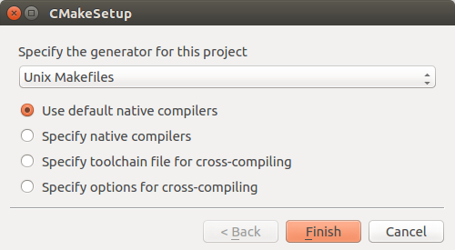
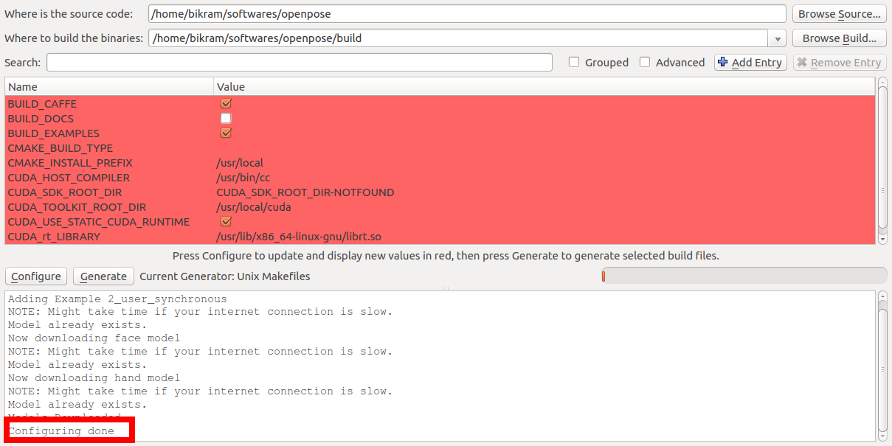

# Installation using CMake

The instructions in this section describe the steps to build OpenPose using CMake. Currently, CMake support has only been tested on Ubuntu 14 and Ubuntu 16.

## Clone the repository

The first step is to clone the OpenPose repository from GitHub.

```bash
git clone https://github.com/CMU-Perceptual-Computing-Lab/openpose.git
```

## Install the prerequisites

Since currently, OpenPose uses Caffe under the hood -- most prerequisites are for Caffe itself. If Caffe is already installed, the user may skip installing most of these packages. The packages can be installed using the script `install_cmake.sh` in the `ubuntu` directory.

## Generate the makefiles

There are two ways to generate the makefiles, either using the CMake GUI program or the command line. Both are described
succinctly in the sections below.

### CMake GUI

* The first step is to open the CMake GUI. After opening the CMake GUI, the next step is to select the project source directory and a sub-directory where the Makefiles will
be generated. We will first select the openpose directory and then we will select a `build` directory in the project root directory as shown in the image below (See the red rectangle). If the `build` directory does not exists, CMake will create one for us.
  
  
  
* Next press the `Configure` button in the GUI. It will first ask you to create the `build` directory, if it already did not exist. Press `Yes`.
  
  
  
* Next a new dialog box will appear, press the `Finish` button here.
  
  
  
* If this step is successful, in the bottom box it will show "Configuring done" (in the last line) as shown below --
  
  
  
* To generate the Makefiles, press the `Generate` button and proceed to [building OpenPose](#build-the-library).
  
#### Caffe already present 

* If Caffe is already installed and you do not want OpenPose to build Caffe, you can specify the Caffe include path and the library as shown below. You will also need to turn on the `WITH_CAFFE` variable and turn off the `BUILD_CAFFE` variable.
  
  
  
SIDENOTE -- If you have OpenCV build from source and OpenPose cannot find it automatically -- you can set the `OPENCV_DIR` variable to the directory where you build OpenCV.

### Command Line build

Create a `build` folder in the root openpose folder, where you will build the library --

```bash
cd openpose
mkdir build
cd build
```

The next step is to generate the Makefiles. Now there can be multiple scenarios based on what the user already has e.x. Caffe might be already installed and the user might be interested in building OpenPose against that version of Caffe instead of requiring OpenPose to build Caffe from scratch.

#### SCENARIO 1 -- Caffe not installed and Opencv installed using `apt-get`

In the build directory, run the below command --

```bash
cmake ..
```

#### SCENARIO 2 -- Caffe installed and OpenCV build from source

In this example, we assume that Caffe and OpenCV are already present. The user needs to supply the paths of the library to CMake. For OpenCV, specify the `OpenCV_DIR` which is where the user build OpenCV. For Caffe, specify the include directory and library using the `Caffe_INCLUDE_DIRS` and `Caffe_LIBS` variables. This will be where you installed Caffe. Below is an example of the same.

```bash
cmake -DOpenCV_DIR=/home/"${USER}"/softwares/opencv/build \
  -DCaffe_INCLUDE_DIRS=/home/"${USER}"/softwares/caffe/build/install/include \
  -DCaffe_LIBS=/home/"${USER}"/softwares/caffe/build/install/lib/libcaffe.so -DWITH_CAFFE=ON ..
```

#### SCENARIO 3 -- OpenCV already installed

If Caffe is not already present but OpenCV is, then use the below command.

```bash
cmake -DOpenCV_DIR=/home/"${USER}"/softwares/opencv/build
```

The next step is to build OpenPose.

### Build the library 

CMake has created the Makefiles for us and the next step is to build the project. Make sure that you are in the `build` directory of the project and run the below 2 commands.

```
no_cores=`cat /proc/cpuinfo | grep processor | wc -l`
make -j${no_cores}
```

# Run the OpenPose demo

Make sure that you are in the root directory of the project. Run the OpenPose demo using --

```
./build/examples/openposeose/openpose.bin
```
