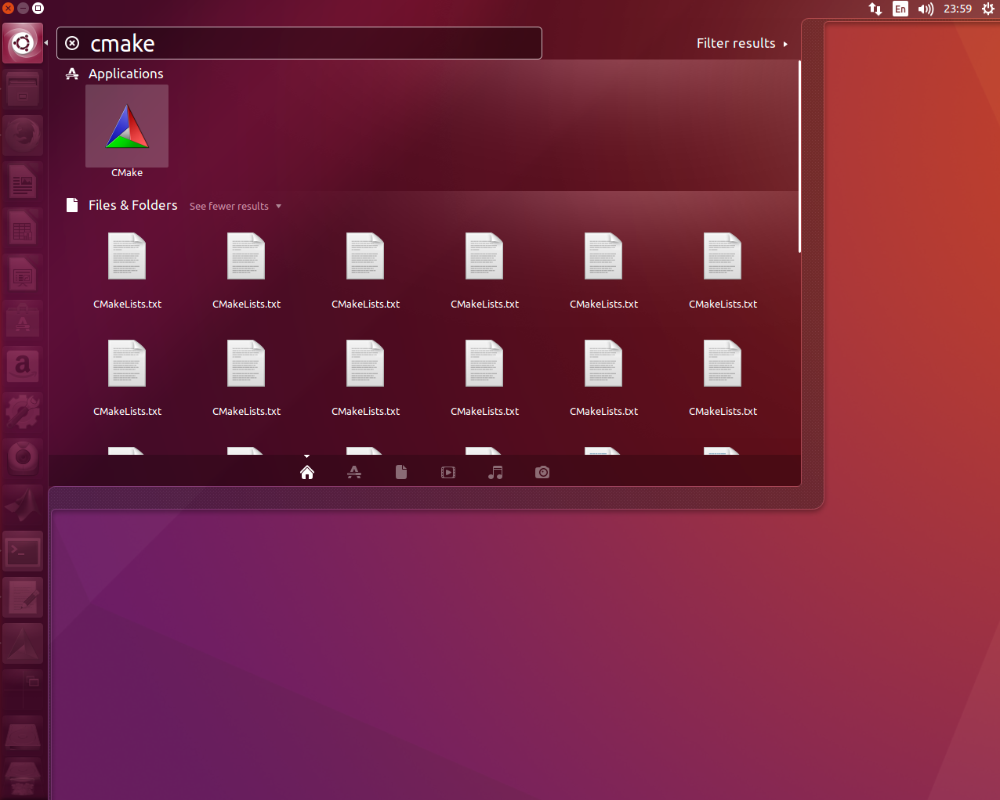
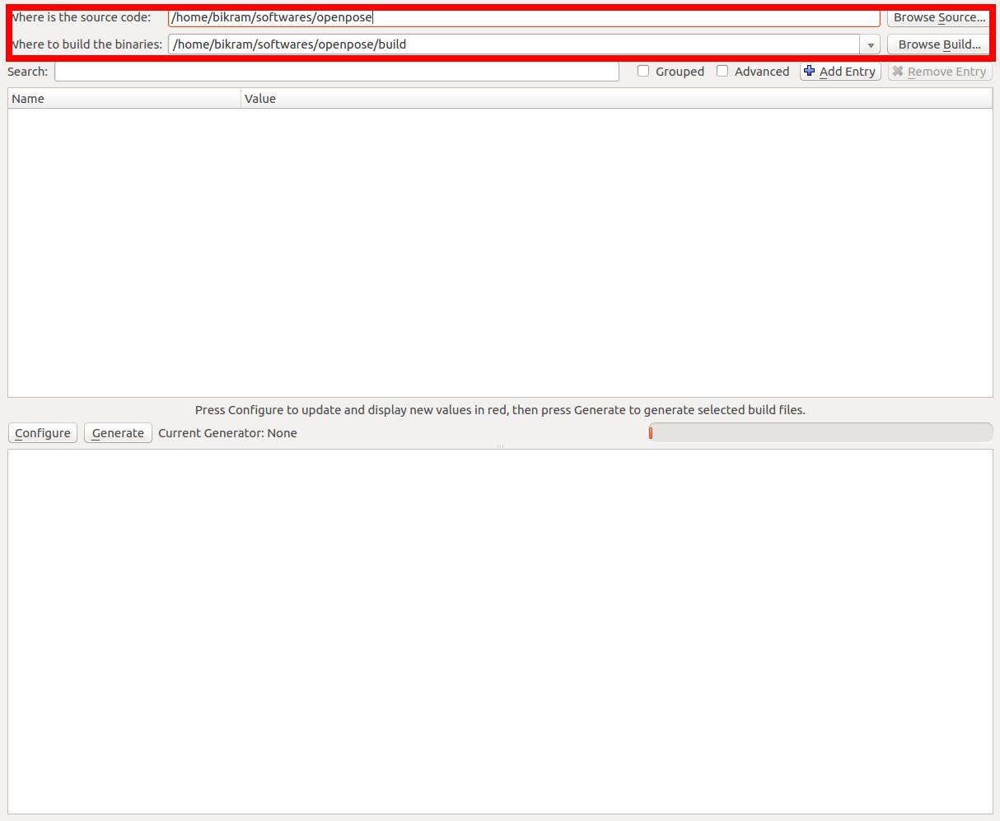
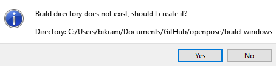
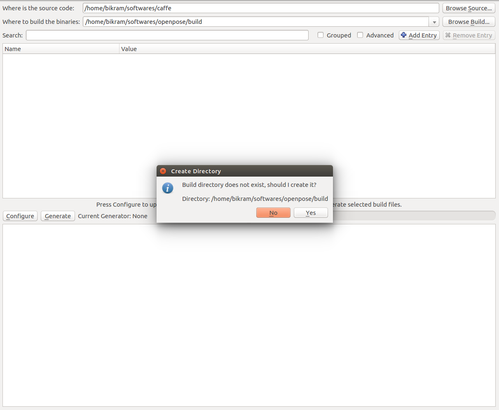
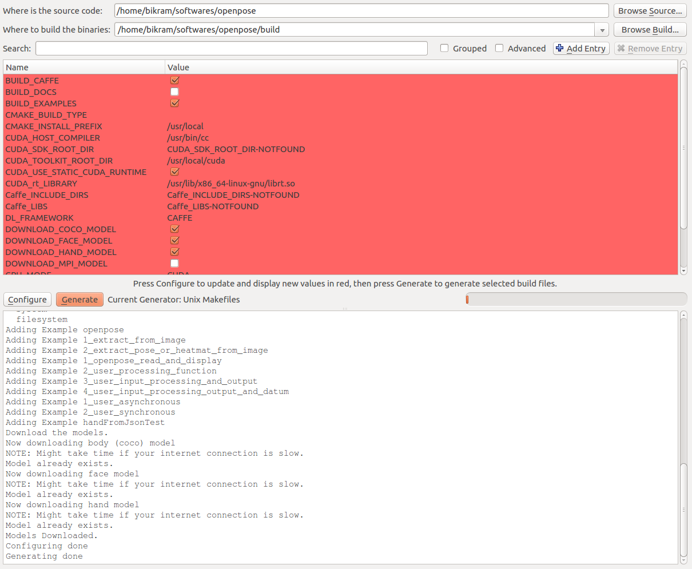

OpenPose - Installation
==========================

## Contents
1. [Windows Portable Demo](#windows-portable-demo)
2. [Operating Systems](#operating-systems)
3. [Community-Based Work](#community-based-work)
4. [Requirements and Dependencies](#requirements-and-dependencies)
5. [Clone OpenPose](#clone-openpose)
6. [Update OpenPose](#update-openpose)
7. [Installation](#installation)
8. [Reinstallation](#reinstallation)
9. [Uninstallation](#uninstallation)
10. [Optional Settings](#optional-settings)
    1. [Maximum Speed](#maximum-speed)
    2. [COCO and MPI Models](#coco-and-mpi-models)
    3. [Python API](#python-api)
    4. [CPU Version](#cpu-version)
    5. [OpenCL Version](#opencl-version)
    6. [Mac OSX Version](#mac-osx-version)
    7. [3D Reconstruction Module](#3d-reconstruction-module)
    8. [Calibration Module](#calibration-module)
    9. [Compiling without cuDNN](#compiling-without-cudnn)
    10. [Custom Caffe](#custom-caffe)
    11. [Custom OpenCV](#custom-opencv)
    12. [Doxygen Documentation Autogeneration (Ubuntu Only)](#doxygen-documentation-autogeneration-ubuntu-only)
    13. [CMake Command Line Configuration (Ubuntu Only)](#cmake-command-line-configuration-ubuntu-only)


## Windows Portable Demo
This installation section is only intended if you plan to modify the OpenPose code or integrate it with another library or project. If you just want to use the OpenPose demo in Windows, simply use the latest version of the OpenPose binaries which you can find in the [Releases](https://github.com/CMU-Perceptual-Computing-Lab/openpose/releases) section.

**NOTE**: Read the `Instructions.txt` to learn to download the models required by OpenPose (about 500 Mb).


## Operating Systems
- **Ubuntu** 14, 16, 18.
- **Windows** 7, 8, 10.
- **Mac OSX** Mavericks and above.
- **Nvidia Jetson TX1** (for JetPack 3.1), installation instructions in [doc/installation_jetson_tx1.md](./installation_jetson_tx1.md).
- **Nvidia Jetson TX2** (for JetPack 3.1 or 3.3), installation instructions in [doc/installation_jetson_tx2_jetpack3.1.md](./installation_jetson_tx2_jetpack3.1.md) and [doc/installation_jetson_tx2_jetpack3.3.md](./installation_jetson_tx2_jetpack3.3.md) respectively.
- OpenPose has also been used on **Windows 7**, **CentOS**, and **Nvidia Jetson (TK1 and TX1)** embedded systems. However, we do not officially support them at the moment.


## Community-Based Work
We add links to some community-based work based on OpenPose. Note: We do not support them, and we will remove GitHub issues opened asking about them as well as block those users from posting again. If you face any issue, comment only in the comment IDs especified below and/or on their respective GitHubs.

- [ROS example](https://github.com/firephinx/openpose_ros) (based on a very old OpenPose version). For questions and more details, read and post ONLY on [issue thread #51](https://github.com/CMU-Perceptual-Computing-Lab/openpose/issues/51).

- Docker Images. For questions and more details, read and post ONLY on [issue thread #347](https://github.com/CMU-Perceptual-Computing-Lab/openpose/issues/347).
    - Dockerfile working with CUDA 10: [link 1](https://github.com/ExSidius/openpose-docker/blob/master/Dockerfile) and [link 2](https://cloud.docker.com/repository/docker/exsidius/openpose/general).
    - [Dockerfile - OpenPose v1.4.0, OpenCV, CUDA 8, CuDNN 6, Python2.7](https://gist.github.com/moiseevigor/11c02c694fc0c22fccd59521793aeaa6).
    - [Dockerfile - OpenPose v1.2.1](https://gist.github.com/sberryman/6770363f02336af82cb175a83b79de33).

- [Google Colab helper script](https://github.com/CMU-Perceptual-Computing-Lab/openpose/issues/949#issue-387855863): Script to install OpenPose on Google Colab. Really useful when access to a computer powerful enough to run OpenPose is not possible, so one possible way to use OpenPose is to build it on a GPU-enabled Colab runtime and then run the programs there. For questions and more details, read and post ONLY on [issue thread #949](https://github.com/CMU-Perceptual-Computing-Lab/openpose/issues/949).


## Requirements and Dependencies
- **Requirements** for the default configuration (you might need more resources with a greater `--net_resolution` and/or `scale_number` or less resources by reducing the net resolution and/or using the MPI and MPI_4 models):
    - CUDA (Nvidia GPU) version:
        - NVIDIA graphics card with at least 1.6 GB available (the `nvidia-smi` command checks the available GPU memory in Ubuntu).
        - At least 2.5 GB of free RAM memory for BODY_25 model or 2 GB for COCO model (assuming cuDNN installed).
        - Highly recommended: cuDNN.
    - OpenCL (AMD GPU) version:
        - Vega series graphics card
        - At least 2 GB of free RAM memory.
    - CPU-only (no GPU) version:
        - Around 8GB of free RAM memory.
    - Highly recommended: a CPU with at least 8 cores.
- **Dependencies**:
    - OpenCV (all 2.X and 3.X versions are compatible).
    - Caffe and all its dependencies. Interesting in porting OpenPose to other DL frameworks (Tensorflow, Caffe2, Pytorch, ...)?. Email us (gines@cmu.edu) if you are interesting in joining the OpenPose team to do so or feel free to make a pull request if you implement any of those!
    - The demo and tutorials additionally use GFlags.


## Clone OpenPose
The first step is to clone the OpenPose repository.

1. Windows: You might use [GitHub Desktop](https://desktop.github.com/).
2. Ubuntu:
```bash
git clone https://github.com/CMU-Perceptual-Computing-Lab/openpose
```


## Update OpenPose
OpenPose can be easily updated by:

1. Download the latest changes:
    1. Windows: Clicking the `synchronization` button at the top-right part in GitHub Desktop in Windows.
    2. Ubuntu: running `git pull origin master`.
2. Perform the [Reinstallation](#reinstallation) section described below.


## Installation
The instructions in this section describe the steps to build OpenPose using CMake (GUI). There are 3 main steps:

1. [Problems and Errors Installing](#problems-and-errors-installing)
2. [Prerequisites](#prerequisites)
3. [OpenPose Configuration](#openpose-configuration)
4. [OpenPose Building](#openpose-building)
5. [Run OpenPose](#run-openpose)
6. [OpenPose from other Projects (Ubuntu and Mac)](#openpose-from-other-projects-ubuntu-and-mac)


### Problems and Errors Installing
Any problem installing OpenPose? Check [doc/faq.md](./faq.md) and/or post a GitHub issue. We will not respond more GitHub issues about Caffe, OpenCV or CUDA errors.


### Prerequisites
Make sure to download and install the prerequisites for your particular operating system following [doc/prerequisites.md](./prerequisites.md).


### OpenPose Configuration
1. Open CMake GUI and select the OpenPose directory as project source directory, and a non-existing or empty sub-directory (e.g., `build`) where the Makefile files (Ubuntu) or Visual Studio solution (Windows) will be generated. If `build` does not exist, it will ask you whether to create it. Press `Yes`.
<p align="center">
    
    
</p>

2. Press the `Configure` button, keep the generator in `Unix Makefile` (Ubuntu) or set it to your 64-bit Visual Studio version (Windows), and press `Finish`. Note for Windows users: CMake-GUI has changed their design after version 14. For versions older than 14, you usually select `Visual Studio XX 20XX Win64` as the generator (`X` depends on your VS version), while the `Optional toolset to use` must be empty. However, new CMake versions require you to select only the VS version as the generator, e.g., `Visual Studio 15 2017`, and then you must manually choose `x64` for the `Optional platform for generator`. See the following images as example.
<p align="center">
    
    
    
</p>

3. If this step is successful, the `Configuring done` text will appear in the bottom box in the last line. Otherwise, some red text will appear in that same bottom box.
<p align="center">
    
    
</p>

4. Press the `Generate` button and proceed to [OpenPose Building](#openpose-building). You can now close CMake.

Note: If you prefer to use your own custom Caffe or OpenCV versions, see [Custom Caffe](#custom-caffe) or [Custom OpenCV](#custom-opencv) respectively.


### OpenPose Building
#### Ubuntu and Mac
Finally, build the project by running the following commands.
```
cd build/
make -j`nproc`
```

#### Windows
In order to build the project, open the Visual Studio solution (Windows), called `build/OpenPose.sln`. Then, set the configuration from `Debug` to `Release` and press the green triangle icon (alternatively press <kbd>F5</kbd>).

**VERY IMPORTANT NOTE**: In order to use OpenPose outside Visual Studio, and assuming you have not unchecked the `BUILD_BIN_FOLDER` flag in CMake, copy all DLLs from `{build_directory}/bin` into the folder where the generated `openpose.dll` and `*.exe` demos are, e.g., `{build_directory}x64/Release` for the 64-bit release version.


### Run OpenPose
Check OpenPose was properly installed by running it on the default images, video, or webcam: [doc/quick_start.md#quick-start](./quick_start.md#quick-start).


### OpenPose from other Projects (Ubuntu and Mac)
If you only intend to use the OpenPose demo, you might skip this step. This step is only recommended if you plan to use the OpenPose API from other projects.

To install the OpenPose headers and libraries into the system environment path (e.g., `/usr/local/` or `/usr/`), run the following command.
```
cd build/
sudo make install
```

Once the installation is completed, you can use OpenPose in your other project using the `find_package` cmake command. Below, is a small example `CMakeLists.txt`. In order to use this script, you also need to copy `FindGFlags.cmake` and `FindGlog.cmake` into your `<project_root_directory>/cmake/Modules/` (create the directory if necessary).
```
cmake_minimum_required(VERSION 2.8.7)

add_definitions(-std=c++11)

list(APPEND CMAKE_MODULE_PATH "${CMAKE_CURRENT_SOURCE_DIR}/cmake/Modules")

find_package(GFlags)
find_package(Glog)
find_package(OpenCV)
find_package(OpenPose REQUIRED)

include_directories(${OpenPose_INCLUDE_DIRS} ${GFLAGS_INCLUDE_DIR} ${GLOG_INCLUDE_DIR} ${OpenCV_INCLUDE_DIRS})

add_executable(example.bin example.cpp)

target_link_libraries(example.bin ${OpenPose_LIBS} ${GFLAGS_LIBRARY} ${GLOG_LIBRARY} ${OpenCV_LIBS})
```

If Caffe was built with OpenPose, it will automatically find it. Otherwise, you will need to link Caffe again as shown below (otherwise, you might get an error like `/usr/bin/ld: cannot find -lcaffe`).
```
link_directories(<path_to_caffe_installation>/caffe/build/install/lib)
```


## Reinstallation
In order to re-install OpenPose:
1. (Ubuntu and Mac) If you ran `sudo make install`, then run `sudo make uninstall` in `build/`.
2. Delete the `build/` folder.
3. In CMake GUI, click on `File` --> `Delete Cache`.
4. Follow the [Installation](#installation) steps again.


## Uninstallation
In order to uninstall OpenPose:
1. (Ubuntu and Mac) If you ran `sudo make install`, then run `sudo make uninstall` in `build/`.
2. Remove the OpenPose folder.


### Optional Settings
#### Maximum Speed
Check the OpenPose Benchmark as well as some hints to speed up and/or reduce the memory requirements for OpenPose on [doc/speed_up_openpose.md](./speed_up_openpose.md).


#### COCO and MPI Models
By default, the body COCO and MPI models are not downloaded. You can download them by turning on the `DOWNLOAD_BODY_COCO_MODEL` or `DOWNLOAD_BODY_MPI_MODEL` flags. It's slightly faster but less accurate and has less keypoints than the COCO body model.

Note: Check the differences between these models in [doc/faq.md#difference-between-body_25-vs.-coco-vs.-mpi](./faq.md#difference-between-body_25-vs.-coco-vs.-mpi).


#### Python API
To install the Python API, ensure that the `BUILD_PYTHON` flag is turned on while running CMake GUI and follow the standard installation steps. After the installation, check [doc/modules/python_module.md](./modules/python_module.md) for further details.


#### CPU Version
To manually select the CPU Version, open CMake GUI mentioned above, and set the `GPU_MODE` flag to `CPU_ONLY`. **NOTE: Accuracy of the CPU version is ~1% higher than CUDA version, so the results will vary.**

- On Ubuntu, OpenPose will link against the Intel MKL version (Math Kernel Library) of Caffe. Alternatively, the user can choose his own Caffe version, by unselecting `USE_MKL` and selecting his own Caffe path.
- On Windows, it will use the default version of Caffe or one provided by the user on the CPU.

The default CPU version takes ~0.2 images per second on Ubuntu (~50x slower than GPU) while the MKL version provides a roughly 2x speedup at ~0.4 images per second. As of now OpenPose does not support MKL on Windows but will at a later date. Also, MKL version does not support unfixed resolution. So a folder of images of different resolutions requires a fixed net resolution (e.g., `--net_resolution 656x368`).

The user can configure the environmental variables `MKL_NUM_THREADS` and `OMP_NUM_THREADS`. They are set at an optimum parameter level by default (i.e., to the number of threads of the machine). However, they can be tweak by running the following commands into the terminal window, right before running any OpenPose application. Eg:

```
# Optimal number = Number of threads (used by default)
export MKL_NUM_THREADS="8"
export OMP_NUM_THREADS="8"
```

Do note that increasing the number of threads results in more memory use. You can check the [doc/speed_up_openpose.md](./speed_up_openpose.md) for more information about speed and memory requirements in several CPUs and GPUs.


#### OpenCL Version
If you have an AMD graphics card, you can compile OpenPose with the OpenCL option. To manually select the OpenCL Version, open CMake GUI mentioned above, and set the `GPU_MODE` flag to `OPENCL`. **Very important:** If you compiled previously the CPU-only or CUDA versions on that same OpenPose folder, you will have to manually delete the `build` directory and run the installation steps from scratch. Otherwise, many weird errors will appear.

The OpenCL version has been tested on Ubuntu, Windows and OSX. This has been tested only on AMD Vega series and NVIDIA 10 series graphics cards. Please email us if you have issues with other operating systems or graphics cards. Running on OSX on a Mac with an AMD graphics card requires special instructions which can be seen in the section below.

Lastly, OpenCL version does not support unfixed `--net_resolution`. So a folder of images of different resolutions with OpenPose, requires the `--net_resolution 656x368` flag for example. This should be fixed by the Caffe author in a future patch.


#### Mac OSX Version
Mac OSX Version compiles similarly to the Ubuntu version. Take a look at the prerequisites section. For GPU acceleration, OpenPose may be built with OpenCL support (check [OpenCL Version](#opencl-version) or add in CMake`GPU_MODE=OPENCL`). If you have a Mac with an inbuilt AMD graphics card, you have to manually select your AMD GPU. To do that, first note which device your Graphics card is set under:

```
clinfo
```

Most likely, your AMD device will be under device 2. Then run openpose with the following options to use youe AMD card for acceleration.

```
build/examples/openpose/openpose.bin --num_gpu 1 --num_gpu_start 2
```

If you only have an integrated Intel Graphics card, then it will most probably be the device 1:

```
build/examples/openpose/openpose.bin --num_gpu 1 --num_gpu_start 1
```

Also as a side note, if the default installation fails (i.e., the one explained above), instal Caffe separately and set `BUILD_CAFFE` to false in the CMake config. Steps:
- Re-create the build folder: `rm -rf build; mkdir build; cd build`.
- `brew uninstall caffe` to remove the version of Caffe previously installed via cmake.
- `brew install caffe` to install Caffe separately.
- Run `cmake-gui` and make the following adjustments to the cmake config:
    1. `BUILD_CAFFE` set to false.
    2. `Caffe_INCLUDE_DIRS` set to `/usr/local/include/caffe`.
    3. `Caffe_LIBS` set to `/usr/local/lib/libcaffe.dylib`.
    4. Run `Configure` and `Generate` from CMake GUI.

You may also have to apply the following patch if you have the latest OSX 10.14. It can be done as follows:

`cd 3rdparty/caffe; git apply ../../scripts/osx/mac_opencl_patch.txt`


#### 3D Reconstruction Module
You can include the 3D reconstruction module by:

1. Install the FLIR camera software, Spinnaker SDK. It is a propietary software, so we cannot provide direct download link. Note: You might skip this step if you intend to use the 3-D OpenPose module with a different camera brand.
    1. Ubuntu: Get and install the latest Spinnaker SKD version in their default path. OpenPose will automatically find it. Otherwise, set the right path with CMake.
    2. Windows: Donwload the latest Spinnaker SKD version from [https://www.ptgrey.com/support/downloads](https://www.ptgrey.com/support/downloads).
        - Copy `{PointGreyParentDirectory}\Point Grey Research\Spinnaker\bin64\vs2015\` as `{OpenPoseDirectory}\3rdparty\windows\spinnaker\bin\`. You can remove all the *.exe files.
        - Copy `{PointGreyParentDirectory}\Point Grey Research\Spinnaker\include\` as `{OpenPoseDirectory}\3rdparty\windows\spinnaker\include\`.
        - Copy `Spinnaker_v140.lib` and `Spinnakerd_v140.lib` from `{PointGreyParentDirectory}\Point Grey Research\Spinnaker\lib64\vs2015\` into `{OpenPoseDirectory}\3rdparty\windows\spinnaker\lib\`.
        - (Optional) Spinnaker SDK overview: [https://www.ptgrey.com/spinnaker-sdk](https://www.ptgrey.com/spinnaker-sdk).
2. Install the 3D visualizer, FreeGLUT:
    1. Ubuntu: run `sudo apt-get update && sudo apt-get install build-essential freeglut3 freeglut3-dev libxmu-dev libxi-dev` and reboot your PC.
    2. Windows:
        1. It is automatically downloaded by the CMake installer.
        2. Alternatively, if you prefer to download it yourself, you could either:
            1. Double click on `3rdparty\windows\getFreeglut.bat`.
            2. Download [this version from our server](http://posefs1.perception.cs.cmu.edu/OpenPose/3rdparty/windows/freeglut_2018_01_14.zip) and unzip it in `{OpenPoseDirectory}\3rdparty\windows\freeglut\`.
            3. Download the latest `MSVC Package` from [http://www.transmissionzero.co.uk/software/freeglut-devel/](http://www.transmissionzero.co.uk/software/freeglut-devel/).
                - Copy `{freeglutParentDirectory}\freeglut\bin\x64\` as `{OpenPoseDirectory}\3rdparty\windows\freeglut\bin\`.
                - Copy `{freeglutParentDirectory}\freeglut\include\` as `{OpenPoseDirectory}\3rdparty\windows\freeglut\include\`.
                - Copy `{freeglutParentDirectory}\freeglut\lib\x64\` as `{OpenPoseDirectory}\3rdparty\windows\freeglut\lib\`.
3. Follow the CMake installation steps. In addition, set the `WITH_FLIR_CAMERA` (only if Spinnaker was installed) and `WITH_3D_RENDERER` options.
4. Increased accuracy with Ceres solver (Ubuntu only): For extra 3-D reconstruction accuracy, run `sudo apt-get install libeigen3-dev`, install [Ceres solver](http://ceres-solver.org/installation.html), and enable `WITH_CERES` in CMake when installing OpenPose. Ceres is harder to install in Windows, so we have not tested it so far in there. Feel free to make a pull request if you do.

After installation, check the [doc/modules/3d_reconstruction_module.md](./modules/3d_reconstruction_module.md) instructions.


#### Calibration Module
The calibration module is included by default, but you must also enable `WITH_EIGEN` if you intend to use the extrinsic camera parameter estimation tool. You can set that flag to 2 different values: `BUILD` or `FIND`, check [Requirements and Dependencies](#requirements-and-dependencies) for more information.

After installation, check the [doc/modules/calibration_module.md](./modules/calibration_module.md) instructions.


#### Compiling without cuDNN
The [cuDNN](https://developer.nvidia.com/cudnn) library is not mandatory, but required for full keypoint detection accuracy. In case your graphics card is not compatible with cuDNN, you can disable it by unchecking `USE_CUDNN` in CMake.

Then, you would have to reduce the `--net_resolution` flag to fit the model into the GPU memory. You can try values like `640x320`, `320x240`, `320x160`, or `160x80` to see your GPU memory capabilities. After finding the maximum approximate resolution that your GPU can handle without throwing an out-of-memory error, adjust the `net_resolution` ratio to your image or video to be processed (see the `--net_resolution` explanation from [doc/demo_overview.md](./demo_overview.md)), or use `-1` (e.g., `--net_resolution -1x320`).


#### Custom Caffe
OpenPose uses a [custom fork of Caffe](https://github.com/CMU-Perceptual-Computing-Lab/caffe) (rather than the official Caffe master). Our custom fork is only updated if it works on our machines, but we try to keep it updated with the latest Caffe version. This version works on a newly formatted machine (Ubuntu 16.04 LTS) and in all our machines (CUDA 8 and 10 tested). The default GPU version is the master branch, which it is also compatible with CUDA 10 without changes (official Caffe version might require some changes for it). We also use the OpenCL and CPU tags if their CMake flags are selected. We only modified some Caffe compilation flags and minor details.

Alternatively, you can use your own Caffe distribution on Ubuntu/Mac by 1) disabling `BUILD_CAFFE`, 2) setting `Caffe_INCLUDE_DIRS` to `{CAFFE_PATH}/include/caffe`, and 3) setting `Caffe_LIBS` to `{CAFFE_PATH}/build/lib/libcaffe.so`, as shown in the image below. Note that cuDNN-compatible Caffe version is required in order to get the maximum possible accuracy in OpenPose.
<p align="center">
    
</p>

For Windows, simply replace the OpenCV DLLs and include folder for your custom one.


#### Custom OpenCV
If you have built OpenCV from source and OpenPose cannot find it automatically, you can set the `OPENCV_DIR` variable to the directory where you build OpenCV (Ubuntu and Mac). For Windows, simply replace the OpenCV DLLs and include folder for your custom one.


#### Doxygen Documentation Autogeneration (Ubuntu Only)
You can generate the documentation by setting the `BUILD_DOCS` flag. The documentation will be generated in `doc/doxygen/html/index.html`. You can simply open it with double-click (your default browser should automatically display it).


#### CMake Command Line Configuration (Ubuntu Only)
Note that this step is unnecessary if you already used the CMake GUI alternative.

Create a `build` folder in the root OpenPose folder, where you will build the library --
```bash
cd openpose
mkdir build
cd build
```

The next step is to generate the Makefiles. Now there can be multiple scenarios based on what the user already has e.x. Caffe might be already installed and the user might be interested in building OpenPose against that version of Caffe instead of requiring OpenPose to build Caffe from scratch.

##### SCENARIO 1 -- Caffe not installed and OpenCV installed using `apt-get`
In the build directory, run the below command --
```bash
cmake ..
```

##### SCENARIO 2 -- Caffe installed and OpenCV build from source
In this example, we assume that Caffe and OpenCV are already present. The user needs to supply the paths of the libraries and the include directories to CMake. For OpenCV, specify the include directories and the libraries directory using `OpenCV_INCLUDE_DIRS` and `OpenCV_LIBS_DIR` variables respectively. Alternatively, the user can also specify the path to the `OpenCVConfig.cmake` file by setting the `OpenCV_CONFIG_FILE` variable. For Caffe, specify the include directory and library using the `Caffe_INCLUDE_DIRS` and `Caffe_LIBS` variables. This will be where you installed Caffe. Below is an example of the same.
```bash
cmake -DOpenCV_INCLUDE_DIRS=/home/"${USER}"/softwares/opencv/build/install/include \
  -DOpenCV_LIBS_DIR=/home/"${USER}"/softwares/opencv/build/install/lib \
  -DCaffe_INCLUDE_DIRS=/home/"${USER}"/softwares/caffe/build/install/include \
  -DCaffe_LIBS=/home/"${USER}"/softwares/caffe/build/install/lib/libcaffe.so -DBUILD_CAFFE=OFF ..
```

```bash
cmake -DOpenCV_CONFIG_FILE=/home/"${USER}"/softwares/opencv/build/install/share/OpenCV/OpenCVConfig.cmake \
  -DCaffe_INCLUDE_DIRS=/home/"${USER}"/softwares/caffe/build/install/include \
  -DCaffe_LIBS=/home/"${USER}"/softwares/caffe/build/install/lib/libcaffe.so -DBUILD_CAFFE=OFF ..
```

##### SCENARIO 3 -- OpenCV already installed
If Caffe is not already present but OpenCV is, then use the below command.
```bash
cmake -DOpenCV_INCLUDE_DIRS=/home/"${USER}"/softwares/opencv/build/install/include \
  -DOpenCV_LIBS_DIR=/home/"${USER}"/softwares/opencv/build/install/lib ..
```

```bash
cmake -DOpenCV_CONFIG_FILE=/home/"${USER}"/softwares/opencv/build/install/share/OpenCV/OpenCVConfig.cmake ..
```
