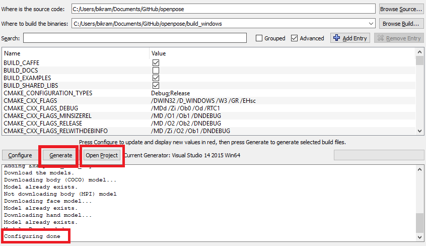

OpenPose - Installation
==========================

## Contents
1. [Operating Systems](#operating-systems)
2. [Requirements](#requirements)
3. [Clone OpenPose](#clone-openpose)
4. [Update OpenPose](#update-openpose)
5. [Installation](#installation)
6. [Reinstallation](#reinstallation)
7. [Uninstallation](#uninstallation)
8. [Optional Settings](#optional-settings)
    1. [MPI Model](#mpi-model)
    2. [OpenPose 3D Reconstruction Module and Demo](#openpose-3d-reconstruction-module-and-demo)
    3. [Compiling without cuDNN](#compiling-without-cudnn)
    4. [Custom Caffe (Ubuntu Only)](#custom-caffe-ubuntu-only)
    5. [Custom OpenCV (Ubuntu Only)](#custom-opencv-ubuntu-only)
    6. [Doxygen Documentation Autogeneration (Ubuntu Only)](#doxygen-documentation-autogeneration-ubuntu-only)
    7. [CMake Command Line Configuration (Ubuntu Only)](#cmake-command-line-configuration-ubuntu-only)


## Operating Systems
- **Ubuntu** 14 and 16.
- **Windows** 8 and 10.
- **Nvidia Jetson TX2**, installation instructions in [doc/installation_jetson_tx2.md](./installation_jetson_tx2.md).
- OpenPose has also been used on **Windows 7**, **Mac**, **CentOS**, and **Nvidia Jetson (TK1 and TX1)** embedded systems. However, we do not officially support them at the moment.


## Requirements
- NVIDIA graphics card with at least 1.6 GB available (the `nvidia-smi` command checks the available GPU memory in Ubuntu).
- At least 2 GB of free RAM memory.
- Highly recommended: cuDNN and a CPU with at least 8 cores.

Note: These requirements assume the default configuration (i.e. `--net_resolution "656x368"` and `scale_number 1`). You might need more (with a greater net resolution and/or number of scales) or less resources (with smaller net resolution and/or using the MPI and MPI_4 models).


## Clone OpenPose
The first step is to clone the OpenPose repository.

1. Windows: You might use [GitHub Desktop](https://desktop.github.com/).
2. Ubuntu:
```bash
git clone https://github.com/CMU-Perceptual-Computing-Lab/openpose
```


## Update OpenPose
OpenPose can be easily updated by:

1. Download the latest changes:
    1. Windows: Clicking the `synchronization` button at the top-right part in GitHub Desktop in Windows.
    2. Ubuntu: running `git pull origin master`.
2. Perform the [Reinstallation](#reinstallation) section described below.


## Installation
The instructions in this section describe the steps to build OpenPose using CMake (GUI). There are 3 main steps:

1. [Prerequisites](#prerequisites)
2. [OpenPose Configuration](#openpose-configuration)
3. [OpenPose Building](#openpose-building)
4. [OpenPose from other Projects (Ubuntu Only)](#openpose-from-other-projects-ubuntu-only) 
5. [Run OpenPose](#run-openpose)


### Prerequisites
1. Download and install CMake GUI:
    - Ubuntu: run the command `sudo apt-get install cmake-qt-gui`. Note: If you prefer to use CMake through the command line, see [Cmake Command Line Build](#cmake-command-line-build-ubuntu-only).
    - Windows: download and install the latest CMake win64-x64 msi installer from the [CMake website](https://cmake.org/download/), called `cmake-X.X.X-win64-x64.msi`.
2. [**CUDA 8**](https://developer.nvidia.com/cuda-80-ga2-download-archive):
    - Ubuntu: Run `ubuntu/install_cuda.sh` or alternatively download and install it from their website.
    - Windows: Install CUDA 8.0 after Visual Studio 2015 is installed to assure that the CUDA installation will generate all necessary files for VS. If CUDA was already installed, re-install CUDA after installing VS!
3. [**cuDNN 5.1**](https://developer.nvidia.com/cudnn):
    - Ubuntu: Run `ubuntu/install_cudnn.sh` or alternatively download and install it from their website.
    - Windows (and Ubuntu if manual installation): In order to manually install it, just unzip it and copy (merge) the contents on the CUDA folder, usually `/usr/local/cuda/` in Ubuntu and `C:\Program Files\NVIDIA GPU Computing Toolkit\CUDA\v8.0` in Windows.
3. Ubuntu - Other prerequisites:
    - Caffe prerequisites: By default, OpenPose uses Caffe under the hood. If you have not used Caffe previously, install its dependencies by running `bash ./ubuntu/install_cmake.sh`.
    - OpenCV must be already installed on your machine. It can be installed with `apt-get install libopencv-dev`. You can also use your own compiled OpenCV version.
4. Windows - **Microsoft Visual Studio (VS) 2015 Enterprise Update 3**:
    - If **Visual Studio 2017 Community** is desired, we do not officially support it, but it might be compiled by firstly [enabling CUDA 8.0 in VS2017](https://stackoverflow.com/questions/43745099/using-cuda-with-visual-studio-2017?answertab=active#tab-top) or use **VS2017 with CUDA 9** by checking the `.vcxproj` file and changing the necessary paths from CUDA 8 to 9.
    - VS 2015 Enterprise Update 1 will give some compiler errors and VS 2015 Community has not been tested.


### OpenPose Configuration
1. Open CMake GUI and select the OpenPose directory as project source directory, and a non-existing or empty sub-directory (e.g., `build`) where the Makefile files (Ubuntu) or Visual Studio solution (Windows) will be generated. If `build` does not exist, it will ask you whether to create it. Press `Yes`.
<p align="center">
    
    
</p>

2. Press the `Configure` button, keep the generator in `Unix Makefile` (Ubuntu) or set it to `Visual Studio 14 2015 Win64` (Windows), and press `Finish`.
<p align="center">
    
    
</p>

3. If this step is successful, the `Configuring done` text will appear in the bottom box in the last line. Otherwise, some red text will appear in that same bottom box.
<p align="center">
    
    
</p>

4. Press the `Generate` button and proceed to [OpenPose Building](#openpose-building). You can now close CMake.

Note: If you prefer to use your own custom Caffe or OpenCV versions, see [Custom Caffe](#custom-caffe) or [Custom OpenCV](#custom-opencv) respectively.


### OpenPose Building
#### Ubuntu
Finally, build the project by running the following commands.
```
cd build/
make -j`nproc`
```

#### Windows
In order to build the project, open the Visual Studio solution (Windows), called `build/OpenPose.sln`. Then, set the configuration from `Debug` to `Release` and press the green triangle icon (alternatively press <kbd>F5</kbd>).


### OpenPose from other Projects (Ubuntu Only)
If you only intend to use the OpenPose demo, you might skip this step. This step is only recommended if you plan to use the OpenPose API from other projects.

To install the OpenPose headers and libraries into the system environment path (e.g. `/usr/local/` or `/usr/`), run the following command.
```
cd build/
sudo make install
```

Once the installation is completed, you can use OpenPose in your other project using the `find_package` cmake command. Below, is a small example `CMakeLists.txt`. In order to use this script, you also need to copy `FindGFlags.cmake` and `FindGlog.cmake` into your `<project_root_directory>/cmake/Modules/` (create the directory if necessary).
```
cmake_minimum_required(VERSION 2.8.7)

add_definitions(-std=c++11)

list(APPEND CMAKE_MODULE_PATH "${CMAKE_CURRENT_SOURCE_DIR}/cmake/Modules")

find_package(GFlags)
find_package(Glog)
find_package(OpenCV)
find_package(OpenPose REQUIRED)

include_directories(${OpenPose_INCLUDE_DIRS} ${GFLAGS_INCLUDE_DIR} ${GLOG_INCLUDE_DIR} ${OpenCV_INCLUDE_DIRS})

add_executable(example.bin example.cpp)

target_link_libraries(example.bin ${OpenPose_LIBS} ${GFLAGS_LIBRARY} ${GLOG_LIBRARY} ${OpenCV_LIBS})
```

If Caffe was built with OpenPose, it will automatically find it. Otherwise, you will need to link Caffe again as shown below (otherwise, you might get an error like `/usr/bin/ld: cannot find -lcaffe`).
```
link_directories(<path_to_caffe_installation>/caffe/build/install/lib) 
```

### Run OpenPose
Check OpenPose was properly installed by running it on the default images, video, or webcam: [doc/quick_start.md#quick-start](./quick_start.md#quick-start).


## Reinstallation
In order to re-install OpenPose:
1. (Ubuntu only) If you ran `sudo make install`, then run `sudo make uninstall` in `build/`.
2. Delete the `build/` folder.
3. In CMake GUI, click on `File` --> `Delete Cache`.
4. Follow the [Installation](#installation) steps again.


## Uninstallation
In order to uninstall OpenPose:
1. (Ubuntu only) If you ran `sudo make install`, then run `sudo make uninstall` in `build/`.
2. Remove the OpenPose folder.


### Optional Settings
#### MPI Model
By default, the body MPI model is not downloaded. You can download it by turning on the `DOWNLOAD_MPI_MODEL`. It's slightly faster but less accurate and has less keypoints than the COCO body model.


#### OpenPose 3D Reconstruction Module and Demo
You can include the 3D reconstruction module by:

1. Install the FLIR camera driver and software, Spinnaker SDK. It is a propietary software, so we cannot provide direct download link.
    1. Ubuntu: Get and install the latest Spinnaker SKD version in their default path. OpenPose will automatically find it. Otherwise, set the right path with CMake.
    2. Windows: Donwload the latest Spinnaker SKD version from [https://www.ptgrey.com/support/downloads](https://www.ptgrey.com/support/downloads).
        - Copy `{PointGreyParentDirectory}\Point Grey Research\Spinnaker\bin64\vs2015\` as `{OpenPoseDirectory}\3rdparty\windows\spinnaker\bin\`. You can remove all the *.exe files.
        - Copy `{PointGreyParentDirectory}\Point Grey Research\Spinnaker\include\` as `{OpenPoseDirectory}\3rdparty\windows\spinnaker\include\`.
        - Copy `Spinnaker_v140.lib` and `Spinnakerd_v140.lib` from `{PointGreyParentDirectory}\Point Grey Research\Spinnaker\lib64\vs2015\` into `{OpenPoseDirectory}\3rdparty\windows\spinnaker\lib\`.
        - (Optional) Spinnaker SDK overview: [https://www.ptgrey.com/spinnaker-sdk](https://www.ptgrey.com/spinnaker-sdk).
2. Install the 3D visualizer, FreeGLUT:
    1. Ubuntu: run `sudo apt-get install freeglut3 freeglut3-dev libxmu-dev libxi-dev`.
    2. Windows:
        1. It is automatically downloaded by the CMake installer.
        2. Alternatively, if you prefer to download it yourself, you could either:
            1. Double click on `3rdparty\windows\getFreeglut.bat`.
            2. Download [this version from our server](http://posefs1.perception.cs.cmu.edu/OpenPose/3rdparty/windows/freeglut_2018_01_14.zip) and unzip it in `{OpenPoseDirectory}\3rdparty\windows\freeglut\`.
            3. Download the latest `MSVC Package` from [http://www.transmissionzero.co.uk/software/freeglut-devel/](http://www.transmissionzero.co.uk/software/freeglut-devel/).
                - Copy `{freeglutParentDirectory}\freeglut\bin\x64\` as `{OpenPoseDirectory}\3rdparty\windows\freeglut\bin\`.
                - Copy `{freeglutParentDirectory}\freeglut\include\` as `{OpenPoseDirectory}\3rdparty\windows\freeglut\include\`.
                - Copy `{freeglutParentDirectory}\freeglut\lib\x64\` as `{OpenPoseDirectory}\3rdparty\windows\freeglut\lib\`.
3. Follow the CMake installation steps, and set the `BUILD_MODULE_3D` option.
4. In Windows, after openning the OpenPose visual studio solution:
    1. Right-click on `Solution 'OpenPose'` of the `Solution Explorer` window, usually placed at the top-right part of the VS screen.
    2. Click on `Properties`. Go to `Configuration Properties` -> `Configuration` and check `Build` for the `OpenPose3DReconstruction` project.

After installation, check the [doc/openpose_3d_reconstruction_demo.md](./openpose_3d_reconstruction_demo.md) instructions.


#### Compiling without cuDNN
The [cuDNN](https://developer.nvidia.com/cudnn) library is not mandatory, but required for full keypoint detection accuracy. In case your graphics card is not compatible with cuDNN, you can disable it by unchecking `USE_CUDNN` in CMake.

Then, you would have to reduce the `--net_resolution` flag to fit the model into the GPU memory. You can try values like `640x320`, `320x240`, `320x160`, or `160x80` to see your GPU memory capabilities. After finding the maximum approximate resolution that your GPU can handle without throwing an out-of-memory error, adjust the `net_resolution` ratio to your image or video to be processed (see the `--net_resolution` explanation from [doc/demo_overview.md](./demo_overview.md)), or use `-1` (e.g. `--net_resolution -1x320`).


#### Custom Caffe (Ubuntu Only)
We only modified some Caffe compilation flags and minor details. You can use your own Caffe distribution, simply specify the Caffe include path and the library as shown below. You will also need to turn off the `BUILD_CAFFE` variable. Note that cuDNN is required in order to get the maximum possible accuracy in OpenPose.
<p align="center">
    
</p>


#### Custom OpenCV (Ubuntu Only)
If you have built OpenCV from source and OpenPose cannot find it automatically, you can set the `OPENCV_DIR` variable to the directory where you build OpenCV.


#### Doxygen Documentation Autogeneration (Ubuntu Only)
You can generate the documentation by setting the `BUILD_DOCS` flag. The documentation will be generated in `doc/doxygen/html/index.html`. You can simply open it with double-click (your default browser should automatically display it).


#### CMake Command Line Configuration (Ubuntu Only)
Note that this step is unnecessary if you already used the CMake GUI alternative.

Create a `build` folder in the root OpenPose folder, where you will build the library --
```bash
cd openpose
mkdir build
cd build
```

The next step is to generate the Makefiles. Now there can be multiple scenarios based on what the user already has e.x. Caffe might be already installed and the user might be interested in building OpenPose against that version of Caffe instead of requiring OpenPose to build Caffe from scratch.

##### SCENARIO 1 -- Caffe not installed and OpenCV installed using `apt-get`
In the build directory, run the below command --
```bash
cmake ..
```

##### SCENARIO 2 -- Caffe installed and OpenCV build from source
In this example, we assume that Caffe and OpenCV are already present. The user needs to supply the paths of the libraries and the include directories to CMake. For OpenCV, specify the include directories and the libraries directory using `OpenCV_INCLUDE_DIRS` and `OpenCV_LIBS_DIR` variables respectively. Alternatively, the user can also specify the path to the `OpenCVConfig.cmake` file by setting the `OpenCV_CONFIG_FILE` variable. For Caffe, specify the include directory and library using the `Caffe_INCLUDE_DIRS` and `Caffe_LIBS` variables. This will be where you installed Caffe. Below is an example of the same.
```bash
cmake -DOpenCV_INCLUDE_DIRS=/home/"${USER}"/softwares/opencv/build/install/include \
  -DOpenCV_LIBS_DIR=/home/"${USER}"/softwares/opencv/build/install/lib \
  -DCaffe_INCLUDE_DIRS=/home/"${USER}"/softwares/caffe/build/install/include \
  -DCaffe_LIBS=/home/"${USER}"/softwares/caffe/build/install/lib/libcaffe.so -DBUILD_CAFFE=OFF ..
```

```bash
cmake -DOpenCV_CONFIG_FILE=/home/"${USER}"/softwares/opencv/build/install/share/OpenCV/OpenCVConfig.cmake \
  -DCaffe_INCLUDE_DIRS=/home/"${USER}"/softwares/caffe/build/install/include \
  -DCaffe_LIBS=/home/"${USER}"/softwares/caffe/build/install/lib/libcaffe.so -DBUILD_CAFFE=OFF ..
```

##### SCENARIO 3 -- OpenCV already installed
If Caffe is not already present but OpenCV is, then use the below command.
```bash
cmake -DOpenCV_INCLUDE_DIRS=/home/"${USER}"/softwares/opencv/build/install/include \
  -DOpenCV_LIBS_DIR=/home/"${USER}"/softwares/opencv/build/install/lib ..
```

```bash
cmake -DOpenCV_CONFIG_FILE=/home/"${USER}"/softwares/opencv/build/install/share/OpenCV/OpenCVConfig.cmake ..
```
