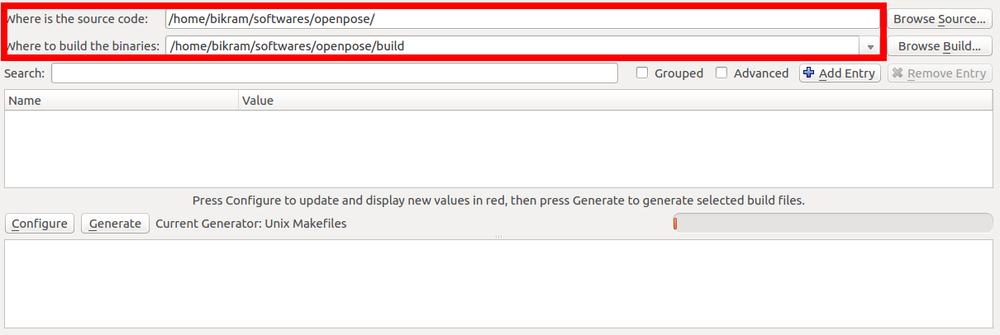
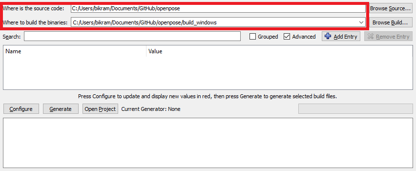
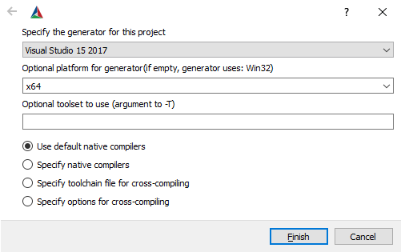

OpenPose Doc - Installation
==========================

## Contents
1. [Operating Systems, Requirements, and Dependencies](#operating-systems-requirements-and-dependencies)
2. [Windows Portable Demo](#windows-portable-demo)
3. [Compiling and Running OpenPose from Source](#compiling-and-running-openpose-from-source)
    1. [Problems and Errors Installing OpenPose](#problems-and-errors-installing-openpose)
    2. [Prerequisites](#prerequisites)
    3. [Clone OpenPose](#clone-openpose)
    4. [CMake Configuration](#cmake-configuration)
    5. [Compilation](#compilation)
    6. [Running OpenPose](#running-openpose)
    7. [Custom User Code](#custom-user-code)
4. [Compiling and Running OpenPose from Source on ROS, Docker, and Google Colab - Community-Based Work](#compiling-and-running-openpose-from-source-on-ros-docker-and-google-colab-community-based-work)
5. [Uninstalling, Reinstalling, or Updating OpenPose](#Uninstalling-reinstalling-or-updating-openpose)
6. [Additional Settings (Optional)](#additional-settings-optional)


## Operating Systems, Requirements, and Dependencies
- Operating Systems
    - **Windows 10**.
    - **Ubuntu 20**.
    - **Mac OSX** Mavericks and above.
    - **Ubuntu 14, 16 and 18** as well as **Windows 7 and 8** are no longer officially maintained. However, they should still work (but might require minor changes).
    - **Nvidia Jetson TX1** (for JetPack 3.1), installation instructions in [doc/installation/jetson_tx/installation_jetson_tx1.md](jetson_tx/installation_jetson_tx1.md).
    - **Nvidia Jetson TX2** (for JetPack 3.1 or 3.3), installation instructions in [doc/installation/jetson_tx/installation_jetson_tx2_jetpack3.1.md](jetson_tx/installation_jetson_tx2_jetpack3.1.md) and [doc/installation/jetson_tx/installation_jetson_tx2_jetpack3.3.md](jetson_tx/installation_jetson_tx2_jetpack3.3.md) respectively.
    - OpenPose has also been used on **CentOS** and other **Nvidia Jetson (TK1)** embedded systems. However, we do not officially support them at the moment.
- **Requirements** for the default configuration
    - CUDA (Nvidia GPU) version:
        - NVIDIA graphics card with at least 1.6 GB available (the `nvidia-smi` command checks the available GPU memory in Ubuntu).
        - At least 2.5 GB of free RAM memory for BODY_25 model or 2 GB for COCO model (assuming cuDNN installed).
        - Highly recommended: cuDNN.
    - OpenCL (AMD GPU) version:
        - Vega series graphics card
        - At least 2 GB of free RAM memory.
    - CPU-only (no GPU) version:
        - Around 8GB of free RAM memory.
    - Highly recommended: a CPU with at least 8 cores.
- Advanced tip: You might need more resources with a greater `--net_resolution` and/or `scale_number` or less resources by reducing the net resolution and/or using the MPI and MPI_4 models.
- **Dependencies**:
    - OpenCV (all 2.X and 3.X versions are compatible).
    - Caffe and all its dependencies. Have you ported OpenPose into another DL framework (Tensorflow, Caffe2, Pytorch, ...)?. Email us (gines@alumni.cmu.edu) or feel free to make a pull request if you implemented any of those!
    - The demo and tutorials additionally use GFlags.


## Windows Portable Demo
**If you just want to use OpenPose** without compiling or writing any code, simply use the latest portable version of OpenPose for Windows.
1. For maximum speed, you should use OpenPose in a machine with a Nvidia GPU version. If so, you must upgrade your Nvidia drivers to the latest version (in the Nvidia "GeForce Experience" software or its [website](https://www.nvidia.com/Download/index.aspx)).
2. Download the latest OpenPose version from the [Releases](https://github.com/CMU-Perceptual-Computing-Lab/openpose/releases) section.
3. Follow the `Instructions.txt` file inside the downloaded zip file to download the models required by OpenPose (about 500 Mb).
4. Then, you can run OpenPose from the PowerShell command-line by following [doc/01_demo.md](../01_demo.md).

Note: If you are using the GPU-accelerated version and are seeing `Cuda check failed (3 vs. 0): initialization error` when running OpenPose, you can fix it by doing one of these:
- Upgrade your Nvidia drivers. If the error persists, make sure your machine does not contain any CUDA version (or if so, that it's the same than the OpenPose portable demo files). Otherwise, uninstall that CUDA version. If you need to keep that CUDA version installed, follow [Compiling and Running OpenPose from Source](#compiling-and-running-openpose-from-source) for that particular CUDA version instead.
- Download an older OpenPose version (v1.6.0 does not show this error).


## Compiling and Running OpenPose from Source
The instructions in the following subsections describe the steps to build OpenPose using CMake-GUI. These instructions are only recommended if you plan to modify the OpenPose code or integrate it with another library or project. You can stop reading this document if you just wanted to run OpenPose on Windows without compiling or modifying any code.


### Problems and Errors Installing OpenPose
Any problem installing OpenPose while following this guidelines? Check [doc/05_faq.md](../05_faq.md) and/or check existing GitHub issues. If you do you find your issue, post a new one. We will not respond to duplicated issues, as well as GitHub issues about Caffe, OpenCV or CUDA installation errors, as well as issues that do not fill all the information that the GitHub template asks for.


### Prerequisites
Make sure to download and install the [prerequisites for your particular operating system](1_prerequisites.md).


### Clone OpenPose
The first step is to clone the OpenPose repository.

1. Windows: You might use [GitHub Desktop](https://desktop.github.com/) or clone it from Powershell.
2. Ubuntu, Mac, or Windows Powershell:
```bash
git clone https://github.com/CMU-Perceptual-Computing-Lab/openpose
cd openpose/
git submodule update --init --recursive --remote
```


### CMake Configuration
1. Go to the OpenPose folder and open CMake-GUI from it. On Windows, double click on CMake-gui. On Ubuntu, Mac, or Windows Powershell:
```
cd {OpenPose_folder}
mkdir build/
cd build/
cmake-gui ..
```
2. Select the OpenPose directory as project source directory, and a non-existing or empty sub-directory (e.g., `build`) where the Makefile files (Ubuntu) or Visual Studio solution (Windows) will be generated. If `build` does not exist, it will ask you whether to create it. Press `Yes`.
<p align="center">
    
    
</p>

3. Press the `Configure` button, keep the generator in `Unix Makefiles` (Ubuntu) or set it to your 64-bit Visual Studio version (Windows), and press `Finish`. Note for Windows users: CMake-GUI has changed their design after version 14. For versions older than 14, you usually select `Visual Studio XX 20XX Win64` as the generator (`X` depends on your VS version), while the `Optional toolset to use` must be empty. However, new CMake versions require you to select only the VS version as the generator, e.g., `Visual Studio 16 2019`, and then you must manually choose `x64` for the `Optional platform for generator`. See the following images as example.
<p align="center">
    
    
    
</p>

4. Enabling Python (optional step, only apply it if you plan to use the Python API): Enable the `BUILD_PYTHON` flag and click `Configure` again.

5. Set the `GPU_MODE` flag to the proper value and click `Configure` again:
    1. If your machine has an Nvidia GPU, you should most probably not modify this flag and skip this step. Cases in which you might have to change it:
        - If you have a Nvidia GPU with 2GB of memory or less: Then you will have to follow some of the tricks in [doc/06_maximizing_openpose_speed.md](../06_maximizing_openpose_speed.md) or change `GPU_MODE` back to `CPU_ONLY`.
        - If you cannot install CUDA, then you can also set `GPU_MODE` to `CPU_ONLY`.
    2. Mac OSX and machines with a non-Nvidia GPU (Intel or AMD GPUs): Set the `GPU_MODE` flag to `CPU_ONLY` (easier to install but slower runtime) or `OPENCL` (GPU-accelerated, it is harder to install but provides a faster runtime speed). For more details on OpenCV support, see [doc/1_prerequisites.md](1_prerequisites.md) and [OpenCL Version](#opencl-version).
    3. If your machine does not have any GPU, set the `GPU_MODE` flag to `CPU_ONLY`.

6. If this step is successful, the `Configuring done` text will appear in the bottom box in the last line. Otherwise, some red text will appear in that same bottom box.
<p align="center">
    
    
</p>

7. Press the `Generate` button and proceed to [Compilation](#compilation). You can now close CMake.

Note: For other optional and custom options (e.g., using your custom Caffe or OpenCV versions), see the [Additional Settings (Optional)](2_additional_settings.md) documentation.


### Compilation
#### Ubuntu
Run the following commands in your terminal.
```bash
cd build/
make -j`nproc`
```

#### Mac
Run the following commands in your terminal:
```bash
cd build/
make -j`sysctl -n hw.logicalcpu`
```
Advanced tip: Mac provides both `logicalcpu` and `physicalcpu`, but we want the logical number for maximum speed.

If the default compilation fails with Caffe errors, install Caffe separately and set `BUILD_CAFFE` to false in the CMake config. Steps:
- Re-create the build folder: `rm -rf build; mkdir build; cd build`.
- `brew uninstall caffe` to remove the version of Caffe previously installed via cmake.
- `brew install caffe` to install Caffe separately.
- Run `cmake-gui` and make the following adjustments to the cmake config:
    1. `BUILD_CAFFE` set to false.
    2. `Caffe_INCLUDE_DIRS` set to `/usr/local/include/caffe`.
    3. `Caffe_LIBS` set to `/usr/local/lib/libcaffe.dylib`.
    4. Run `Configure` and `Generate` from CMake GUI.

If you face an OpenCV error during compiling time similar to `fatal error: 'opencv2/highgui/highgui.hpp' file not found`, please apply the following patch (this error has been reported in the latest OSX 10.14):
```bash
cd 3rdparty/caffe; git apply ../../scripts/osx/mac_opencl_patch.txt
```

#### Windows
In order to build the project, select and run only one of the 2 following alternatives.

- **CMake-GUI alternative (recommended)**:
    1. Open the Visual Studio solution (Windows) by clicking in `Open Project` in CMake (or alternatively `build/OpenPose.sln`). Then, set the configuration from `Debug` to `Release`.
    2. Press <kbd>F7</kbd> (or `Build` menu and click on `Build Solution`).
    3. **Important for Python version**: Make sure not to skip step 2, it is not enough to click on <kbd>F5</kbd> (Run), you must also `Build Solution` for the Python bindings to be generated.
    4. After it has compiled, and if you have a webcam, you can press the green triangle icon (alternatively <kbd>F5</kbd>) to run the OpenPose demo with the default settings on the webcam.

- Command-line build alternative (not recommended). NOTE: The command line alternative is not officially supported, but it was added in [GitHub issue #1198](https://github.com/CMU-Perceptual-Computing-Lab/openpose/issues/1198). For any questions or bug report about this command-line version, comment in that GitHub issue.
    1. Run "MSVS 2019 Developer Command Console"
    ```batch
    openpose\mkdir  build
    cd build
    cmake .. -G "Visual Studio 16 2019" -A x64 -T v142
    cmake --build . --config Release
    copy x64\Release\*  bin\
    ```
    2. If you want to clean build
    ```batch
    cmake --clean-first .
    cmake --build . --config Release
    copy x64\Release\*  bin\
    ```

**VERY IMPORTANT NOTE**: In order to use OpenPose outside Visual Studio, and assuming you have not unchecked the `BUILD_BIN_FOLDER` flag in CMake, copy all DLLs from `{build_directory}/bin` into the folder where the generated `openpose.dll` and `*.exe` demos are, e.g., `{build_directory}x64/Release` for the 64-bit release version.

If you are facing errors with these instructions, these are a set of alternative instructions created by the community:
- OpenPose for Windows 10, Visual Studio 2019, CMake, and Nvidia GPU: [https://github.com/quickgrid/Build-Guide/blob/master/README.md#windows-10-cmu-openpose-setup-visual-studio-2019-cmake-nvidia-gpu](https://github.com/quickgrid/Build-Guide/blob/master/README.md#windows-10-cmu-openpose-setup-visual-studio-2019-cmake-nvidia-gpu).
- Video-tutorial: OpenPose + Visual Studio 2017 + CUDA 10.0 + cuDNN 7.5 (no portable demo): [https://youtu.be/QC9GTb6Wsb4](https://youtu.be/QC9GTb6Wsb4). For questions, post in GitHub issue #1426.

We welcome users to send us their installation videos (e.g., sharing them as GitHub issue or doing a pull request) and we will post them here.


### Running OpenPose
Check OpenPose was properly installed by running any demo example: [doc/01_demo.md](../01_demo.md).


### Custom User Code
You can quickly add your custom code so that quick prototypes can be easily tested without having to create a whole new project just for it. See [examples/user_code/README.md](https://github.com/CMU-Perceptual-Computing-Lab/openpose/blob/master/examples/user_code/README.md) for more details.


## Compiling and Running OpenPose from Source on ROS, Docker, and Google Colab - Community-Based Work
If you do not want to use the Windows portable binaries nor compile it from source code, we add links to some community-based work based on OpenPose. Note: We do not support them, and we will remove new GitHub issues opened asking about them as well as block those users from posting again. If you face any issue, comment only in the GitHub issues links especified below, or ask the owner of them.

- ROS examples:
    - [ROS example 1](https://github.com/ravijo/ros_openpose). For questions and more details, read and post ONLY on [issue thread #891](https://github.com/CMU-Perceptual-Computing-Lab/openpose/issues/891).
    - [ROS example 2](https://github.com/firephinx/openpose_ros) (based on a very old OpenPose version). For questions and more details, read and post ONLY on [issue thread #51](https://github.com/CMU-Perceptual-Computing-Lab/openpose/issues/51).

- Docker Images. For questions and more details, read and post ONLY on [issue thread #347](https://github.com/CMU-Perceptual-Computing-Lab/openpose/issues/347).
    - Dockerfile working also with CUDA 10:
        - Option 1:
            - 1. If necessary, install the latest version of docker. There are extra steps, but if you are on Ubuntu, the main one is `sudo apt-get install docker-ce`. The other steps can be found [here](https://phoenixnap.com/kb/how-to-install-docker-on-ubuntu-18-04).
            - 2. `docker pull exsidius/openpose` - [Guide](https://github.com/gormonn/openpose-docker/blob/master/README.md).
            - 3. [More details here](https://cloud.docker.com/repository/docker/exsidius/openpose/general).
        - [Link 2](https://github.com/esemeniuc/openpose-docker), it claims to also include Python support. Read and post ONLY on [issue thread #1102](https://github.com/CMU-Perceptual-Computing-Lab/openpose/issues/1102).
        - [Link 3](https://github.com/ExSidius/openpose-docker/blob/master/Dockerfile).
        - [Link 4](https://cloud.docker.com/repository/docker/exsidius/openpose/general).
    - Dockerfile working only with CUDA 8:
        - [Dockerfile - OpenPose v1.4.0, OpenCV, CUDA 8, CuDNN 5, Python2.7](https://github.com/tlkh/openpose). Read and post ONLY on [issue thread #1102](https://github.com/CMU-Perceptual-Computing-Lab/openpose/issues/1102).
        - [Dockerfile - OpenPose v1.4.0, OpenCV, CUDA 8, CuDNN 6, Python2.7](https://gist.github.com/moiseevigor/11c02c694fc0c22fccd59521793aeaa6).
        - [Dockerfile - OpenPose v1.2.1](https://gist.github.com/sberryman/6770363f02336af82cb175a83b79de33).

- Google Colab helper scripts: Script to install OpenPose on Google Colab. Really useful when access to a computer powerful enough to run OpenPose is not possible, so one possible way to use OpenPose is to build it on a GPU-enabled Colab runtime and then run the programs there.
    - [Google Colab with Openpose 1.7.0](https://colab.research.google.com/github/miu200521358/motion_trace_colab/blob/master/OpenposeDemo.ipynb): For questions and more details, read and post ONLY on [issue thread #949](https://github.com/CMU-Perceptual-Computing-Lab/openpose/issues/949).
    - [Google Colab 2/3](https://github.com/CMU-Perceptual-Computing-Lab/openpose/issues/1736#issuecomment-736846794): For questions and more details, read and post ONLY on [issue thread #1736](https://github.com/CMU-Perceptual-Computing-Lab/openpose/issues/1736).
    - [Google Colab 3/3](https://github.com/CMU-Perceptual-Computing-Lab/openpose/issues/949#issue-387855863): For questions and more details, read and post ONLY on [issue thread #949](https://github.com/CMU-Perceptual-Computing-Lab/openpose/issues/949).


## Uninstalling, Reinstalling, or Updating OpenPose
OpenPose can be easily uninstalled:
1. (Ubuntu and Mac) If you ran `sudo make install` (which we do not recommend), then run `sudo make uninstall` in `build/`.
2. Remove the OpenPose folder.

In order to update it or reinstall it:
1. Follow the above steps to uninstall it.
2. Follow the [Compiling and Running OpenPose from Source](#compiling-and-running-openpose-from-source) steps again.


## Additional Settings (Optional)
Check the [Additional Settings (Optional)](2_additional_settings.md) documentation if you want to:
1. [Deploy or Export OpenPose to Other Projects](2_additional_settings.md#deploy-or-export-openpose-to-other-projects)
2. [Maximum Speed](2_additional_settings.md#maximum-speed)
3. [Faster CPU Version (Ubuntu Only)](2_additional_settings.md#faster-cpu-version-ubuntu-only)
4. [OpenCL Version](2_additional_settings.md#opencl-version)
5. [COCO and MPI Models](2_additional_settings.md#coco-and-mpi-models)
6. [3D Reconstruction Module](2_additional_settings.md#3d-reconstruction-module)
7. [Calibration Module](2_additional_settings.md#calibration-module)
8. [Unity Compatible Version](2_additional_settings.md#unity-compatible-version)
9. [Compile without cuDNN](2_additional_settings.md#compiling-without-cudnn)
10. [Custom Caffe](2_additional_settings.md#custom-caffe)
11. [Custom NVIDIA NVCaffe](2_additional_settings.md#custom-nvidia-nvcaffe)
12. [Custom OpenCV](2_additional_settings.md#custom-opencv)
13. [Doxygen Documentation Autogeneration (Ubuntu Only)](2_additional_settings.md#doxygen-documentation-autogeneration-ubuntu-only)
14. [CMake Command Line Configuration (Ubuntu Only)](2_additional_settings.md#cmake-command-line-configuration-ubuntu-only)
