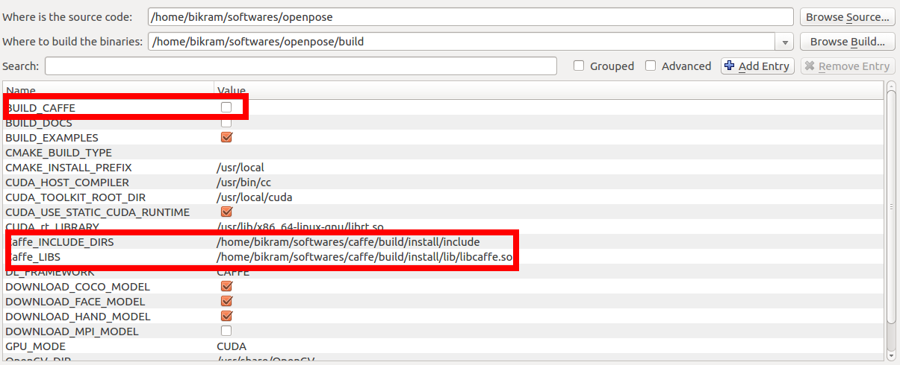

OpenPose Doc - Installation - Additional Settings (Optional)
==========================

## Contents
1. [Additional Settings (Optional)](#advanced-additional-settings-optional)
    1. [Deploy or Export OpenPose to Other Projects](#deploy-or-export-openpose-to-other-projects)
    2. [Maximum Speed](#maximum-speed)
    3. [Faster CPU Version (Ubuntu Only)](#faster-cpu-version-ubuntu-only)
    4. [OpenCL Version](#opencl-version)
    5. [COCO and MPI Models](#coco-and-mpi-models)
    6. [3D Reconstruction Module](#3d-reconstruction-module)
    7. [Calibration Module](#calibration-module)
    8. [Unity Compatible Version](#unity-compatible-version)
    9. [Compile without cuDNN](#compile-without-cudnn)
    10. [Custom Caffe](#custom-caffe)
    11. [Custom NVIDIA NVCaffe](#custom-nvidia-nvcaffe)
    12. [Custom OpenCV](#custom-opencv)
    13. [Doxygen Documentation Autogeneration (Ubuntu Only)](#doxygen-documentation-autogeneration-ubuntu-only)
    14. [CMake Command Line Configuration (Ubuntu Only)](#cmake-command-line-configuration-ubuntu-only)


## Additional Settings (Optional)
### Deploye or Exporte OpenPose to Other Projects
See [doc/advanced/deployment.md](../advanced/deployment.md).


### Maximum Speed
Check the OpenPose Benchmark as well as some hints to speed up and/or reduce the memory requirements to run OpenPose on [doc/06_maximizing_openpose_speed.md](../06_maximizing_openpose_speed.md).


### Faster CPU Version (Ubuntu Only)
**NOTE**: The accuracy of the CPU/OpenCL versions is a bit lower than CUDA version, so the results will very slightly vary. In practice, the different is barely noticeable, so you are safe using these.

This step is only supported for Intel CPUs on Ubuntu versions 16 and 14. It does not compile on Ubuntu 20, and we have not tested it on Ubuntu 18.

After setting the `GPU_MODE` flag to `CPU_ONLY` and clicking `Configured`, search for `USE_MKL` and set it to true. Then, click `Configure` again. This way, OpenPose will link against the Intel MKL version (Math Kernel Library) of Caffe. This speeds up CPU version on Ubuntu roughly about 2-3x, making it as fast as the Windows CPU-only version.

The default CPU version takes about 0.2 images per second on Ubuntu (~50x slower than GPU) while the MKL version provides a roughly 2x speedup at ~0.4 images per second. As of now OpenPose does not support MKL on Windows but will at a later date. Also, MKL version does not support unfixed resolution. So a folder of images of different resolutions requires a fixed net resolution (e.g., `--net_resolution 656x368`).

For MKL, the user can configure the environmental variables `MKL_NUM_THREADS` and `OMP_NUM_THREADS`. They are set at an optimum parameter level by default (i.e., to the number of threads of the machine). However, they can be tweak by running the following commands into the terminal window, right before running any OpenPose application. Eg:

```bash
# Optimal number = Number of threads (used by default)
export MKL_NUM_THREADS="8"
export OMP_NUM_THREADS="8"
```

Increasing the number of threads results in a higher RAM memory usage. You can check the [doc/06_maximizing_openpose_speed.md](../06_maximizing_openpose_speed.md) for more information about speed and memory requirements in several CPUs and GPUs.


### OpenCL Version
**NOTE**: The accuracy of the CPU/OpenCL versions is a bit lower than CUDA version, so the results will very slightly vary. In practice, the different is not barely noticeable, so you are safe using these.

If you have an AMD graphics card, you can compile OpenPose with the OpenCL option. To manually select the OpenCL Version, open CMake GUI mentioned above, and set the `GPU_MODE` flag to `OPENCL` (or non-UI CMake with `GPU_MODE=OPENCL`). **Very important:** If you compiled previously the CPU-only or CUDA versions on that same OpenPose folder, you will have to manually delete the `build` directory and run the installation steps from scratch. Otherwise, many weird errors will appear.

The OpenCL version has been tested on Ubuntu, Windows and OSX. This has been tested only on AMD Vega series and NVIDIA 10 series graphics cards. Please email us if you have issues with other operating systems or graphics cards. Running on OSX on a Mac with an AMD graphics card requires special instructions which can be seen in the section below.

Lastly, OpenCL version does not support unfixed `--net_resolution`. So a folder of images of different resolutions with OpenPose, requires the `--net_resolution 656x368` flag for example. This should be fixed by the Caffe author in a future patch.


### COCO and MPI Models
By default, the body `COCO` and `MPI` models are not downloaded (they are slower and less accurate than `BODY_25`, so not useful in most cases!). But you can download them by turning on the `DOWNLOAD_BODY_COCO_MODEL` or `DOWNLOAD_BODY_MPI_MODEL` flags. Check the differences between these models in [doc/05_faq.md#difference-between-body_25-vs-coco-vs-mpi](../05_faq.md#difference-between-body_25-vs-coco-vs-mpi).


### 3D Reconstruction Module
You can include the 3D reconstruction module by:

1. Install the FLIR camera software, Spinnaker SDK. It is a proprietary software, so we cannot provide direct download link. Note: You might skip this step if you intend to use the 3-D OpenPose module with a different camera brand.
    1. Ubuntu: Get and install the latest Spinnaker SKD version in their default path. OpenPose will automatically find it. Otherwise, set the right path with CMake.
    2. Windows: Download the latest Spinnaker SKD version from [https://www.ptgrey.com/support/downloads](https://www.ptgrey.com/support/downloads).
        - Copy `{PointGreyParentDirectory}\Point Grey Research\Spinnaker\bin64\vs2015\` as `{OpenPoseDirectory}\3rdparty\windows\spinnaker\bin\`. You can remove all the *.exe files.
        - Copy `{PointGreyParentDirectory}\Point Grey Research\Spinnaker\include\` as `{OpenPoseDirectory}\3rdparty\windows\spinnaker\include\`.
        - Copy `Spinnaker_v140.lib` and `Spinnakerd_v140.lib` from `{PointGreyParentDirectory}\Point Grey Research\Spinnaker\lib64\vs2015\` into `{OpenPoseDirectory}\3rdparty\windows\spinnaker\lib\`.
        - (Optional) Spinnaker SDK overview: [https://www.ptgrey.com/spinnaker-sdk](https://www.ptgrey.com/spinnaker-sdk).
2. Install the 3D visualizer, FreeGLUT:
    1. Ubuntu: run `sudo apt-get update && sudo apt-get install build-essential freeglut3 freeglut3-dev libxmu-dev libxi-dev` and reboot your PC.
    2. Windows:
        1. It is automatically downloaded by the CMake installer.
        2. Alternatively, if you prefer to download it yourself, you could either:
            1. Double click on `3rdparty\windows\getFreeglut.bat`.
            2. Download [this version from our server](http://posefs1.perception.cs.cmu.edu/OpenPose/3rdparty/windows/freeglut_2018_01_14.zip) and unzip it in `{OpenPoseDirectory}\3rdparty\windows\freeglut\`.
            3. Download the latest `MSVC Package` from [http://www.transmissionzero.co.uk/software/freeglut-devel/](http://www.transmissionzero.co.uk/software/freeglut-devel/).
                - Copy `{freeglutParentDirectory}\freeglut\bin\x64\` as `{OpenPoseDirectory}\3rdparty\windows\freeglut\bin\`.
                - Copy `{freeglutParentDirectory}\freeglut\include\` as `{OpenPoseDirectory}\3rdparty\windows\freeglut\include\`.
                - Copy `{freeglutParentDirectory}\freeglut\lib\x64\` as `{OpenPoseDirectory}\3rdparty\windows\freeglut\lib\`.
3. Follow the CMake installation steps. In addition, set the `WITH_FLIR_CAMERA` (only if Spinnaker was installed) and `WITH_3D_RENDERER` options.
4. Increased accuracy with Ceres solver (Ubuntu only): For extra 3-D reconstruction accuracy, run `sudo apt-get install libeigen3-dev`, install [Ceres solver](http://ceres-solver.org/installation.html), and enable `WITH_CERES` in CMake when installing OpenPose. Ceres is harder to install in Windows, so we have not tested it so far in there. Feel free to make a pull request if you do.

After installation, check the [doc/advanced/3d_reconstruction_module.md](../advanced/3d_reconstruction_module.md) instructions.


### Calibration Module
The intrinsic camera calibration toolbox is included by default.

To enable the extrinsic camera parameter estimation toolbox, you must also enable `WITH_EIGEN` in CMake during [CMake Configuration](#cmake-configuration). You can perform any of the 3 following options (but only 1 of them!)
- Recommended: Simply set the `WITH_EIGEN` flag to `AUTOBUILD`. CMake will automatically download Eigen and configure OpenPose to use it. If you prefer to download it manually (or if your firewall blocks CMake from downloading it):
    - [Eigen 3.3.8](http://posefs1.perception.cs.cmu.edu/OpenPose/3rdparty/eigen_2020_11_18.zip): Unzip it as `3rdparty/eigen/`.
- Advanced (not recommended): If you set `WITH_EIGEN` to `FIND`, you must have Eigen already installed in your system. Note that [Eigen <= 3.3.6 is not supported by CUDA >=9.1](https://bitbucket.org/eigen/eigen/commits/034b6c3e101792a3cc3ccabd9bfaddcabe85bb58?at=default). In order to install it (make sure that Eigen version is compatible with CUDA!):
    - Run `sudo apt-get install libeigen3-dev` and link CMake to the right CMake.
- Advanced (not recommended): Or you could also use your own version of Eigen by setting `WITH_EIGEN` to `AUTOBUILD`, click `Configure` to let CMake download the zip file, and replace `3rdparty/eigen/` by your own version.

After installation, check the [doc/advanced/calibration_module.md](../advanced/calibration_module.md) instructions.


### Unity Compatible Version
Check [**Unity Plugin**](https://github.com/CMU-Perceptual-Computing-Lab/openpose_unity_plugin).

However, the OpenPose Unity version will crash if if faces an error while it is not used inside Unity. Thus, do not use it without Unity. Although this version would work as long as no errors occur.


### Compile without cuDNN
The [cuDNN](https://developer.nvidia.com/cudnn) library is not mandatory, but required for full keypoint detection accuracy. In case your graphics card is not compatible with cuDNN, you can disable it by unchecking `USE_CUDNN` in CMake.

Then, you would have to reduce the `--net_resolution` flag to fit the model into the GPU memory. You can try values like `640x320`, `320x240`, `320x160`, or `160x80` to see your GPU memory capabilities. After finding the maximum approximate resolution that your GPU can handle without throwing an out-of-memory error, adjust the `net_resolution` ratio to your image or video to be processed (see the `--net_resolution` explanation from [doc/advanced/demo_advanced.md](../advanced/demo_advanced.md)), or use `-1` (e.g., `--net_resolution -1x320`).


### Custom Caffe
OpenPose uses a [custom fork of Caffe](https://github.com/CMU-Perceptual-Computing-Lab/caffe) (rather than the official Caffe master). Our custom fork is only updated if it works on our machines, but we try to keep it updated with the latest Caffe version. This version works on a newly formatted machine (Ubuntu 16.04 LTS) and in all our machines (CUDA 8 and 10 tested). The default GPU version is the master branch, which it is also compatible with CUDA 10 without changes (official Caffe version might require some changes for it). We also use the OpenCL and CPU tags if their CMake flags are selected. We only modified some Caffe compilation flags and minor details.

Alternatively, you can use your own Caffe distribution on Ubuntu/Mac by 1) disabling `BUILD_CAFFE`, 2) setting `Caffe_INCLUDE_DIRS` to `{CAFFE_PATH}/include/caffe`, and 3) setting `Caffe_LIBS` to `{CAFFE_PATH}/build/lib/libcaffe.so`, as shown in the image below. Note that cuDNN-compatible Caffe version is required in order to get the maximum possible accuracy in OpenPose.
<p align="center">
    
</p>

For Windows, simply replace the OpenCV DLLs and include folder for your custom one.


### Custom NVIDIA NVCaffe
This functionality was added by the community, and we do not officially support it. New pull requests with additional functionality or fixing any bug are welcome!

It has been tested with the official Nvidia Docker image [nvcr.io/nvidia/caffe:18.12-py2](https://ngc.nvidia.com/catalog/containers/nvidia:caffe).

For questions and issues, please only post on the related [Pull Request #1169](https://github.com/CMU-Perceptual-Computing-Lab/openpose/pull/1169). New GitHub issues about this topic (i.e., outside PR #1169) will be automatically closed with no answer.

Windows support has not been added. Replace `set_property(CACHE DL_FRAMEWORK PROPERTY STRINGS CAFFE)` by `set_property(CACHE DL_FRAMEWORK PROPERTY STRINGS CAFFE NV_CAFFE)` in `CMakeLists.txt` if you intend to use it for Windows, and feel free to do a pull request of it working!

To use a NVIDIA's NVCaffe docker image instead of the standard Caffe, set the following CMake flags:

1. Set the `DL_FRAMEWORK` variable to `NV_CAFFE`.
2. Set the `BUILD_CAFFE` variable to `OFF`.
3. Set the correct `Caffe_INCLUDE_DIRS` and `Caffe_LIBS` paths following [Custom Caffe](#custom-caffe).

In addition, [peter-uhrig.de/openpose-with-nvcaffe-in-a-singularity-container-with-support-for-multiple-architectures/](http://peter-uhrig.de/openpose-with-nvcaffe-in-a-singularity-container-with-support-for-multiple-architectures/) contains a detailed step-by-step guide to install a portable container with NVCaffe and support for multiple NVidia cards as well as CPU.


### Custom OpenCV
If you have built OpenCV from source and OpenPose cannot find it automatically, you can set the `OPENCV_DIR` variable to the directory where you build OpenCV (Ubuntu and Mac). For Windows, simply replace the OpenCV DLLs and include folder for your custom one.


### Doxygen Documentation Autogeneration (Ubuntu Only)
You can generate the documentation by setting the `BUILD_DOCS` flag. The documentation will be generated in `doc/doxygen/html/index.html`. You can simply open it with double-click (your default browser should automatically display it).


### CMake Command Line Configuration (Ubuntu Only)
Note that this step is unnecessary if you already used the CMake GUI alternative.

Create a `build` folder in the root OpenPose folder, where you will build the library --
```bash
cd openpose
mkdir build
cd build
```

The next step is to generate the Makefiles. Now there can be multiple scenarios based on what the user already has e.x. Caffe might be already installed and the user might be interested in building OpenPose against that version of Caffe instead of requiring OpenPose to build Caffe from scratch.

#### Scenario 1 - Caffe not installed and OpenCV installed using `apt-get`
In the build directory, run the below command --
```bash
cmake ..
```

#### Scenario 2 - Caffe installed and OpenCV build from source
In this example, we assume that Caffe and OpenCV are already present. The user needs to supply the paths of the libraries and the include directories to CMake. For OpenCV, specify the include directories and the libraries directory using `OpenCV_INCLUDE_DIRS` and `OpenCV_LIBS_DIR` variables respectively. Alternatively, the user can also specify the path to the `OpenCVConfig.cmake` file by setting the `OpenCV_CONFIG_FILE` variable. For Caffe, specify the include directory and library using the `Caffe_INCLUDE_DIRS` and `Caffe_LIBS` variables. This will be where you installed Caffe. Below is an example of the same.
```bash
cmake -DOpenCV_INCLUDE_DIRS=/home/"${USER}"/softwares/opencv/build/install/include \
  -DOpenCV_LIBS_DIR=/home/"${USER}"/softwares/opencv/build/install/lib \
  -DCaffe_INCLUDE_DIRS=/home/"${USER}"/softwares/caffe/build/install/include \
  -DCaffe_LIBS=/home/"${USER}"/softwares/caffe/build/install/lib/libcaffe.so -DBUILD_CAFFE=OFF ..
```

```bash
cmake -DOpenCV_CONFIG_FILE=/home/"${USER}"/softwares/opencv/build/install/share/OpenCV/OpenCVConfig.cmake \
  -DCaffe_INCLUDE_DIRS=/home/"${USER}"/softwares/caffe/build/install/include \
  -DCaffe_LIBS=/home/"${USER}"/softwares/caffe/build/install/lib/libcaffe.so -DBUILD_CAFFE=OFF ..
```

#### Scenario 3 - OpenCV already installed
If Caffe is not already present but OpenCV is, then use the below command.
```bash
cmake -DOpenCV_INCLUDE_DIRS=/home/"${USER}"/softwares/opencv/build/install/include \
  -DOpenCV_LIBS_DIR=/home/"${USER}"/softwares/opencv/build/install/lib ..
```

```bash
cmake -DOpenCV_CONFIG_FILE=/home/"${USER}"/softwares/opencv/build/install/share/OpenCV/OpenCVConfig.cmake ..
```

#### Any Other Scenario
You can check the CMake online documentation to check all the options that CMake provides and its analogs to the CMake-gui ones that we show on this document.
