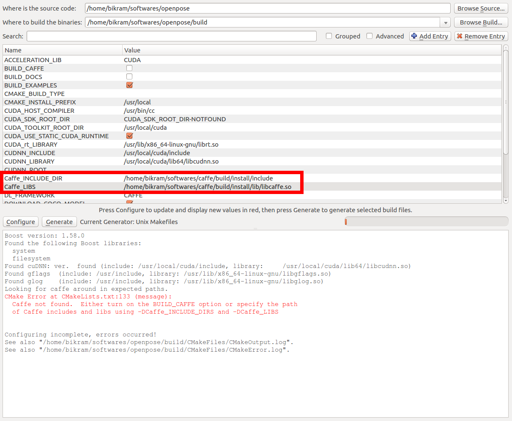

OpenPose - Installation using CMake
====================================

## Contents
1. [Requirements](#requirements)
2. [Clone and Update the Repository](#clone-and-update-the-repository)
3. [Installation](#installation)
    1. [Caffe Prerequisites (Ubuntu Only)](#caffe-prerequisites-ubuntu-only)
    2. [OpenPose Configuration](#openpose-configuration)
    3. [OpenPose Building](#openpose-building)
    4. [Run OpenPose](#run-openpose)


## Requirements
- Ubuntu (tested on 14 and 16). Windows CMake version will come soon.
- NVIDIA graphics card with at least 1.6 GB available (the `nvidia-smi` command checks the available GPU memory in Ubuntu).
- At least 2 GB of free RAM memory.
- Highly recommended: A CPU with at least 8 cores.

Note: These requirements assume the default configuration (i.e. `--net_resolution "656x368"` and `scale_number 1`). You might need more (with a greater net resolution and/or number of scales) or less resources (with smaller net resolution and/or using the MPI and MPI_4 models).


## Clone and Update the Repository
The first step is to clone the OpenPose repository. It might be done with [GitHub Desktop](https://desktop.github.com/) in Windows and from the terminal in Ubuntu:
```bash
git clone https://github.com/CMU-Perceptual-Computing-Lab/openpose
```

OpenPose can be easily updated by clicking the `synchronization` button at the top-right part in GitHub Desktop in Windows, or by running the following command in Ubuntu:
```bash
git pull origin master
```

After the files have been updated, just run the `Reinstallation` section described below for your specific Operating System.


## Installation
The CMake installation is experimental. It will eventually replace the standard and current installation system, but at the moment it is a beta version.

The instructions in this section describe the steps to build OpenPose using CMake. There are 3 main steps:

    1. [Caffe Prerequisites (Ubuntu Only)](#caffe-prerequisites-ubuntu-only)
    2. [OpenPose Configuration](#openpose-configuration)
    3. [OpenPose Building](#openpose-building)


### Caffe Prerequisites (Ubuntu Only)
OpenPose uses Caffe under the hood by default. If you have not used Caffe previously, install its dependencies by running:
```
bash ./ubuntu/install_cmake.sh
```


### OpenPose Configuration
There are two ways to generate the makefiles, either using the CMake GUI program or the command line. Both are described
succinctly in the sections below.


#### CMake GUI
* The first step is to open the CMake GUI. After opening the CMake GUI, the next step is to select the project source directory and a sub-directory where the Makefiles will
be generated. We will first select the openpose directory and then we will select a `build` directory in the project root directory as shown in the image below (See the red rectangle). If the `build` directory does not exists, CMake will create one for us.
  
  
  
* Next press the `Configure` button in the GUI. It will first ask you to create the `build` directory, if it already did not exist. Press `Yes`.
  
  
  
* Next a new dialog box will appear, press the `Finish` button here.
  
  
  
* If this step is successful, in the bottom box it will show "Configuring done" (in the last line) as shown below --
  
  
  
* To generate the Makefiles, press the `Generate` button and proceed to [building OpenPose](#build-the-library).
  
##### Caffe already present 
* If Caffe is already installed and you do not want OpenPose to build Caffe, you can specify the Caffe include path and the library as shown below. You will also need to turn on the `WITH_CAFFE` variable and turn off the `BUILD_CAFFE` variable.
  
  
  
SIDENOTE -- If you have OpenCV build from source and OpenPose cannot find it automatically -- you can set the `OPENCV_DIR` variable to the directory where you build OpenCV.


#### Command Line build
Create a `build` folder in the root openpose folder, where you will build the library --

```bash
cd openpose
mkdir build
cd build
```

The next step is to generate the Makefiles. Now there can be multiple scenarios based on what the user already has e.x. Caffe might be already installed and the user might be interested in building OpenPose against that version of Caffe instead of requiring OpenPose to build Caffe from scratch.

##### SCENARIO 1 -- Caffe not installed and Opencv installed using `apt-get`
In the build directory, run the below command --

```bash
cmake ..
```

##### SCENARIO 2 -- Caffe installed and OpenCV build from source
In this example, we assume that Caffe and OpenCV are already present. The user needs to supply the paths of the library to CMake. For OpenCV, specify the `OpenCV_DIR` which is where the user build OpenCV. For Caffe, specify the include directory and library using the `Caffe_INCLUDE_DIRS` and `Caffe_LIBS` variables. This will be where you installed Caffe. Below is an example of the same.

```bash
cmake -DOpenCV_DIR=/home/"${USER}"/softwares/opencv/build \
  -DCaffe_INCLUDE_DIRS=/home/"${USER}"/softwares/caffe/build/install/include \
  -DCaffe_LIBS=/home/"${USER}"/softwares/caffe/build/install/lib/libcaffe.so -DWITH_CAFFE=ON ..
```

##### SCENARIO 3 -- OpenCV already installed
If Caffe is not already present but OpenCV is, then use the below command.
```bash
cmake -DOpenCV_DIR=/home/"${USER}"/softwares/opencv/build
```


### OpenPose Building
Finally, build the project by running the following commands.
```
cd build/
no_cores=`cat /proc/cpuinfo | grep processor | wc -l`
make -j${no_cores}
```


### Run OpenPose
Check OpenPose was properly installed by running it on the default images, video or webcam: [doc/quick_start.md#quick-start](./quick_start.md#quick-start).
