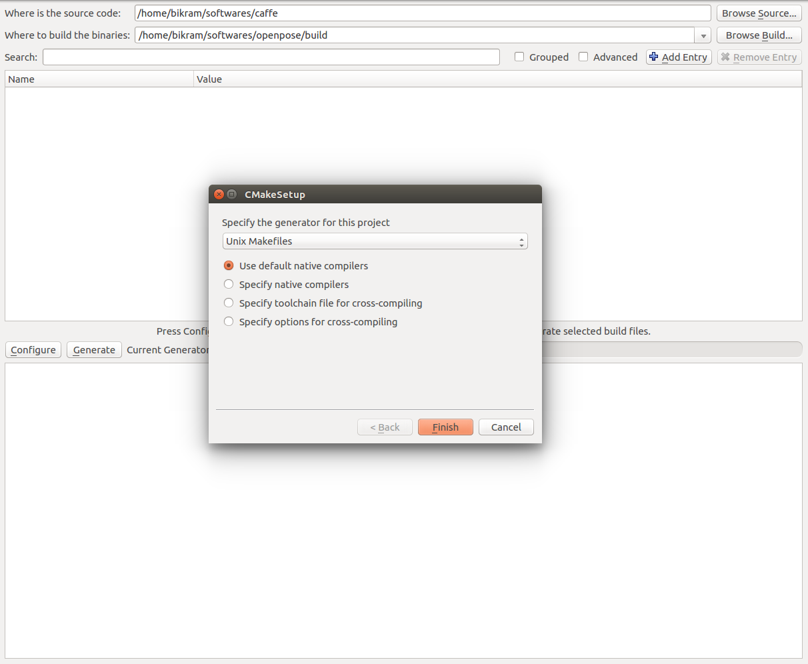

OpenPose - Installation using CMake
====================================

## Contents
1. [Operating Systems](#operating-systems)
2. [Requirements](#requirements)
3. [Clone and Update the Repository](#clone-and-update-the-repository)
4. [Installation](#installation)
    1. [Caffe Prerequisites (Ubuntu Only)](#caffe-prerequisites-ubuntu-only)
    2. [Configuration](#openpose-configuration)
    3. [Building](#openpose-building)
    4. [OpenPose from other Projects](#openpose-from-other-projects) 
    5. [Run OpenPose](#run-openpose)
5. [Reinstallation](#reinstallation)
6. [Uninstallation](#uninstallation)
7. [Optional Settings](#optional-settings)
    1. [Doxygen Documentation Autogeneration](#doxygen-documentation-autogeneration)
    2. [Custom Caffe](#custom-caffe)
    3. [Custom OpenCV](#custom-opencv)
    4. [MPI Model](#mpi-model)
    5. [CMake Command Line Configuration](#cmake-command-line-configuration)


## Operating Systems
- **Ubuntu** 14 and 16.


## Requirements
See [doc/quick_start.md#requirements](./quick_start.md#requirements).


## Clone and Update the Repository
See [doc/quick_start.md#clone-and-update-the-repository](./quick_start.md#clone-and-update-the-repository).


## Installation
The instructions in this section describe the steps to build OpenPose using CMake (GUI). There are 3 main steps:

1. [Caffe Prerequisites (Ubuntu Only)](#caffe-prerequisites-ubuntu-only)
2. [OpenPose Configuration](#openpose-configuration)
3. [OpenPose Building](#openpose-building)


### Caffe Prerequisites (Ubuntu Only)
By default, OpenPose uses Caffe under the hood. If you have not used Caffe previously, install its dependencies by running:
```bash
bash ./ubuntu/install_cmake.sh
```


### OpenPose Configuration
Note: If you prefer to use CMake through the command line, see [Cmake Command Line Build](#cmake-command-line-build).

1. Install CMake GUI.
    1. Ubuntu: run `sudo apt-get install cmake-qt-gui`.
    2. Windows: download and install the latest Windows win64-x64 msi installer from the [CMake website](https://cmake.org/download/).

2. Open CMake GUI and select the project source directory and a sub-directory where the Makefiles will
be generated. We will first select the openpose directory and then we will select a `build` directory in the project root directory as shown in the image below (See the red rectangle). If the `build` directory does not exists, CMake will create it.
<p align="center">
    
</p>

3. Next press the `Configure` button in the GUI. It will first ask you to create the `build` directory, if it already did not exist. Press `Yes`.
<p align="center">
    
</p>

4. Next a new dialog box will appear, press the `Finish` button here.
<p align="center">
    
</p>

5. If this step is successful, in the bottom box it will show "Configuring done" (in the last line) as shown below.
<p align="center">
    
</p>

6. Press the `Generate` button and proceed to [OpenPose Building](#openpose-building).

Note: If you prefer to use your own custom Caffe or OpenCV versions, see [Custom Caffe](#custom-caffe) or [Custom OpenCV](#custom-opencv) respectively.


### OpenPose Building
Finally, build the project by running the following commands.
```
cd build/
make -j`nproc`
```

### OpenPose from other Projects
If you only intend to use the OpenPose demo, you might skip this step. This step is only recommended if you plan to use the OpenPose API from other projects.

To install the OpenPose headers and libraries into the system environment path (e.g. `/usr/local/` or `/usr/`), run the following command.
```
cd build/
sudo make install
```

Once the installation is completed, you can use OpenPose in your other project using the `find_package` cmake command. Below, is a small example `CMakeLists.txt`.
```
cmake_minimum_required(VERSION 2.8.7)

add_definitions(-std=c++11)

list(APPEND CMAKE_MODULE_PATH "${CMAKE_CURRENT_SOURCE_DIR}/cmake/Modules")

find_package(GFlags)
find_package(Glog)
find_package(OpenCV)
find_package(OpenPose REQUIRED)

include_directories(${OpenPose_INCLUDE_DIRS} ${GFLAGS_INCLUDE_DIR} ${GLOG_INCLUDE_DIR} ${OpenCV_INCLUDE_DIRS})

add_executable(example.bin example.cpp)

target_link_libraries(example.bin ${OpenPose_LIBS} ${GFLAGS_LIBRARY} ${GLOG_LIBRARY} ${OpenCV_LIBS})
```

If Caffe was built with OpenPose, it will automatically find it. Otherwise, you will need to link Caffe again as shown below (otherwise, you might get an error like `/usr/bin/ld: cannot find -lcaffe`).
```
link_directories(<path_to_caffe_installation>/caffe/build/install/lib) 
```

### Run OpenPose
Check OpenPose was properly installed by running it on the default images, video or webcam: [doc/quick_start.md#quick-start](./quick_start.md#quick-start).


## Reinstallation
In order to re-install OpenPose:
1. If you ran `sudo make install`, then run `sudo make uninstall` in `build/`.
2. Delete the `build/` folder.
3. In CMake GUI, click on `File` --> `Delete Cache`.
4. Follow the [Installation](#installation) steps again.


## Uninstallation
If you used `sudo make install`, simply use the command below in the `build` directory and later remove the OpenPose folder.
```
cd build/
sudo make uninstall
```
If you did not use `sudo make install`, simply remove the OpenPose folder.


### Optional Settings
#### Doxygen Documentation Autogeneration
You can generate the documentation by setting the `BUILD_DOCS` flag.


#### Custom Caffe
We only modified some Caffe compilation flags and minor details. You can use your own Caffe distribution, simply specify the Caffe include path and the library as shown below. You will also need to turn off the `BUILD_CAFFE` variable.
<p align="center">
    
</p>


#### Custom OpenCV
If you have built OpenCV from source and OpenPose cannot find it automatically, you can set the `OPENCV_DIR` variable to the directory where you build OpenCV.


#### MPI Model
By default, the body MPI model is not downloaded. You can download it by turning on the `DOWNLOAD_MPI_MODEL`.


#### CMake Command Line Configuration
Note that this step is unnecessary if you already used the CMake GUI alternative.

Create a `build` folder in the root openpose folder, where you will build the library --
```bash
cd openpose
mkdir build
cd build
```

The next step is to generate the Makefiles. Now there can be multiple scenarios based on what the user already has e.x. Caffe might be already installed and the user might be interested in building OpenPose against that version of Caffe instead of requiring OpenPose to build Caffe from scratch.

##### SCENARIO 1 -- Caffe not installed and OpenCV installed using `apt-get`
In the build directory, run the below command --
```bash
cmake ..
```

##### SCENARIO 2 -- Caffe installed and OpenCV build from source
In this example, we assume that Caffe and OpenCV are already present. The user needs to supply the paths of the library to CMake. For OpenCV, specify the `OpenCV_DIR` which is where the user build OpenCV. For Caffe, specify the include directory and library using the `Caffe_INCLUDE_DIRS` and `Caffe_LIBS` variables. This will be where you installed Caffe. Below is an example of the same.
```bash
cmake -DOpenCV_DIR=/home/"${USER}"/softwares/opencv/build \
  -DCaffe_INCLUDE_DIRS=/home/"${USER}"/softwares/caffe/build/install/include \
  -DCaffe_LIBS=/home/"${USER}"/softwares/caffe/build/install/lib/libcaffe.so -DBUILD_CAFFE=OFF ..
```

##### SCENARIO 3 -- OpenCV already installed
If Caffe is not already present but OpenCV is, then use the below command.
```bash
cmake -DOpenCV_DIR=/home/"${USER}"/softwares/opencv/build
```
