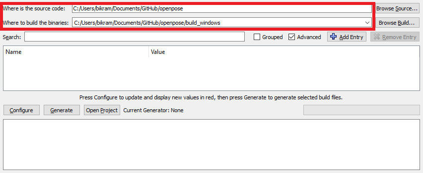

OpenPose - Installation using CMake
====================================

## Contents
1. [Operating Systems](#operating-systems)
2. [Requirements](#requirements)
3. [Clone and Update the Repository](#clone-and-update-the-repository)
4. [Installation](#installation)
5. [Reinstallation](#reinstallation)
6. [Uninstallation](#uninstallation)
7. [Optional Settings](#optional-settings)
    1. [MPI Model](#mpi-model)
    2. [Custom Caffe (Ubuntu Only)](#custom-caffe-ubuntu-only)
    3. [Custom OpenCV (Ubuntu Only)](#custom-opencv-ubuntu-only)
    4. [OpenPose 3D Reconstruction Demo (Windows Only)](#openpose-3d-reconstruction-demo-windows-only)
    5. [Doxygen Documentation Autogeneration (Ubuntu Only)](#doxygen-documentation-autogeneration-ubuntu-only)
    6. [CMake Command Line Configuration (Ubuntu Only)](#cmake-command-line-configuration-ubuntu-only)


## Operating Systems
- **Ubuntu** 14 and 16.
- **Windows** 8 and 10.


## Requirements
See [doc/installation.md#requirements](./installation.md#requirements).


## Clone and Update the Repository
See [doc/quick_start.md#clone-and-update-the-repository](./quick_start.md#clone-and-update-the-repository).


## Installation
The instructions in this section describe the steps to build OpenPose using CMake (GUI). There are 3 main steps:

1. [Prerequisites (Ubuntu Only)](#prerequisites-ubuntu-only)
2. [Caffe Prerequisites (Ubuntu Only)](#caffe-prerequisites-ubuntu-only)
3. [OpenPose Configuration](#openpose-configuration)
4. [OpenPose Building](#openpose-building)
5. [OpenPose from other Projects (Ubuntu Only)](#openpose-from-other-projects-ubuntu-only) 
6. [Run OpenPose](#run-openpose)


### Prerequisites (Ubuntu Only)
OpenCV must be already installed on your machine. It can be installed with `apt-get install libopencv-dev`. You can also use your own compiled OpenCV version.


### Caffe Prerequisites (Ubuntu Only)
By default, OpenPose uses Caffe under the hood. If you have not used Caffe previously, install its dependencies by running:
```bash
bash ./ubuntu/install_cmake.sh
```


### OpenPose Configuration
1. Download and install CMake GUI.
    - Ubuntu: runn the command `sudo apt-get install cmake-qt-gui`. Note: If you prefer to use CMake through the command line, see [Cmake Command Line Build](#cmake-command-line-build-ubuntu-only).
    - Windows: download and install the latest CMake win64-x64 msi installer from the [CMake website](https://cmake.org/download/), called `cmake-X.X.X-win64-x64.msi`.

2. Open CMake GUI and select the OpenPose directory as project source directory, and a non-existing or empty sub-directory (e.g., `build`) where the Makefile files (Ubuntu) or Visual Studio solution (Windows) will be generated. If `build` does not exist, it will ask you whether to create it. Press `Yes`.
<p align="center">
    
    
</p>

3. Press the `Configure` button, keep the generator in `Unix Makefile` (Ubuntu) or set it to `Visual Studio 14 2015 Win64` (Windows), and press `Finish`.
<p align="center">
    
    
</p>

4. If this step is successful, the `Configuring done` text will appear in the bottom box in the last line. Otherwise, some red text will appear in that same bottom box.
<p align="center">
    
    
</p>

5. Press the `Generate` button and proceed to [OpenPose Building](#openpose-building). You can now close CMake.

Note: If you prefer to use your own custom Caffe or OpenCV versions, see [Custom Caffe](#custom-caffe) or [Custom OpenCV](#custom-opencv) respectively.


### OpenPose Building
#### Ubuntu
Finally, build the project by running the following commands.
```
cd build/
make -j`nproc`
```

#### Windows
In order to build the project, open the Visual Studio solution (Windows), called `build/OpenPose.sln`. Then, set the configuration from `Debug` to `Release` and press the green triangle icon (alternatively press <kbd>F5</kbd>).


### OpenPose from other Projects (Ubuntu Only)
If you only intend to use the OpenPose demo, you might skip this step. This step is only recommended if you plan to use the OpenPose API from other projects.

To install the OpenPose headers and libraries into the system environment path (e.g. `/usr/local/` or `/usr/`), run the following command.
```
cd build/
sudo make install
```

Once the installation is completed, you can use OpenPose in your other project using the `find_package` cmake command. Below, is a small example `CMakeLists.txt`. In order to use this script, you also need to copy `FindGFlags.cmake` and `FindGlog.cmake` into your `<project_root_directory>/cmake/Modules/` (create the directory if necessary).
```
cmake_minimum_required(VERSION 2.8.7)

add_definitions(-std=c++11)

list(APPEND CMAKE_MODULE_PATH "${CMAKE_CURRENT_SOURCE_DIR}/cmake/Modules")

find_package(GFlags)
find_package(Glog)
find_package(OpenCV)
find_package(OpenPose REQUIRED)

include_directories(${OpenPose_INCLUDE_DIRS} ${GFLAGS_INCLUDE_DIR} ${GLOG_INCLUDE_DIR} ${OpenCV_INCLUDE_DIRS})

add_executable(example.bin example.cpp)

target_link_libraries(example.bin ${OpenPose_LIBS} ${GFLAGS_LIBRARY} ${GLOG_LIBRARY} ${OpenCV_LIBS})
```

If Caffe was built with OpenPose, it will automatically find it. Otherwise, you will need to link Caffe again as shown below (otherwise, you might get an error like `/usr/bin/ld: cannot find -lcaffe`).
```
link_directories(<path_to_caffe_installation>/caffe/build/install/lib) 
```

### Run OpenPose
Check OpenPose was properly installed by running it on the default images, video, or webcam: [doc/quick_start.md#quick-start](./quick_start.md#quick-start).


## Reinstallation
In order to re-install OpenPose:
1. (Ubuntu only) If you ran `sudo make install`, then run `sudo make uninstall` in `build/`.
2. Delete the `build/` folder.
3. In CMake GUI, click on `File` --> `Delete Cache`.
4. Follow the [Installation](#installation) steps again.


## Uninstallation
In order to uninstall OpenPose:
1. (Ubuntu only) If you ran `sudo make install`, then run `sudo make uninstall` in `build/`.
2. Remove the OpenPose folder.


### Optional Settings
#### MPI Model
By default, the body MPI model is not downloaded. You can download it by turning on the `DOWNLOAD_MPI_MODEL`. It's slightly faster but less accurate and has less keypoints than the COCO body model.


#### Custom Caffe (Ubuntu Only)
We only modified some Caffe compilation flags and minor details. You can use your own Caffe distribution, simply specify the Caffe include path and the library as shown below. You will also need to turn off the `BUILD_CAFFE` variable.
<p align="center">
    
</p>


#### Custom OpenCV (Ubuntu Only)
If you have built OpenCV from source and OpenPose cannot find it automatically, you can set the `OPENCV_DIR` variable to the directory where you build OpenCV.


#### OpenPose 3D Reconstruction Demo (Windows Only)
You can include the 3D Reconstruction Demo by setting the `WITH_3D` option. After installation, check the [doc/openpose_3d_reconstruction_demo.md](./openpose_3d_reconstruction_demo.md) instructions.


#### Doxygen Documentation Autogeneration (Ubuntu Only)
You can generate the documentation by setting the `BUILD_DOCS` flag.


#### CMake Command Line Configuration (Ubuntu Only)
Note that this step is unnecessary if you already used the CMake GUI alternative.

Create a `build` folder in the root OpenPose folder, where you will build the library --
```bash
cd openpose
mkdir build
cd build
```

The next step is to generate the Makefiles. Now there can be multiple scenarios based on what the user already has e.x. Caffe might be already installed and the user might be interested in building OpenPose against that version of Caffe instead of requiring OpenPose to build Caffe from scratch.

##### SCENARIO 1 -- Caffe not installed and OpenCV installed using `apt-get`
In the build directory, run the below command --
```bash
cmake ..
```

##### SCENARIO 2 -- Caffe installed and OpenCV build from source
In this example, we assume that Caffe and OpenCV are already present. The user needs to supply the paths of the library to CMake. For OpenCV, specify the `OpenCV_DIR` which is where the user build OpenCV. For Caffe, specify the include directory and library using the `Caffe_INCLUDE_DIRS` and `Caffe_LIBS` variables. This will be where you installed Caffe. Below is an example of the same.
```bash
cmake -DOpenCV_DIR=/home/"${USER}"/softwares/opencv/build \
  -DCaffe_INCLUDE_DIRS=/home/"${USER}"/softwares/caffe/build/install/include \
  -DCaffe_LIBS=/home/"${USER}"/softwares/caffe/build/install/lib/libcaffe.so -DBUILD_CAFFE=OFF ..
```

##### SCENARIO 3 -- OpenCV already installed
If Caffe is not already present but OpenCV is, then use the below command.
```bash
cmake -DOpenCV_DIR=/home/"${USER}"/softwares/opencv/build
```
