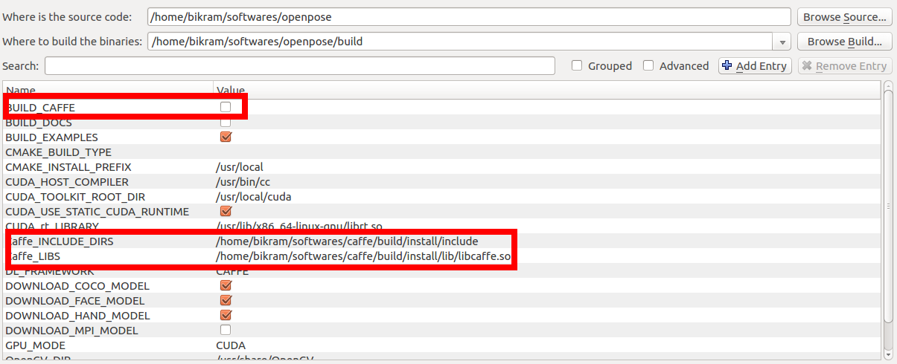

OpenPose - Installation using CMake
====================================

The CMake installation is experimental. It will eventually replace the standard and current installation system, but at the moment it is a beta version.

## Contents
1. [Requirements](#requirements)
2. [Clone and Update the Repository](#clone-and-update-the-repository)
3. [Installation](#installation)
    1. [Caffe Prerequisites (Ubuntu Only)](#caffe-prerequisites-ubuntu-only)
    2. [OpenPose Configuration](#openpose-configuration)
    3. [OpenPose Building](#openpose-building)
    4. [Run OpenPose](#run-openpose)
4. [Custom Caffe](#custom-caffe)
5. [Custom OpenCV](#custom-opencv)
6. [CMake Command Line Configuration](#cmake-command-line-configuration)


## Requirements
- Ubuntu (tested on 14 and 16). Windows CMake version will come soon.
- NVIDIA graphics card with at least 1.6 GB available (the `nvidia-smi` command checks the available GPU memory in Ubuntu).
- At least 2 GB of free RAM memory.
- Highly recommended: A CPU with at least 8 cores.

Note: These requirements assume the default configuration (i.e. `--net_resolution "656x368"` and `scale_number 1`). You might need more (with a greater net resolution and/or number of scales) or less resources (with smaller net resolution and/or using the MPI and MPI_4 models).


## Clone and Update the Repository
The first step is to clone the OpenPose repository. It might be done with [GitHub Desktop](https://desktop.github.com/) in Windows and from the terminal in Ubuntu:
```bash
git clone https://github.com/CMU-Perceptual-Computing-Lab/openpose
```

OpenPose can be easily updated by clicking the `synchronization` button at the top-right part in GitHub Desktop in Windows, or by running `git pull origin master` in Ubuntu. After OpenPose has been updated, just run the `Reinstallation` section described below for your specific Operating System.


## Installation
The instructions in this section describe the steps to build OpenPose using CMake (GUI). There are 3 main steps:

1. [Caffe Prerequisites (Ubuntu Only)](#caffe-prerequisites-ubuntu-only)
2. [OpenPose Configuration](#openpose-configuration)
3. [OpenPose Building](#openpose-building)


### Caffe Prerequisites (Ubuntu Only)
By default, OpenPose uses Caffe under the hood. If you have not used Caffe previously, install its dependencies by running:
```bash
bash ./ubuntu/install_cmake.sh
```


### OpenPose Configuration
Note: If you prefer to use CMake though the command line, see [Cmake Command Line Build](#cmake-command-line-build).

1. Install CMake GUI.
    1. Ubuntu: run `sudo apt-get install cmake-qt-gui`.
    2. Windows: download and install the latest Windows win64-x64 msi installer from the [CMake website](https://cmake.org/download/).

2. Open CMake GUI and select the project source directory and a sub-directory where the Makefiles will
be generated. We will first select the openpose directory and then we will select a `build` directory in the project root directory as shown in the image below (See the red rectangle). If the `build` directory does not exists, CMake will create it.
<p align="center">
    
</p>

3. Next press the `Configure` button in the GUI. It will first ask you to create the `build` directory, if it already did not exist. Press `Yes`.
<p align="center">
    
</p>

4. Next a new dialog box will appear, press the `Finish` button here.
<p align="center">
    
</p>

5. If this step is successful, in the bottom box it will show "Configuring done" (in the last line) as shown below.
<p align="center">
    
</p>

6. Press the `Generate` button and proceed to [OpenPose Building](#openpose-building).

Note: If you prefer to use your own custom Caffe or OpenCV versions, see [Custom Caffe](#custom-caffe) or [Custom OpenCV](#custom-opencv) respectively.


### OpenPose Building
Finally, build the project by running the following commands.
```
cd build/
no_cores=`cat /proc/cpuinfo | grep processor | wc -l`
make -j${no_cores}
```


### Run OpenPose
Check OpenPose was properly installed by running it on the default images, video or webcam: [doc/quick_start.md#quick-start](./quick_start.md#quick-start).


##### Custom Caffe
We only modified some Caffe compilation flags and minor details. You can use your own Caffe distribution, simply specify the Caffe include path and the library as shown below. You will also need to turn o pluginsff the `BUILD_CAFFE` variable.
<p align="center">
    
</p>


##### Custom OpenCV
If you have built OpenCV from source and OpenPose cannot find it automatically, you can set the `OPENCV_DIR` variable to the directory where you build OpenCV.


### Custom Caffe
We only modified some Caffe compilation flags and minor details. You can use your own Caffe distribution, these are the files we added and modified:

1. Added files: `install_caffe.sh`; as well as `Makefile.config.Ubuntu14.example`, `Makefile.config.Ubuntu16.example`, `Makefile.config.Ubuntu14_cuda_7.example` and `Makefile.config.Ubuntu16_cuda_7.example` (extracted from `Makefile.config.example`). Basically, you must enable cuDNN.
2. Edited file: Makefile. Search for "# OpenPose: " to find the edited code. We basically added the C++11 flag to avoid issues in some old computers.
3. Optional - deleted Caffe file: `Makefile.config.example`.
4. In order to link it to OpenPose:
    1. Run `make all && make distribute` in your Caffe version.
    2. Open the OpenPose Makefile config file: `./Makefile.config.UbuntuX.example` (where X depends on your OS and CUDA version).
    3. Modify the Caffe folder directory variable (`CAFFE_DIR`) to your custom Caffe `distribute` folder location in the previous OpenPose Makefile config file.


### CMake Command Line Configuration
Note that this step is unnecessary if you already used the CMake GUI alternative.

Create a `build` folder in the root openpose folder, where you will build the library --

```bash
cd openpose
mkdir build
cd build
```

The next step is to generate the Makefiles. Now there can be multiple scenarios based on what the user already has e.x. Caffe might be already installed and the user might be interested in building OpenPose against that version of Caffe instead of requiring OpenPose to build Caffe from scratch.

##### SCENARIO 1 -- Caffe not installed and OpenCV installed using `apt-get`
In the build directory, run the below command --

```bash
cmake ..
```

##### SCENARIO 2 -- Caffe installed and OpenCV build from source
In this example, we assume that Caffe and OpenCV are already present. The user needs to supply the paths of the library to CMake. For OpenCV, specify the `OpenCV_DIR` which is where the user build OpenCV. For Caffe, specify the include directory and library using the `Caffe_INCLUDE_DIRS` and `Caffe_LIBS` variables. This will be where you installed Caffe. Below is an example of the same.

```bash
cmake -DOpenCV_DIR=/home/"${USER}"/softwares/opencv/build \
  -DCaffe_INCLUDE_DIRS=/home/"${USER}"/softwares/caffe/build/install/include \
  -DCaffe_LIBS=/home/"${USER}"/softwares/caffe/build/install/lib/libcaffe.so -DBUILD_CAFFE=OFF ..
```

##### SCENARIO 3 -- OpenCV already installed
If Caffe is not already present but OpenCV is, then use the below command.
```bash
cmake -DOpenCV_DIR=/home/"${USER}"/softwares/opencv/build
```

### Downloading additional models

By default, the MPI model is not downloaded. To download the MPI model, turn on the `DOWNLOAD_MPI_MODEL` either using the GUI or using the command line.
