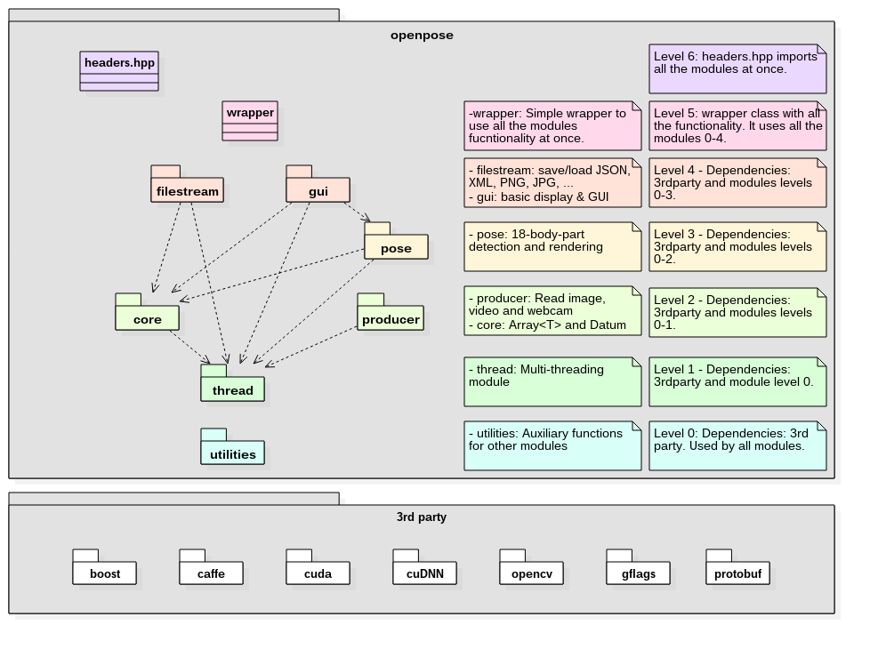

OpenPose C++ API - Basic Overview
====================================


Note: Read [doc/library_introduction.md](./library_introduction.md) before this page.


## Modules Diagram
<p align="center">
    
</p>


## Main Modules
In order to use and/or slightly extend the OpenPose library, we try to explain the 2 main components on this section. [doc/UML/](../doc/UML/) contains the class diagram of all these modules.

1. The basic module: `core`.

2. The multi-threading module: `thread`.

3. The multi-person keypoint detection module: `pose`.


## Basic Module: `core`
### Array<T> - The OpenPose Basic Raw Data Container
This template class implements a multidimensional data array. It is our basic data container, analogous to `cv::Mat` in OpenCV, Tensor in Torch and TensorFlow or Blob in Caffe. It wraps a `cv::Mat` and a `std::shared_ptr`, both of them pointing to the same raw data. I.e. they both share the same memory, so we can read this data in both formats, while there is no performance impact. For instance, `op::Datum` has several `op::Array<float>`, for instance the `op::Datum<float> pose` with the pose data.

#### Construction And Data allocation
There are 4 different ways to allocate the memory:

1. The constructor `Array(const std::vector<int>& size)`, which calls `reset(size)`.

2. The constructor `Array(const int size)`, which calls `reset(size)`.

3. The `reset(const std::vector<int>& size)` function: It allocates the memory indicated for size. The allocated memory equals the product of all elements in the size vector. Internally, it is saved as a 1-D std::shared_ptr<T[]>.

4. The `reset(const int size)` function: equivalent for 1-dimension data (i.e., vector).

5. The `setFrom(const cv::Mat& cvMat)` function: It calls `reset()` and copies the data from `cvMat`.

#### Data access
The data can be access as a raw pointer, shared pointer or `cv::Mat`. So given your `Array<T>` array:

1. Similar to the std::vector: `array[index]` or `array.at(index)`. If the code is in debug mode, they both has the same functionality. In release mode, the only difference is that the `at` function checks whether the index is within the limits of the data.

2. As `const cv::Mat`: `array.getConstCvMat()`. We do not allow to directly modify the `cv::Mat`, since some operations might change the dimensional size of the data. If you want to do so, you can clone this `cv::Mat`, perform any desired operation, and copy it back to the array class with `setFrom()`.

3. As raw pointer: `T* getPtr()` and `const T* const getConstPtr()`. Similar to std:: and std::shared_ptr::get(). For instance, CUDA code usually requires raw pointers to access its data.

#### Dimensionality Information
There are several functions to get information about the allocated data:

1. `bool empty()`: Similar to `cv::Mat::empty()`. It checks whether internal data has been allocated.

2. `std::vector<int> getSize()`: It returns the size of each dimension.

3. `int getSize(const int index)`: It returns the size of the `index` dimension.

4. `size_t getNumberDimensions()`: It returns the number of dimensions (i.e., getSize().size()).

5. `size_t getVolume()`: It returns the total internal number of T objects, i.e., the product of all dimensions size.


### Datum - The OpenPose Basic Piece of Information Between Threads
The `Datum` class has all the variables that our Workers need to share to each other. The user can inherit from `op::Datum` in order to add extra functionality (e.g., if he want to add new Workers and they require extra information between them). We highly recommend not to modify the `op::Datum` source code. Instead, just inherit it and tell the Workers and `ThreadManager` to use your inherited class. No changes are needed in the OpenPose source code for this task.
```
UserDatum : public op::Datum {/* op::Datum + extra variables */}

// Worker and ThreadManager example initialization
op::WGui<std::shared_ptr<std::vector<std::shared_ptr<UserDatum>>> userGUI(/* constructor arguments */);
op::ThreadManager<std::shared_ptr<std::vector<std::shared_ptr<UserDatum>>> userThreadManager;
```

Since `UserDatum` inherits from `op::Datum`, all the original OpenPose code will compile and run with your inherited version of `op::Datum`.


## Multi-Threading Module - `thread`
### The ThreadManager<T> Template Class
It manages and automates the multi-threading configuration and execution. The user just needs to add the desired Worker<T> classes to be executed and the parallelization mode, and this class will take care of it.

#### Constructor
Just call `op::ThreadManager<TypedefDatumsSP> threadManager`.

#### Adding a Worker Sequence
There are 4 ways to add sequence of workers:

1. `void add(const std::vector<std::tuple<unsigned long long, std::vector<TWorker>, unsigned long long, unsigned long long>>& threadWorkerQueues)`.

2. `void add(const std::vector<std::tuple<unsigned long long, TWorker, unsigned long long, unsigned long long>>& threadWorkerQueues)`.

3. `void add(const unsigned long long threadId, const std::vector<TWorker>& tWorkers, const unsigned long long queueInId, const unsigned long long queueOutId)`.

4. `void add(const unsigned long long threadId, const TWorker& tWorker, const unsigned long long queueInId, const unsigned long long queueOutId)`.

#### Threading Configuration Modes
There are 3 basic configuration modes: single-threading, multi-threading and smart multi-threading (mix of single- and multi-threading):

1. Single-threading, with 2 variations:
    1. Just call `threadManager.add(0, std::vector<TypedefWorker> VECTOR_WITH_ALL_WORKERS, 0, 1);`
    2. Add the workers one by one, but keeping the same threadId:
    ```
    auto threadId = 0;
    auto queueIn = 0;
    auto queueOut = 0;
    threadManager.add(threadId, {wDatumProducer, wCvMatToOpInput}, queueIn++, queueOut++);      // Thread 0, queues 0 -> 1
    threadManager.add(threadId, wPose, queueIn++, queueOut++);                                  // Thread 0, queues 1 -> 2
    ```

2. Multi-threading: Just increase the thread id for each new sequence:
    ```
    auto threadId = 0;
    auto queueIn = 0;
    auto queueOut = 0;
    threadManager.add(threadId++, wDatumProducer, queueIn++, queueOut++);                       // Thread 0, queues 0 -> 1
    threadManager.add(threadId++, wCvMatToOpInput}, queueIn++, queueOut++);                     // Thread 1, queues 1 -> 2
    threadManager.add(threadId++, wPose, queueIn++, queueOut++);                                // Thread 2, queues 3 -> 3
    ```

3. Smart multi-threading: Some classes are much more faster than others (e.g., pose estimation takes ~100 ms while extracting frames from a video only ~10 ms). In addition, any machine has a limited number of threads. Therefore, the library allows the user to merge the faster threads in order to potentially speed up the code. Check the [real-time pose demo](../examples/openpose/openpose.cpp) too see a more complete example.
    ```
    auto threadId = 0;
    auto queueIn = 0;
    auto queueOut = 0;
    threadManager.add(threadId++, {wDatumProducer, wCvMatToOpInput}, queueIn++, queueOut++);    // Thread 0, queues 0 -> 1, 2 workers merged together into 1 thread
    threadManager.add(threadId++, wPose, queueIn++, queueOut++);                                // Thread 1, queues 1 -> 2, 1 worker
    ```

#### Thread Id:
In order to have X different threads, you just need X different thread ids in the `add()` function. There should not be any missing thread or queue id. I.e., when `start` is called, all the thread ids from 0 to max_thread_id must have been added with the `add()` function, as well as all queue ids from 0 to the maximum queue id introduced.

The threads will be started following the thread id order (first the lowest id, last the highest one). In practice, thread id ordering might negatively affect the program execution by adding some lag. I.e., if the thread ids are assigned in complete opposite order to the temporal order of the Workers (e.g., first the GUI and lastly the webcam reader), then during the first few iterations the GUI Worker will have an empty queue until all other Workers have processed at least one frame.

Within each thread, the Workers are executed in the order that they have been added to `ThreadManager` by the `add()` function.

#### Queue Id:
In addition, each queue id is forced to be the input and output of at least 1 Worker sequence. Special cases are the queue id 0 (only forced to be input of >= 1 Workers) and max_queue_id (forced to be output of >=1 Workers). This prevent users from accidentally forgetting connecting some queue ids.

Recursive queuing is allowed. E.g., a Worker might work from queue 0 to 1, another one from 1 to 2, and a third one from 2 to 1, creating a recursive queue/threading. However, the index 0 is reserved for the first queue, and the maximum index for the last one.


### The Worker<T>  Template Class - The Parent Class of All Workers
Classes starting by the letter `W` + upper case letter (e.g., `WGui`) directly or indirectly inherit from Worker<T>. They can be directly added to the `ThreadManager` class so they can access and/or modify the data as well as be parallelized automatically.

The easiest way to create your own Worker is to inherit Worker<T>, and implement the work() function such us it just calls a wrapper to your desired functionality (check the source code of some of our basic Workers). Since the Worker classes are templates, they are always compiled. Therefore, including your desired functionality in a different file will let you compile it only once. Otherwise, it would be compiled any time that any code which uses your worker is compiled.

All OpenPose Workers are templates, i.e., they are not only limited to work with the default op::Datum. However, if you intend to use some of our Workers, your custom `TDatums` class (the one substituting op::Datum) should implement the same variables and functions that those Workers use. The easiest solution is to inherit from `op::Datum` and extend its functionality.


### Creating New Workers
Users can directly implement their own `W` from Worker<T> or any other sub-inherited Worker[...]<T> class and add them to `ThreadManager`. For that, they just need to: inherit those classes from...

1. Inherit from `Worker<T>` and implement the functionality `work(T& tDatum)`, i.e., it will use and modify tDatum.

2. Inherit from `WorkerProducer<T>` and implement the functionality `T work()`, i.e., it will create and return tDatum.

3. Inherit from `WorkerConsumer<T>` and implement the functionality `work(const T& tDatum)`, i.e., it will use but will not modify tDatum.

We suggest users to also start their inherited `Worker<T>` classes with the `W` letter for code clarity, required if they want to send us a pull request.


### All Workers Wrap a Non-Worker Class
All Workers wrap and call a non-Worker non-template equivalent which actually performs their functionality. E.g., `WPoseExtractor<T>` and `PoseExtractor`. In this way, threading and functionality are completely decoupled. This gives us the best of templates and normal classes:

1. Templates allow us to use different classes, e.g., the user could use his own specific equivalent to `op::Datum`. However, they must be compiled any time that any function that uses them changes.

2. Classes can be compiled only once, and later the algorithm just use them. However, they can only be used with specific arguments. 

By separating functionality and their `Worker<T>` wrappers, we get the good of both points, eliminating the cons. In this way, the user is able to:

1. Change `std::shared_ptr<std::vector<std::shared_ptr<op::Datum>>>` for a custom class, implementing his own `Worker` templates, but using the already implemented functionality to create new custom `Worker` templates.

2. Create a `Worker` which wraps several non-`Worker`s classes.


## Multi-Person Key-Point Detection module - `pose`
The human body pose detection is wrapped into the `WPoseExtractor<T>` worker and its equivalent non-template PoseExtractor. In addition, it can be rendered and/or blended into the original frame with `(W)PoseRenderer` class.

### PoseExtractor Class
Currently, only `PoseExtractorCaffe` is implemented, which uses the Caffe framework. We might add other famous frameworks later (e.g., Torch or TensorFlow). If you compile our library with any other framework, please email us or make a pull request! We are really interested in adding any other Deep Net framework, and the code is mostly prepared for it. Just create the equivalent `PoseExtractorDesiredFramework` and make the pull request!

#### Constructor
In order to be initialized, `PoseExtractorCaffe` has the following constructor and parameters: `PoseExtractorCaffe(const Point<int>& netInputSize, const Point<int>& netOutputSize, const Point<int>& outputSize, const int scaleNumber, const double scaleGap, const PoseModel poseModel, const std::string& modelsFolder, const int gpuId)`.

1. `netInputSize` is the resolution of the first layer of the deep net. I.e., the frames given to this class must have that size.

2. `netOutputSize` is the resolution of the last layer of the deep net. I.e., the resulting heatmaps will have this size. Currently, it must be set to the same size as `netInputSize`.

3. `outputSize` is the final desired resolution to be used. The human pose keypoint locations will be scaled to this output size. However, the heat-maps will have the `netOutputSize` size due to performance.

4. `scaleNumber` and `scaleGap` specify the multi-scale parameters. Explained in the [README.md](../README.md), in the demo section.

5. `poseModel` specifies the model to load (e.g., COCO or MPI).

6. `modelsFolder` is the resolution of the last layer of the deep net. I.e., the resulting heat-maps will have this size.

7. `gpuId` specifies the GPU where the deep net will run. To parallelize the process along the number of available GPUs, just create the class with the same number of parameters but a different GPU id.

#### Detect Human Pose
In order to detect the human pose:

1. First run the deep net over the desired target image, by using `forwardPass(const Array<float>& inputNetData, const Point<int>& inputDataSize)`. `inputNetData` is the input image scaled to `netInputSize`, while `inputDataSize` indicates the original frame resolution before being rescaled to `netInputSize` (this is required given that we resize the images keeping the original aspect ratio).

2. After, you can choose either to get:
    1. The people pose as a op::Array<float>: `Array<float> getPose()`.
    2. The scale used (keeping the aspect ratio) to rescale from `netOutputSize` to `outputSize`: `double getScaleNetToOutput()`.
    3. The people pose as a constant GPU float pointer (not implemented yet): `const float* getPoseGpuConstPtr()`.
    4. The heatmap data as a constant CPU or GPU float pointer: `const float* getHeatMapCpuConstPtr()` and `const float* getHeatMapGpuConstPtr()`.

Due to performance reasons, we only copy the people pose data given by `getPose()`. However, we do not copy the heatmap and GPU pose values and just give you a raw pointer to them. Hence, you need to manually copy the data if you pretend to use it later, since we reuse that memory on each `forwardPass`.

### PoseRenderer Class
After estimating the pose, you usually desired to visualize it. `PoseRenderer` does this work for you.

#### Constructor
In order to be initialized, `PoseRenderer` has the following constructor and parameters: `PoseRenderer(const Point<int>& netOutputSize, const Point<int>& outputSize, const PoseModel poseModel, const std::shared_ptr<PoseExtractor>& poseExtractor, const float alphaKeypoint, const float alphaHeatMap)`.

1. `netOutputSize`, `outputSize` and `poseModel` are the same as the ones used for `PoseExtractorCaffe`.

2. `poseExtractor` is the pose extractor used previously. It is only used for heatmap and PAFs rendering, since the GPU data is not copied to `op::Datum` for performance purposes. If any of the heatmaps are gonna be rendered, `PoseRenderer` must be placed in the same thread as `PoseExtractor`. Otherwise, it will throw a runtime exception.

3. `alphaKeypoint` and `alphaHeatMap` controls the blending coefficient between original frame and rendered pose or heatmap/PAF respectively. A value `alphaKeypoint = 1` will render the pose with no transparency at all, while `alphaKeypoint = 0` will not be visible. In addition, `alphaHeatMap = 1` would only show the heatmap, while `alphaHeatMap = 0` would only show the original frame.

#### Render Human Pose
In order to render the detected human pose, run `std::pair<int, std::string> renderPose(Array<float>& outputData, const Array<float>& pose, const double scaleNetToOutput)`.

1. `outputData` is the Array<float> where the original image resized to `outputSize` is located.

2. `pose` is given by `PoseExtractor::getPose()`.

3. `scaleNetToOutput` is given by `PoseExtractor::getScaleNetToOutput()`.

4. The resulting std::pair has the element rendered id, and its name. E.g., <0, "Nose"> or <19, "Part Affinity Fields">.
