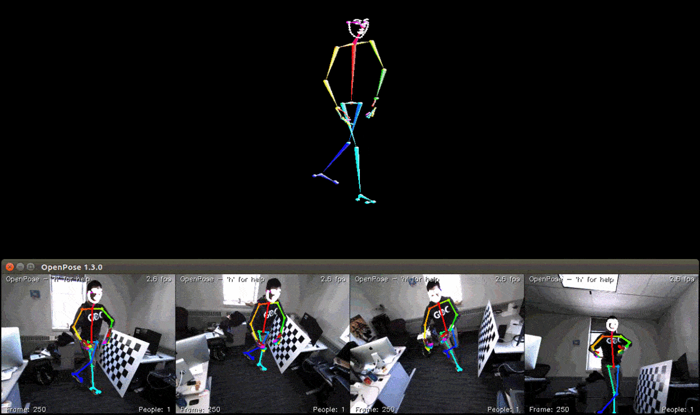

OpenPose 3-D Reconstruction Module and Demo
=============================================

## Contents
1. [Introduction](#introduction)
2. [Installation](#installation)
3. [Non Linear Optimization](#non-linear-optimization)
4. [Features](#features)
5. [Required Hardware](#required-hardware)
6. [Camera Calibration](#camera-calibration)
7. [Camera Ordering](#camera-ordering)
8. [Quick Start](#quick-start)
9. [Expected Visual Results](#expected-visual-results)
10. [Using a Different Camera Brand](#using-a-different-camera-brand)
11. [Known Bug](#known-bug)

## Introduction
This module performs 3-D keypoint (body, face, and hand) reconstruction and rendering for 1 person. We will not keep updating it nor solving questions/issues about it at the moment. It requires the user to be familiar with computer vision and camera calibration, including extraction of intrinsic and extrinsic parameters.

## Installation
Check [doc/installation.md#3d-reconstruction-module](../installation.md#3d-reconstruction-module) for installation steps.

## Non Linear Optimization
In order to increase the 3-D reconstruction accuracy, OpenPose optionally performs non-linear optimization if Ceres solver support is enabled (only available in Ubuntu for now). To enable it, check [doc/installation.md#3d-reconstruction-module](../installation.md#3d-reconstruction-module) for more details.

## Features
- Auto detection of all FLIR cameras connected to your machine, and image streaming from all of them.
- Hardware trigger and buffer `NewestFirstOverwrite` modes enabled. Hence, the algorithm will always get the last synchronized frame from each camera, deleting the rest.
- 3-D reconstruction of body, face, and hands for 1 person.
- If more than 1 person is detected per camera, the algorithm will just try to match person 0 on each camera, which will potentially correspond to different people in the scene. Thus, the 3-D reconstruction will completely fail.
- Only points with high threshold with respect to each one of the cameras are reprojected (and later rendered). An alternative for > 4 cameras could potentially do 3-D reprojection and render all points with good views in more than N different cameras (not implemented here).
- Only Direct linear transformation (DLT) is applied for reconstruction. Non-linear optimization methods (e.g., from Ceres Solver) will potentially improve results (not implemented).
- Basic OpenGL rendering with the `freeglut` library.

## Required Hardware
This demo assumes n arbitrary stereo cameras from the FLIR company (formerly Point Grey). Ideally any USB-3 FLIR model should work, but we have only used the following specific specifications:

1. Camera details:
    - Blackfly S Color 1.3 MP USB3 Vision (ON Semi PYTHON 1300)
    - Model: BFS-U3-13Y3C-C
    - 1280x1024 resolution and 170 FPS
    - [https://www.ptgrey.com/blackfly-s-13-mp-color-usb3-vision-on-semi-python1300](https://www.ptgrey.com/blackfly-s-13-mp-color-usb3-vision-on-semi-python1300)
    - Hardware trigger synchronization required. For this camera model, see `Blackfly S` section in [https://www.ptgrey.com/tan/11052](https://www.ptgrey.com/tan/11052) or [https://www.ptgrey.com/KB/11052](https://www.ptgrey.com/KB/11052).
    - (Ubuntu-only) Open your USB ports following section `Configuring USBFS` in [http://www.ptgrey.com/KB/10685](http://www.ptgrey.com/KB/10685).
    - Install the Spinnaker SDK for your operating system: [https://www.ptgrey.com/support/downloads](https://www.ptgrey.com/support/downloads).
2. Fujinon 3 MP Varifocal Lens (3.8-13mm, 3.4x Zoom) for each camera.
    - E.g., [https://www.bhphotovideo.com/c/product/736855-REG/Fujinon_DV3_4X3_8SA_1_3_MP_Varifocal_Lens.html](https://www.bhphotovideo.com/c/product/736855-REG/Fujinon_DV3_4X3_8SA_1_3_MP_Varifocal_Lens.html).
3. 4-Port PCI Express (PCIe) USB 3.0 Card Adapter with 4 dedicated channels.
    - E.g., the 4 Ext Quad Bus version, PCI Express, from: [https://www.amazon.com/Express-SuperSpeed-Adapter-Dedicated-Channels/dp/B00HJZEA2S/ref=sr_1_1?ie=UTF8&qid=1492197599&sr=8-1&keywords=4%2BPort%2BPCI%2BExpress%2B(PCIe)%2Bdedicated%2Bports&th=1](https://www.amazon.com/Express-SuperSpeed-Adapter-Dedicated-Channels/dp/B00HJZEA2S/ref=sr_1_1?ie=UTF8&qid=1492197599&sr=8-1&keywords=4%2BPort%2BPCI%2BExpress%2B(PCIe)%2Bdedicated%2Bports&th=1).
    - Alternative: [https://www.startech.com/Cards-Adapters/USB-3.0/Cards/PCI-Express-USB-3-Card-4-Dedicated-Channels-4-Port~PEXUSB3S44V](https://www.startech.com/Cards-Adapters/USB-3.0/Cards/PCI-Express-USB-3-Card-4-Dedicated-Channels-4-Port~PEXUSB3S44V).
4. USB 3.0 cable for each FLIR camera.
    - From their official website: [https://www.ptgrey.com/5-meter-type-a-to-micro-b-locking-usb-30-cable](https://www.ptgrey.com/5-meter-type-a-to-micro-b-locking-usb-30-cable).

## Camera Calibration
The user must manually get the intrinsic and extrinsic parameters of the stereo-cameras. Note, we will assume `Flir` cameras, which is specified by default with the flag `--camera_parameter_path "models/cameraParameters/flir/"`. Otherwise, change the path to your camera name accordingly.

There are 2 alternatives to calibrate the cameras:
1. Using the [OpenPose calibration toolbox](./calibration_module.md#).
2. Using your own calibration toolbox (or if you already know the camera parameters of your cameras):
    1. Create a xml file for each camera named as `models/cameraParameters/flir/{camera_serial_number}.xml`.
    2. The elements inside each xml file are the extrinsic parameters of the camera (`CameraMatrix`), the intrinsic parameters (`Intrinsics`), and the distortion coefficients (`Distortion`). Copy the format from `models/cameraParameters/flir/17012332.xml.example`. For the extrinsic parameters of the camera, it allows you to set the coordinate origin (so that 3-d keypoints are distances with respect to that origin).
        - E.g., in order to set the camera 1 as the coordinate center, set its `CameraMatrix` as the identity matrix of size 3x4, and the `CameraMatrix` of the other cameras as the camera extrinsic parameters of from those cameras with respect to the main camera `M_1_i`.
        - **VERY IMPORTANT: The intrinsic camera matrix should be an upper triangular matrix.**
    3. The program can use any arbitrary number of cameras. Even if lots of cameras are added in `models/cameraParameters/flir/`, the program will check at runtime which FLIR cameras are detected and simply read those camera parameters. If the file corresponding to any of the cameras detected at runtime is not found, OpenPose will return an error.
    4. In the example XML, OpenPose uses the 8-distortion-parameter version of OpenCV. The distortion parameters are internally used by the OpenCV function [undistort()](http://docs.opencv.org/3.2.0/da/d54/group__imgproc__transform.html#ga69f2545a8b62a6b0fc2ee060dc30559d) to rectify the images. Therefore, this function can take either 4-, 5- or 8-parameter distortion coefficients (OpenCV 3.X also adds a 12- and 14-parameter alternatives). Therefore, either version (4, 5, 8, 12 or 14) will work in 3D OpenPose.

## Camera Ordering
OpenPose will display the cameras sorted by serial number, starting in the left with the image corresponding to the lowest serial number. When the program is run, OpenPose displays the camera serial number associated to each index of each detected camera. If the number of cameras detected is different to the number of actual cameras, make sure the hardware is properly connected and the camera leds are on.

## Quick Start
Check the [doc/quick_start.md#3-d-reconstruction](./quick_start.md#3-d-reconstruction) for basic examples.

## Expected Visual Results
The visual GUI should show 3 screens.

1. The Windows command line or Ubuntu bash terminal.
2. The different cameras 2-D keypoint estimations.
3. The final 3-D reconstruction.

It should be similar to the following image.

    

## Using a Different Camera Brand
You can copy and modify the OpenPose 3-D demo to use any camera brand by:

1. You can optionally turn off the `WITH_FLIR_CAMERA` while compiling CMake.
2. Copy `examples/tutorial_api_cpp/14_synchronous_custom_input.cpp` (or `18_synchronous_custom_all_and_datum.cpp`).
3. Modify `WUserInput` and add your custom code there. Your code should fill `Datum::name`, `Datum::cameraMatrix`, `Datum::cvInputData`, and `Datum::cvOutputData` (fill cvOutputData = cvInputData).
4. Remove `WUserPostProcessing` and `WUserOutput` (unless you want to have your custom post-processing and/or output).

Note that your custom code should retrieve synchronized images from your cameras or any other source, as well as their intrinsic and extrinsic camera parameters.

## Known Bug
FreeGLUT is a quite light library. Due to that, there is a known bug in the 3D module:

1. The window must be closed with the <kbd>Esc</kbd> key. Clicking the close button will cause a core dumped or std::exception error in OpenPose. Reason: There is no way to control the behaviour of the exit button in a FreeGLUT program. Feel free to let us know or create a pull request if you find a workaround applicable to 3-D OpenPose. Another alternative is ussing `--disable_multi_thread` in OpenPose. This would avoid the issue but slow down the program, especially in multi-GPU systems.
