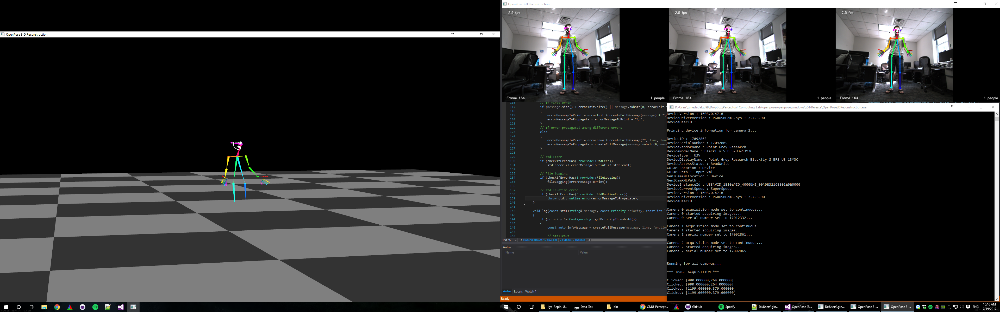

Running OpenPose 3-D Reconstruction Demo
====================================

This is a beta version that makes body + face + hand keypoint 3-D reconstruction and rendering for 1 person. We will not keep updating it nor solving questions/issues about it at the moment. It requires the user to be familiar with computer vision, in particular with camera calibration, i.e. extraction of intrinsic and extrinsic parameters.

The Windows steps were tested and worked in the OpenPose 1.0.2 version from the last GitHub commit on September 1st, 2017 in the [official repository](https://github.com/CMU-Perceptual-Computing-Lab/openpose). 3D OpenPose should work with any newer version to that one. However, in case it does not, open a GitHub issue and meanwhile use the mentioned version of July 18th.


### Description of this demo:
- Auto detection of all the FLIR cameras, and extraction of images from each one of them.
- Hardware trigger and buffer `NewestFirstOverwrite` modes enabled. Hence, the algorithm will always get the last synchronized frame from each camera, deleting the rest.
- 3-D reconstruction of body, face and hands for 1 person.
- If more than 1 person is detected per camera, the algorithm will just try to match person 0 on each camera, which will potentially correspond to different people in the scene. Thus, the 3-D reconstruction will completely fail.
- Only points with high threshold with respect to each one of the cameras are reprojected (and later rendered). An alternative for > 4 cameras could be to do 3-D reprojection and render all points with good views in more than N different cameras (not implemented here).
- Only Direct linear transformation (DLT) applied. Non-linear optimization methods (e.g. from Ceres Solver) will potentially improve results (not implemented).
- Basic OpenGL rendering with the `freeglut` library.


### Hardware
This demo assumes n arbitrary stereo cameras, FLIR company (former Point Grey). Ideally any USB-3 FLIR model should work, but we have only used the following specific specifications:

1. Camera details:
    - Blackfly S Color 1.3 MP USB3 Vision (ON Semi PYTHON 1300)
    - Model: BFS-U3-13Y3C-C
    - 1280x1024 resolution and 170 FPS
    - https://www.ptgrey.com/blackfly-s-13-mp-color-usb3-vision-on-semi-python1300
    - Hardware trigger synchronization required. For this camera model, see `Blackfly S` section in [https://www.ptgrey.com/tan/11052](https://www.ptgrey.com/tan/11052) or [https://www.ptgrey.com/KB/11052](https://www.ptgrey.com/KB/11052).
    - (Ubuntu-only) Open your USB ports following section `Configuring USBFS` in [http://www.ptgrey.com/KB/10685](http://www.ptgrey.com/KB/10685).
    - Install the Spinnaker SDK for your operating system: [https://www.ptgrey.com/support/downloads](https://www.ptgrey.com/support/downloads).
2. Fujinon 3 MP Varifocal Lens (3.8-13mm, 3.4x Zoom) for each camera.
    - E.g. [https://www.bhphotovideo.com/c/product/736855-REG/Fujinon_DV3_4X3_8SA_1_3_MP_Varifocal_Lens.html](https://www.bhphotovideo.com/c/product/736855-REG/Fujinon_DV3_4X3_8SA_1_3_MP_Varifocal_Lens.html).
3. 4-Port PCI Express (PCIe) USB 3.0 Card Adapter with 4 dedicated channels.
    - E.g. [https://www.startech.com/Cards-Adapters/USB-3.0/Cards/PCI-Express-USB-3-Card-4-Dedicated-Channels-4-Port~PEXUSB3S44V](https://www.startech.com/Cards-Adapters/USB-3.0/Cards/PCI-Express-USB-3-Card-4-Dedicated-Channels-4-Port~PEXUSB3S44V).
4. USB 3.0 cable for each FLIR camera.
    - From their official website: [https://www.ptgrey.com/5-meter-type-a-to-micro-b-locking-usb-30-cable](https://www.ptgrey.com/5-meter-type-a-to-micro-b-locking-usb-30-cable).


### Calibrate Cameras
The user must manually get the intrinsic and extrinsic parameters of your cameras and introduce them on: `include\openpose3d\cameraParameters.hpp`.

The program uses 3 cameras by default, but cameras can be added or removed from `cameraParameters.hpp` by adding or removing elements to `INTRINSICS`, `DISTORTIONS` and `M_EACH_CAMERA`. `INTRINSICS` corresponds to the intrinsic parameters, `DISTORTIONS` to the distortion coefficients, and `M_EACH_CAMERA` corresponds to the extrinsic parameters of the cameras with respect to camera 1, i.e. camera 1 is considered the coordinates origin.

3D OpenPose uses the 8-distortion-parameter version of OpenCV by default. Internally, the distortion parameters are used by the OpenCV function [undistort()](http://docs.opencv.org/3.2.0/da/d54/group__imgproc__transform.html#ga69f2545a8b62a6b0fc2ee060dc30559d) to rectify the images. This function can take either 4-, 5- or 8-parameter distortion coefficients (OpenCV 3.X also adds a 12- and 14-parameter alternatives). Therefore, either version (4, 5, 8, 12 or 14) will work in 3D OpenPose, the user just needs to modify the `DISTORTION_i` variables in `cameraParameters.hpp` with the desired number of distortion parameters for each camera.


### Windows
1. [Install the OpenPose library](installation.md#installation---library) and make sure the [OpenPose demo runs](installation.md#quick-start), so that the required OpenPose library was properly compiled.
2. Open the OpenPose visual studio solution `windows\openpose.sln`.
3. Right-click on `Solution 'OpenPose'` of the `Solution Explorer` window, usually placed at the top-right part of the VS screen.
4. Click on `Properties`. Go to `Configuration Properties` -> `Configuration` and check `Build` for the `OpenPose3DReconstruction` project.
5. Get the last Spinnaker SKD version, i.e. the FLIR camera driver and software:
    - Download last Spinnaker SDK: https://www.ptgrey.com/support/downloads
    - Copy `{PointGreyParentDirectory}\Point Grey Research\Spinnaker\bin64\vs2015\` as `{OpenPoseDirectory}\3rdparty\windows\spinnaker\bin\`. You can remove all the *.exe files.
    - Copy `{PointGreyParentDirectory}\Point Grey Research\Spinnaker\include\` as `{OpenPoseDirectory}\3rdparty\windows\spinnaker\include\`.
    - Copy `Spinnaker_v140.lib` and `Spinnakerd_v140.lib` from `{PointGreyParentDirectory}\Point Grey Research\Spinnaker\lib64\vs2015\` into `{OpenPoseDirectory}\3rdparty\windows\spinnaker\lib\`.
    - (Optional) Spinnaker SDK overview: https://www.ptgrey.com/spinnaker-sdk
6. Get the last OpenGL Glut library version for the rendering:
    - Download the latest `MSVC Package` from http://www.transmissionzero.co.uk/software/freeglut-devel/
    - Copy `{freeglutParentDirectory}\freeglut\bin\x64\` as `{OpenPoseDirectory}\3rdparty\windows\freeglut\bin\bin\`.
    - Copy `{freeglutParentDirectory}\freeglut\include\` as `{OpenPoseDirectory}\3rdparty\windows\freeglut\include\`.
    - Copy `{freeglutParentDirectory}\freeglut\lib\x64\` as `{OpenPoseDirectory}\3rdparty\windows\freeglut\lib\`.


### Ubuntu
We did not create an Ubuntu version. We did an very first version for Ubuntu 16 long ago, but it was highly changed later. These are the steps we used for that one. Note that there might be needed some changes to make it work. Feel free to send us or make a pull request with any updated steps.

1. Install the OpenGL rendering library: `sudo apt-get install freeglut3-dev`.
2. Compile the standard OpenPose [from https://github.com/CMU-Perceptual-Computing-Lab/openpose](from https://github.com/CMU-Perceptual-Computing-Lab/openpose).
3. Perform `make distribute` on OpenPose, and copy the `include` and `lib` files from `distribute` into your custom `3rdparty/openpose/`.
4. Copy the `include` and `lib` folders from {OpenPose path}/3rdparty/caffe/distribute/ into your custom `3rdparty/caffe/`.
5. Copy your Spinnaker desired version `include` and `lib` folders in your custom `3rdparty/spinnaker/`.
7. From the Spinnaker `bin` folder, copy all the *.xml files to the generated build folder of your project.
8. Get the required files from `{OpenPose path}/examples_beta/openpose3d/`. Check the Windows VS solution for more details.
9. Create a proper Makefile or CMake file to run it. The following code is part of an old QMake (Qt) file generated for the old version, you can ideally get all the flags and includes from it:
```
DEFINES += USE_CAFFE USE_CUDNN
INCLUDEPATH += \
    $$PWD/include \
    $$PWD/3rdparty/caffe/include \
    $$PWD/3rdparty/openpose/include \
    $$PWD/3rdparty/spinnaker/include \
    /usr/include \
    /usr/local/include \
    /usr/local/cuda-8.0/include
}
# Generic
LIBS += -L/usr/lib/ -L/usr/local/lib/ -L/usr/lib/x86_64-linux-gnu
# OpenPose
LIBS += -Wl,-rpath=$$PWD/3rdparty/openpose/lib
LIBS += -Wl,-Bdynamic -L$$PWD/3rdparty/openpose/lib/ -lopenpose
# Caffe
LIBS += -Wl,-rpath=$$PWD/3rdparty/caffe/lib
LIBS += -Wl,-Bdynamic -L$$PWD/3rdparty/caffe/lib/ -lcaffe
# Spinnaker
LIBS += -Wl,-rpath=$$PWD/3rdparty/spinnaker/lib
LIBS += -Wl,-Bdynamic -L$$PWD/3rdparty/spinnaker/lib/ -lSpinnaker
# OpenCV
LIBS += -lopencv_core -lopencv_highgui -lopencv_imgproc -lopencv_contrib -lopencv_calib3d
# CUDA
LIBS += -I/usr/local/cuda-8.0/include/
LIBS += -L/usr/local/cuda-8.0/lib64 -lcudart -lcublas -lcurand
# OpenGL
LIBS += -lGLU -lGL -lglut
# Other 3rdparty
LIBS += -lcudnn -lglog -lgflags -lboost_system -lboost_filesystem -lm -lboost_thread
LIBS += -pthread -fPIC -std=c++11 -fopenmp
# Optimization flags
LIBS += -DNDEBUG -O3 -march=native
# Debug flags
LIBS += -Wpedantic -Wall -Wextra -Wfatal-errors
```
10. If you find any error/difference, feel free to add a pull request to help other users.


## Expected Visual Results
The visual GUI should show 3 screens, the Windows command line or Ubuntu bash terminal, the different cameras 2-D keypoint estimations, and the final 3-D reconstruction, similarly to the following image:
<p align="center">
    
</p>
