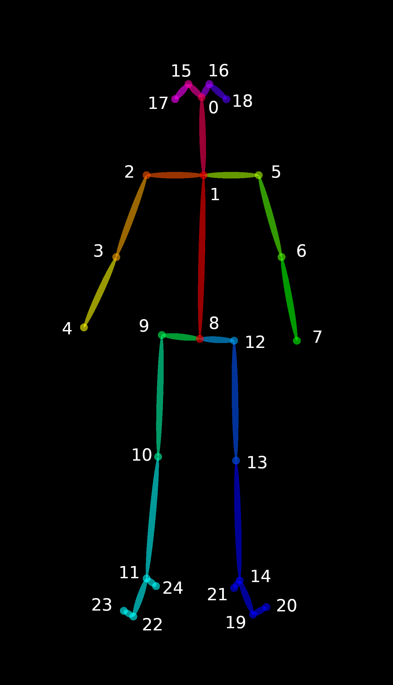
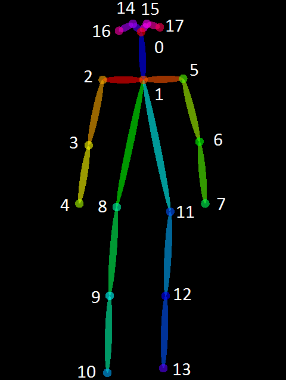

OpenPose Demo - Output
====================================


## Contents
1. [Output Format](#output-format)
    1. [Keypoint Ordering in C++/Python](#keypoint-ordering-in-c-python)
    2. [Heatmap Ordering](#heatmap-ordering)
    3. [Heatmap Saving in Float Format](#heatmap-saving-in-float-format)
    4. [Heatmap Scaling](#heatmap-scaling)
    5. [Face and Hands](#face-and-hands)
    6. [Pose Output Format](#pose-output-format)
    7. [Face Output Format](#face-output-format)
    8. [Hand Output Format](#hand-output-format)
2. [Reading Saved Results](#reading-saved-results)
3. [Keypoint Format in the C++ API](#keypoint-format-in-the-c-api)
4. [Camera Matrix Output Format](#camera-matrix-output-format)


## Output Format
There are 2 alternatives to save the OpenPose output.

1. The `write_json` flag saves the people pose data using a custom JSON writer. Each JSON file has a `people` array of objects, where each object has:
    1. An array `pose_keypoints_2d` containing the body part locations and detection confidence formatted as `x1,y1,c1,x2,y2,c2,...`. The coordinates `x` and `y` can be normalized to the range [0,1], [-1,1], [0, source size], [0, output size], etc., depending on the flag `keypoint_scale` (see flag for more information), while `c` is the confidence score in the range [0,1].
    2. The arrays `face_keypoints_2d`, `hand_left_keypoints_2d`, and `hand_right_keypoints_2d`, analogous to `pose_keypoints_2d`.
    3. The analogous 3-D arrays `body_keypoints_3d`, `face_keypoints_3d`, `hand_left_keypoints_2d`, and `hand_right_keypoints_2d` (if `--3d` is enabled, otherwise they will be empty). Instead of `x1,y1,c1,x2,y2,c2,...`, their format is `x1,y1,z1,c1,x2,y2,z2,c2,...`, where `c` is simply 1 or 0 depending on whether the 3-D reconstruction was successful or not.
    4. The body part candidates before being assembled into people (if `--part_candidates` is enabled).
```
{
    "version":1.1,
    "people":[
        {
            "pose_keypoints_2d":[582.349,507.866,0.845918,746.975,631.307,0.587007,...],
            "face_keypoints_2d":[468.725,715.636,0.189116,554.963,652.863,0.665039,...],
            "hand_left_keypoints_2d":[746.975,631.307,0.587007,615.659,617.567,0.377899,...],
            "hand_right_keypoints_2d":[617.581,472.65,0.797508,0,0,0,723.431,462.783,0.88765,...]
            "pose_keypoints_3d":[582.349,507.866,507.866,0.845918,507.866,746.975,631.307,0.587007,...],
            "face_keypoints_3d":[468.725,715.636,715.636,0.189116,715.636,554.963,652.863,0.665039,...],
            "hand_left_keypoints_3d":[746.975,631.307,631.307,0.587007,631.307,615.659,617.567,0.377899,...],
            "hand_right_keypoints_3d":[617.581,472.65,472.65,0.797508,472.65,0,0,0,723.431,462.783,0.88765,...]
        }
    ],
    // If `--part_candidates` enabled
    "part_candidates":[
        {
            "0":[296.994,258.976,0.845918,238.996,365.027,0.189116],
            "1":[381.024,321.984,0.587007],
            "2":[313.996,314.97,0.377899],
            "3":[238.996,365.027,0.189116],
            "4":[283.015,332.986,0.665039],
            "5":[457.987,324.003,0.430488,283.015,332.986,0.665039],
            "6":[],
            "7":[],
            "8":[],
            "9":[],
            "10":[],
            "11":[],
            "12":[],
            "13":[],
            "14":[293.001,242.991,0.674305],
            "15":[314.978,241,0.797508],
            "16":[],
            "17":[369.007,235.964,0.88765]
        }
    ]
}
```

2. (Deprecated) The `write_keypoint` flag uses the OpenCV cv::FileStorage default formats, i.e., JSON (available after OpenCV 3.0), XML, and YML. Note that it does not include any other information othern than keypoints.

Both of them follow the keypoint ordering described in the [Keypoint Ordering in C++/Python](#keypoint-ordering-in-c-python) section.


### Keypoint Ordering in C++/Python
The body part mapping order of any body model (e.g., COCO, MPI) can be extracted from the C++ API by using the `getPoseBodyPartMapping(const PoseModel poseModel)` function available in [poseParameters.hpp](../include/openpose/pose/poseParameters.hpp):
```
// C++ API call
#include <openpose/pose/poseParameters.hpp>
const auto& poseBodyPartMappingBody25 = getPoseBodyPartMapping(PoseModel::BODY_25);
const auto& poseBodyPartMappingCoco = getPoseBodyPartMapping(PoseModel::COCO_18);
const auto& poseBodyPartMappingMpi = getPoseBodyPartMapping(PoseModel::MPI_15);
const auto& poseBodyPartMappingBody25B = getPoseBodyPartMapping(PoseModel::BODY_25B);
const auto& poseBodyPartMappingBody135 = getPoseBodyPartMapping(PoseModel::BODY_135);

// Result for BODY_25 (25 body parts consisting of COCO + foot)
// const std::map<unsigned int, std::string> POSE_BODY_25_BODY_PARTS {
//     {0,  "Nose"},
//     {1,  "Neck"},
//     {2,  "RShoulder"},
//     {3,  "RElbow"},
//     {4,  "RWrist"},
//     {5,  "LShoulder"},
//     {6,  "LElbow"},
//     {7,  "LWrist"},
//     {8,  "MidHip"},
//     {9,  "RHip"},
//     {10, "RKnee"},
//     {11, "RAnkle"},
//     {12, "LHip"},
//     {13, "LKnee"},
//     {14, "LAnkle"},
//     {15, "REye"},
//     {16, "LEye"},
//     {17, "REar"},
//     {18, "LEar"},
//     {19, "LBigToe"},
//     {20, "LSmallToe"},
//     {21, "LHeel"},
//     {22, "RBigToe"},
//     {23, "RSmallToe"},
//     {24, "RHeel"},
//     {25, "Background"}
// };
```

In Python, you can check them with the following code:
```
poseModel = op.PoseModel.BODY_25
print(op.getPoseBodyPartMapping(poseModel))
print(op.getPoseNumberBodyParts(poseModel))
print(op.getPosePartPairs(poseModel))
print(op.getPoseMapIndex(poseModel))
```


### Heatmap Ordering
For the **heat maps storing format**, instead of saving each of the 67 heatmaps (18 body parts + background + 2 x 19 PAFs) individually, the library concatenates them into a huge (width x #heat maps) x (height) matrix (i.e., concatenated by columns). E.g., columns [0, individual heat map width] contain the first heat map, columns [individual heat map width + 1, 2 * individual heat map width] contain the second heat map, etc. Note that some image viewers are not able to display the resulting images due to the size. However, Chrome and Firefox are able to properly open them.

The saving order is body parts + background + PAFs. Any of them can be disabled with program flags. If background is disabled, then the final image will be body parts + PAFs. The body parts and background follow the order of `getPoseBodyPartMapping(const PoseModel poseModel)`.

The PAFs follow the order specified on `getPosePartPairs(const PoseModel poseModel)` together with `getPoseMapIndex(const PoseModel poseModel)`. E.g., assuming COCO (see example code below), the PAF channels in COCO start in 19 (smallest number in `getPoseMapIndex`, equal to #body parts + 1), and end up in 56 (highest one). Then, we can match its value from `getPosePartPairs`. For instance, 19 (x-channel) and 20 (y-channel) in `getPoseMapIndex` correspond to PAF from body part 1 to 8; 21 and 22 correspond to x,y channels in the joint from body part 8 to 9, etc. Note that if the smallest channel is odd (19), then all the x-channels are odd, and all the y-channels even. If the smallest channel is even, then the opposite will happen.
```
// C++ API call
#include <openpose/pose/poseParameters.hpp>
const auto& posePartPairsBody25 = getPosePartPairs(PoseModel::BODY_25);
const auto& posePartPairsCoco = getPosePartPairs(PoseModel::COCO_18);
const auto& posePartPairsMpi = getPosePartPairs(PoseModel::MPI_15);

// getPosePartPairs(PoseModel::BODY_25) result
// Each index is the key value corresponding to each body part in `getPoseBodyPartMapping`. E.g., 1 for "Neck", 2 for "RShoulder", etc.
// 1,8,   1,2,   1,5,   2,3,   3,4,   5,6,   6,7,   8,9,   9,10,  10,11, 8,12,  12,13, 13,14,  1,0,   0,15, 15,17,  0,16, 16,18,   2,17,  5,18,   14,19,19,20,14,21, 11,22,22,23,11,24

// getPoseMapIndex(PoseModel::BODY_25) result
// 0,1, 14,15, 22,23, 16,17, 18,19, 24,25, 26,27, 6,7, 2,3, 4,5, 8,9, 10,11, 12,13, 30,31, 32,33, 36,37, 34,35, 38,39, 20,21, 28,29, 40,41,42,43,44,45, 46,47,48,49,50,51
```


### Heatmap Saving in Float Format
If you save the heatmaps in floating format by using the flag `--write_heatmaps_format float`, you can later read them in Python with:
```
# Load custom float format - Example in Python, assuming a (18 x 300 x 500) size Array
x = np.fromfile(heatMapFullPath, dtype=np.float32)
assert x[0] == 3 # First parameter saves the number of dimensions (18x300x500 = 3 dimensions)
shape_x = x[1:1+int(x[0])]
assert len(shape_x[0]) == 3 # Number of dimensions
assert shape_x[0] == 18 # Size of the first dimension
assert shape_x[1] == 300 # Size of the second dimension
assert shape_x[2] == 500 # Size of the third dimension
arrayData = x[1+int(round(x[0])):]
```


### Heatmap Scaling
Note that `--net_resolution` sets the size of the network, thus also the size of the output heatmaps. This heatmaps are resized while keeping the aspect ratio. When aspect ratio of the the input and network are not the same, padding is added at the bottom and/or right part of the output heatmaps.


### Face and Hands
The output format is analogous for hand (`hand_left_keypoints`, `hand_right_keypoints`) and face (`face_keypoints`) JSON files.


### Pose Output Format (BODY_25)
<p align="center">
    
</p>


### Pose Output Format (COCO)
<p align="center">
    
</p>


### Face Output Format
<p align="center">
    
</p>


### Hand Output Format
<p align="center">
    
</p>


## Reading Saved Results
We use standard formats (JSON, XML, PNG, JPG, ...) to save our results, so there are many open-source libraries to read them in most programming languages. From C++, but you might the functions in [include/openpose/filestream/fileStream.hpp](../include/openpose/filestream/fileStream.hpp). In particular, `loadData` (for JSON, XML and YML files) and `loadImage` (for image formats such as PNG or JPG) to load the data into cv::Mat format.


## Keypoint Format in the C++ API
There are 3 different keypoint `Array<float>` elements in the `Datum` class:

1. Array<float> **poseKeypoints**: In order to access person `person` and body part `part` (where the index matches `POSE_COCO_BODY_PARTS` or `POSE_MPI_BODY_PARTS`), you can simply output:
```
    // Common parameters needed
    const auto numberPeopleDetected = poseKeypoints.getSize(0);
    const auto numberBodyParts = poseKeypoints.getSize(1);
    // Easy version
    const auto x = poseKeypoints[{person, part, 0}];
    const auto y = poseKeypoints[{person, part, 1}];
    const auto score = poseKeypoints[{person, part, 2}];
    // Slightly more efficient version
    // If you want to access these elements on a huge loop, you can get the index
    // by your own, but it is usually not faster enough to be worthy
    const auto baseIndex = poseKeypoints.getSize(2)*(person*numberBodyParts + part);
    const auto x = poseKeypoints[baseIndex];
    const auto y = poseKeypoints[baseIndex + 1];
    const auto score = poseKeypoints[baseIndex + 2];
```
2. Array<float> **faceKeypoints**: It is completely analogous to poseKeypoints.
```
    // Common parameters needed
    const auto numberPeopleDetected = faceKeypoints.getSize(0);
    const auto numberFaceParts = faceKeypoints.getSize(1);
    // Easy version
    const auto x = faceKeypoints[{person, part, 0}];
    const auto y = faceKeypoints[{person, part, 1}];
    const auto score = faceKeypoints[{person, part, 2}];
    // Slightly more efficient version
    const auto baseIndex = faceKeypoints.getSize(2)*(person*numberFaceParts + part);
    const auto x = faceKeypoints[baseIndex];
    const auto y = faceKeypoints[baseIndex + 1];
    const auto score = faceKeypoints[baseIndex + 2];
```
3. std::array<Array<float>, 2> **handKeypoints**, where handKeypoints[0] corresponds to the left hand and handKeypoints[1] to the right one. Each handKeypoints[i] is analogous to poseKeypoints and faceKeypoints:
```
    // Common parameters needed
    const auto numberPeopleDetected = handKeypoints[0].getSize(0); // = handKeypoints[1].getSize(0)
    const auto numberHandParts = handKeypoints[0].getSize(1); // = handKeypoints[1].getSize(1)

    // Easy version
    // Left Hand
    const auto xL = handKeypoints[0][{person, part, 0}];
    const auto yL = handKeypoints[0][{person, part, 1}];
    const auto scoreL = handKeypoints[0][{person, part, 2}];
    // Right Hand
    const auto xR = handKeypoints[1][{person, part, 0}];
    const auto yR = handKeypoints[1][{person, part, 1}];
    const auto scoreR = handKeypoints[1][{person, part, 2}];

    // Slightly more efficient version
    const auto baseIndex = handKeypoints[0].getSize(2)*(person*numberHandParts + part);
    // Left Hand
    const auto xL = handKeypoints[0][baseIndex];
    const auto yL = handKeypoints[0][baseIndex + 1];
    const auto scoreL = handKeypoints[0][baseIndex + 2];
    // Right Hand
    const auto xR = handKeypoints[1][baseIndex];
    const auto yR = handKeypoints[1][baseIndex + 1];
    const auto scoreR = handKeypoints[1][baseIndex + 2];
```

## Camera Matrix Output Format
Check [doc/modules/calibration_module.md#camera-matrix-output-format](./modules/calibration_module.md#camera-matrix-output-format).
