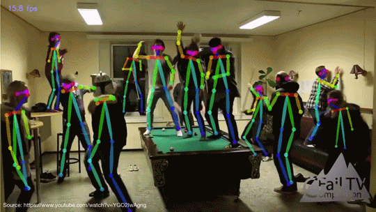
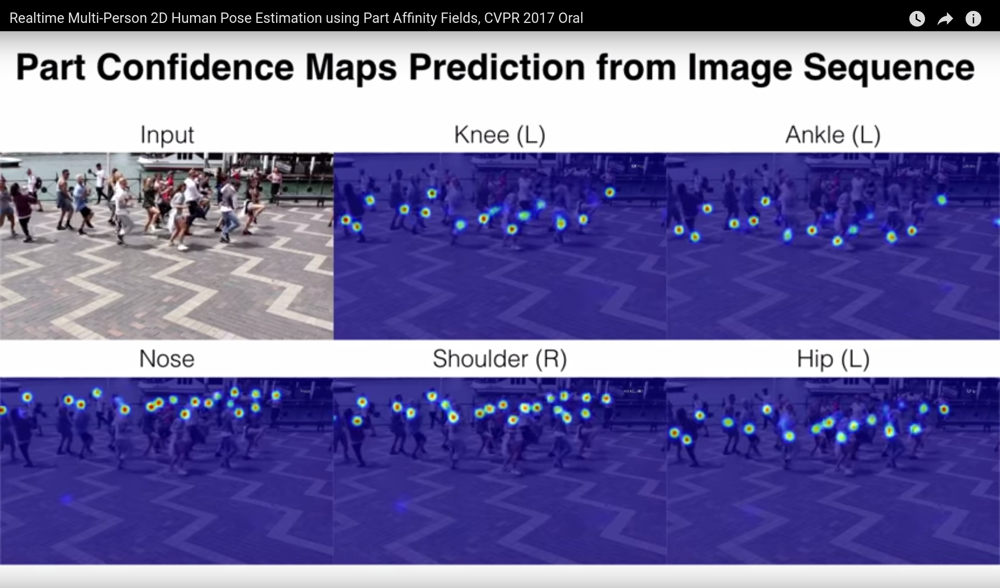
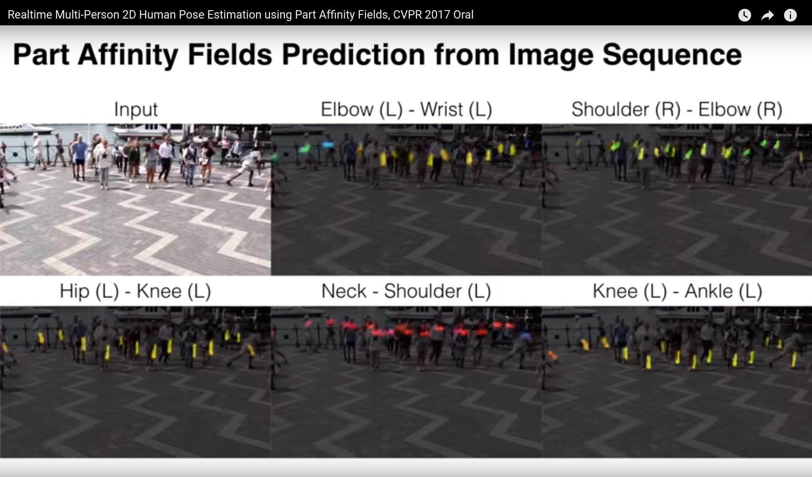

OpenPose - Quick Start
====================================

## Contents
1. [Quick Start](#quick-start)
    1. [Running on Video](#running-on-video)
    2. [Running on Webcam](#running-on-webcam)
    3. [Running on Images](#running-on-images)
    4. [Maximum Accuracy Configuration](#maximum-accuracy-configuration)
    5. [3-D Reconstruction](#3-d-reconstruction)
    6. [Tracking](#tracking)
2. [Expected Visual Results](#expected-visual-results)


## Quick Start
Check that the library is working properly by running any of the following commands on any command-line interface program. In Ubuntu, Mac, and other Unix systems, use any command-line interface, such as `Terminal` or `Terminator`. In Windows, open the `PowerShell` (recommended) or Windows Command Prompt (CMD). They can be open by pressing the Windows button + X, and then A. Feel free to watch any Youtube video tutorial if you are not familiar with these non-GUI tools. Make sure that you are in the **root directory of the project** (i.e., in the OpenPose folder, not inside `build/` nor `windows/` nor `bin/`). In addition, `examples/media/video.avi` and `examples/media` do exist, no need to change the paths.

### Running on Video
```
# Ubuntu and Mac
./build/examples/openpose/openpose.bin --video examples/media/video.avi
# With face and hands
./build/examples/openpose/openpose.bin --video examples/media/video.avi --face --hand
```
```
:: Windows - Portable Demo
bin\OpenPoseDemo.exe --video examples\media\video.avi
:: With face and hands
bin\OpenPoseDemo.exe --video examples\media\video.avi --face --hand
```
```
:: Windows - Library - Assuming you copied the DLLs following doc/installation.md#windows
build\x64\Release\OpenPoseDemo.exe --video examples\media\video.avi
:: With face and hands
build\x64\Release\OpenPoseDemo.exe --video examples\media\video.avi --face --hand
```


### Running on Webcam
```
# Ubuntu and Mac
./build/examples/openpose/openpose.bin
# With face and hands
./build/examples/openpose/openpose.bin --face --hand
```
```
:: Windows - Portable Demo
bin\OpenPoseDemo.exe
:: With face and hands
bin\OpenPoseDemo.exe --face --hand
```
```
:: Windows - Library - Assuming you copied the DLLs following doc/installation.md#windows
build\x64\Release\OpenPoseDemo.exe
:: With face and hands
build\x64\Release\OpenPoseDemo.exe --face --hand
```


### Running on Images
```
# Ubuntu and Mac
./build/examples/openpose/openpose.bin --image_dir examples/media/
# With face and hands
./build/examples/openpose/openpose.bin --image_dir examples/media/ --face --hand
```
```
:: Windows - Portable Demo
bin\OpenPoseDemo.exe --image_dir examples\media\
:: With face and hands
bin\OpenPoseDemo.exe --image_dir examples\media\ --face --hand
```
```
:: Windows - Library - Assuming you copied the DLLs following doc/installation.md#windows
build\x64\Release\OpenPoseDemo.exe --image_dir examples\media\
:: With face and hands
build\x64\Release\OpenPoseDemo.exe --image_dir examples\media\ --face --hand
```


### Maximum Accuracy Configuration
This command provides the most accurate results we have been able to achieve for body, hand and face keypoint detection. However, this command will need ~10.5 GB of GPU memory (6.7 GB for COCO model) and runs at ~2 FPS on a Titan X for the body-foot model (1 FPS for COCO).

- **Note 1:** Increasing `--net_resolution` will highly reduce the frame rate and increase latency, while it might increase the accuracy. However, this accuracy increase is not guaranteed in all scenarios, required a more detailed analysis for each particular scenario. E.g., it will work better for images with very small people, but usually worse for people taking a big ratio of the image. Thus, we recommend to follow the commands below for maximum accuracy in most cases for both big and small-size people.
- **Note 2: Do not use this configuration for MPII model**, its accuracy might be harmed by this multi-scale setting. This configuration is optimal only for COCO and COCO-extended (e.g., the default BODY_25) models.

```
# Ubuntu and Mac: Body
./build/examples/openpose/openpose.bin --net_resolution "1312x736" --scale_number 4 --scale_gap 0.25
# Ubuntu and Mac: Body + Hand + Face
./build/examples/openpose/openpose.bin --net_resolution "1312x736" --scale_number 4 --scale_gap 0.25 --hand --hand_scale_number 6 --hand_scale_range 0.4 --face
```
```
:: Windows - Portable Demo: Body
bin\OpenPoseDemo.exe --net_resolution "1312x736" --scale_number 4 --scale_gap 0.25
:: Windows - Portable Demo: Body + Hand + Face
bin\OpenPoseDemo.exe --net_resolution "1312x736" --scale_number 4 --scale_gap 0.25 --hand --hand_scale_number 6 --hand_scale_range 0.4 --face
```
```
:: Windows - Library - Assuming you copied the DLLs following doc/installation.md#windows: Body
build\x64\Release\OpenPoseDemo.exe --net_resolution "1312x736" --scale_number 4 --scale_gap 0.25
:: Windows - Library - Assuming you copied the DLLs following doc/installation.md#windows: Body + Hand + Face
build\x64\Release\OpenPoseDemo.exe --net_resolution "1312x736" --scale_number 4 --scale_gap 0.25 --hand --hand_scale_number 6 --hand_scale_range 0.4 --face
```

If you want to increase the accuracy value metric on COCO, while harming the qualitative accuracy, add the flag `--maximize_positives`. It reduces the thresholds to accept a person candidate. It highly increases both false and true positives. I.e., it maximizes average recall but could harm average precision. Our experience is that it looks much worse visually, but it improves the COCO accuracy numbers, so use it at your own risk.

In addition, our paper numbers are not based on the current models that have been released. We released our best model at the time but later found a better one. But given that the accuracy difference is less than 2%, we did not want to release yet another model to avoid confusion for the users (otherwise there would be more than 10 models released at this point). We will release a new one every time a major improvement is achieved.

If you are operating on Ubuntu, you can check the experimental scripts that we use to test our accuracy (we do not officially support it, i.e., we will not answer questions about it, as well as it might change it continuously), they are placed in `openpose/scripts/tests/`, called `pose_accuracy_coco_test_dev.sh` and `pose_accuracy_coco_val.sh`.


### 3-D Reconstruction
1. Real-time demo
```
# Ubuntu and Mac
./build/examples/openpose/openpose.bin --flir_camera --3d --number_people_max 1
# With face and hands
./build/examples/openpose/openpose.bin --flir_camera --3d --number_people_max 1 --face --hand
```
```
:: Windows - Portable Demo
bin\OpenPoseDemo.exe --flir_camera --3d --number_people_max 1
:: With face and hands
bin\OpenPoseDemo.exe --flir_camera --3d --number_people_max 1 --face --hand
```
```
:: Windows - Library - Assuming you copied the DLLs following doc/installation.md#windows
build\x64\Release\OpenPoseDemo.exe --flir_camera --3d --number_people_max 1
:: With face and hands
build\x64\Release\OpenPoseDemo.exe --flir_camera --3d --number_people_max 1 --face --hand
```

2. Saving 3-D keypoints and video
```
# Ubuntu and Mac (same flags for Windows version)
./build/examples/openpose/openpose.bin --flir_camera --3d --number_people_max 1 --write_json output_folder_path/ --write_video_3d output_folder_path/video_3d.avi
```

3. Fast stereo camera image saving (without keypoint detection) for later post-processing
```
# Ubuntu and Mac (same flags for Windows version)
# Saving video
# Note: saving in PNG rather than JPG will improve image quality, but slow down FPS (depending on hard disk writing speed and camera number)
./build/examples/openpose/openpose.bin --flir_camera --num_gpu 0 --write_video output_folder_path/video.avi --write_video_fps 5
# Saving images
# Note: saving in PNG rather than JPG will improve image quality, but slow down FPS (depending on hard disk writing speed and camera number)
./build/examples/openpose/openpose.bin --flir_camera --num_gpu 0 --write_images output_folder_path/ --write_images_format jpg
```

4. Reading and processing previouly saved stereo camera images
```
# Ubuntu and Mac (same flags for Windows version)
# Optionally add `--face` and/or `--hand` to include face and/or hands
# Assuming 3 cameras
# Note: We highly recommend to reduce `--output_resolution`. E.g., for 3 cameras recording at 1920x1080, the resulting image is (3x1920)x1080, so we recommend e.g. 640x360 (x3 reduction).
# Video
./build/examples/openpose/openpose.bin --video output_folder_path/video.avi --3d_views 3 --3d --number_people_max 1 --output_resolution {desired_output_resolution}
# Images
./build/examples/openpose/openpose.bin --image_dir output_folder_path/ --3d_views 3 --3d --number_people_max 1 --output_resolution {desired_output_resolution}
```

5. Reconstruction when at least n visible views
```
# Ubuntu and Mac (same flags for Windows version)
# Assuming >=2 cameras and reconstruction when at least 2 visible views
./build/examples/openpose/openpose.bin --flir_camera --3d --number_people_max 1 --3d_min_views 2 --output_resolution {desired_output_resolution}
```


### Tracking
1. Runtime huge speed up by reducing the accuracy:
```
# Using OpenPose 1 frame, tracking the following e.g., 5 frames
./build/examples/openpose/openpose.bin --tracking 5 --number_people_max 1
```

2. Runtime speed up while keeping most of the accuracy:
```
:: Using OpenPose 1 frame and tracking another frame
./build/examples/openpose/openpose.bin --tracking 1 --number_people_max 1
```

3. Visual smoothness:
```
# Running both OpenPose and tracking on each frame. Note: There is no speed up/slow down
./build/examples/openpose/openpose.bin --tracking 0 --number_people_max 1
```


## Expected Visual Results
The visual GUI should show the original image with the poses blended on it, similarly to the pose of this gif:
<p align="center">
    
</p>

If you choose to visualize a body part or a PAF (Part Affinity Field) heat map with the command option `--part_to_show`, the result should be similar to one of the following images:
<p align="center">
    
</p>

<p align="center">
    
</p>
