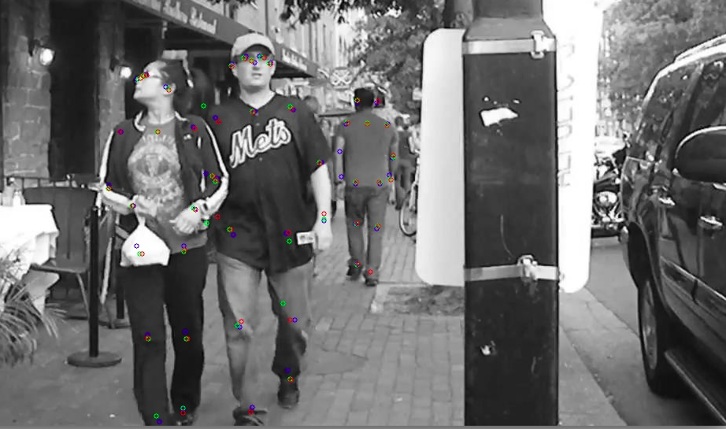
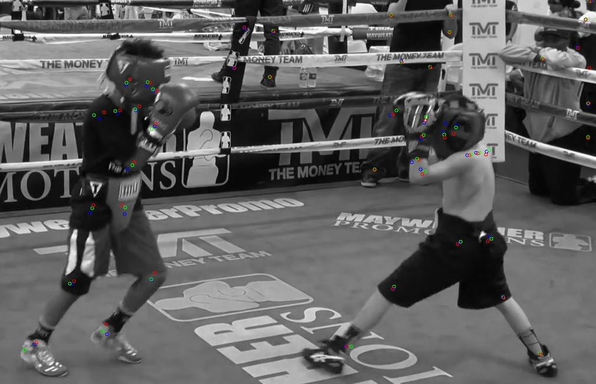
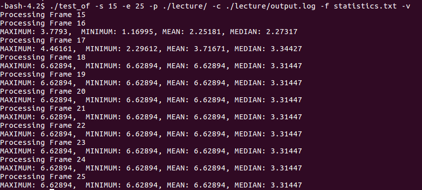

# Custom optical flow Lucas Kanade Pyramidal tester

<div align="center">
    
</div>
</div>
    This tester contains a test framework to test both the CPU and a GPU (NVIDIA) version of the Lucas-Kanade Pyramidal flow algorithm used by OpenPose. 
    

## Files description

- **test_of.cpp**: Accuracy tester of the custom LK Pyramidal implementation. OpenCV and OpenPose ground truth are shown.
</div>


## How to use the test framework

You will need to add the OpenPose shared library to your LD_LIBRARY_PATH environment variable:

1. Go to your OpenPose home directory.
2. Run the following command 'export LD_LIBRARY_PATH=./build/lib'

    ```export LD_LIBRARY_PATH=./build/lib/``` 

You will need to have a dataset ready for testing. Currently there are 4 datasets available for testing. In the future the dataset generation will be automated:

1. Boxing video:
https://github.com/fragalfernando/optical_flow_pyramidal/tree/master/boxing
2. People in the street video:
https://github.com/fragalfernando/optical_flow_pyramidal/tree/master/street
3. People in the street (video included with OpenPose):
https://github.com/fragalfernando/optical_flow_pyramidal/tree/master/data
4. Lecture video:
https://github.com/fragalfernando/optical_flow_pyramidal/tree/master/lecture


## Running the accuracy tester (test_of).

From the OpenPose home directory you can call the OpticalFlow tester (make sure it is compiled first after running 'make' in the OpenPose home directory).

    ./build/examples/tests/tracking/test_of.bin -s 'START FRAME' -e 'END FRAME' -p 'TEST DATA DIRECTORY' -c 'TEST DATA DIRECTORY/output.log' -o 'VISUAL RESULTS OUTPUT DIRECTORY' -v -g 

The following options are provided by the accuracy tester:

- **-s (Mandatory)**: Start frame (initial reference frame for the tracker)
- **-e (Mandatory)**: End frame (last frame where tracker is done)
- **-p (Mandatory)**: Directory path where the data frames are located.
- **-c (Mandatory)**: File containing the coordinates of the Open Pose keypoints for each frame
- **-f**: Stats file. When specified, the tester will calculate statistical measures of the tester in each frame and report them in the file name that goes after the flag.
- **-o**: Output framespath. When specified, the result frame will be saved showing the OpenPose keypoints (blue), custom LK Pyramidal keypoints (red) and OpenCV keypoints (green).
- **-v**: Verbose. Use it with the -f flag to indicate you want verbose output on the console.
- **-g**: GPU mode. By default the tester is invoked on the CPU version. Adding the '-g' flag tests the GPU instead.

Example 1:  

    ./test_of -s 19 -e 29 -p ./boxing/ -c ./boxing/output.log -o ./output/output/ 

will run the accuracy tester from frames 19 to 29, using the frames at the ./boxing/ directory, using the coordinate file ./boxing/output.log and saving the resulting frames at ./output/output (**NOTE** the output directiry **MUST** exist before running the command above).

As explained before, the blue points are the Open Pose points (ground truth), the green points are OpenCV pointss withh LKPyramidal-Iterative tracking and the red points our results.

<div align="center">
    
</div>

Example 2:  

    ./test_of -s 15 -e 25 -p ./lecture/ -c ./lecture/output.log -f statistics.txt -v

will show the statistics of errors with respect to OpenPose (median, minimum, maximum and mean pixel disances) in the screen and will generate statistics.txt (more on that below).
<div align="center">
    
</div>


